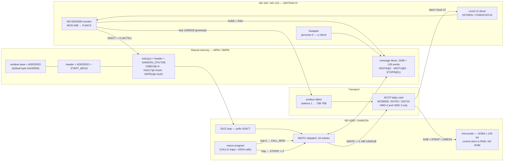
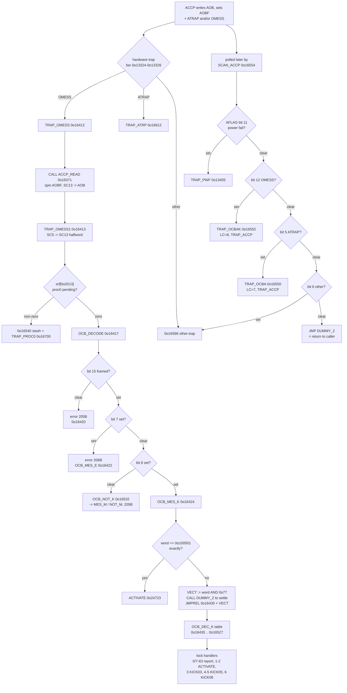
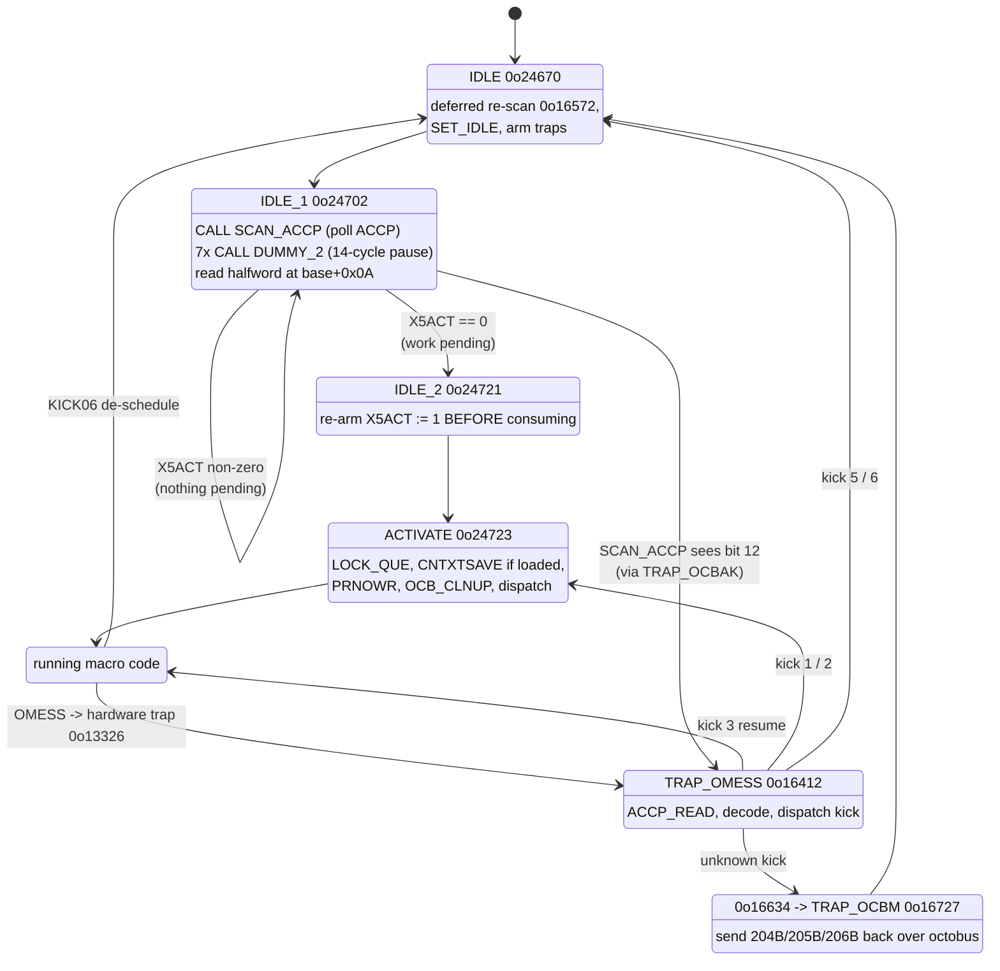
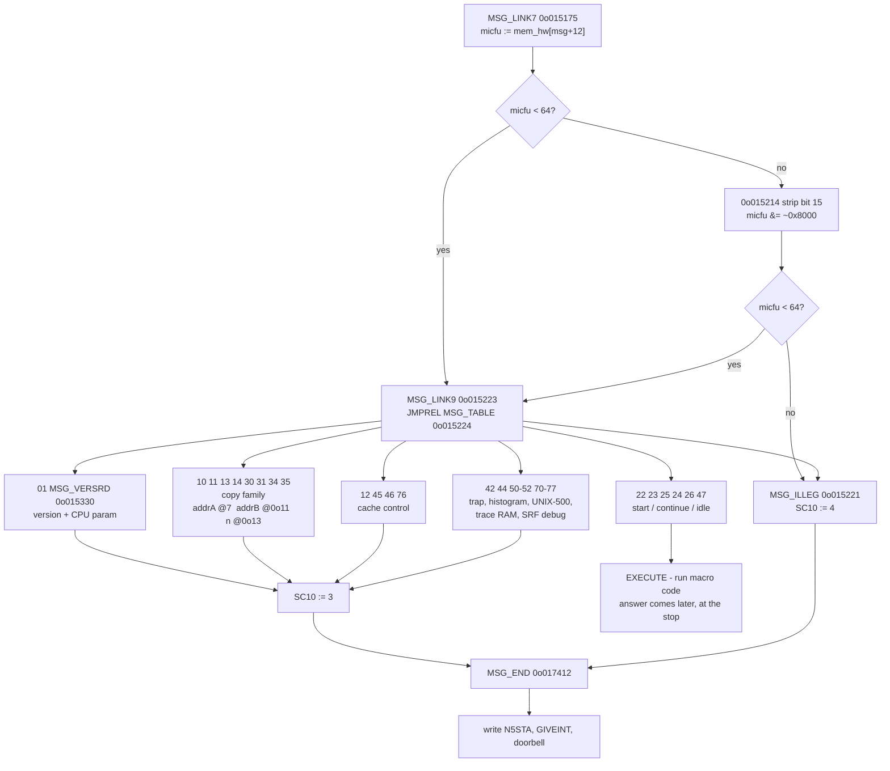
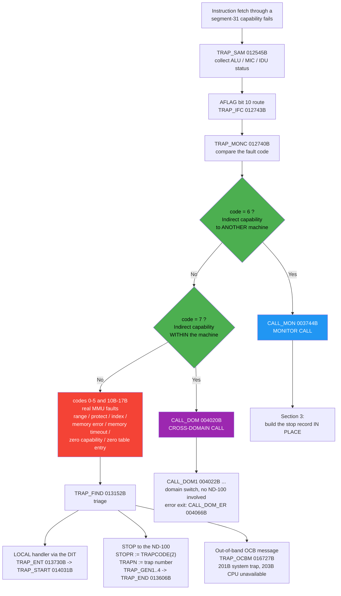
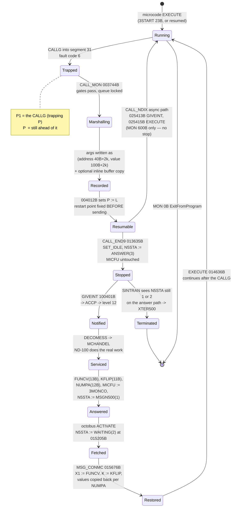
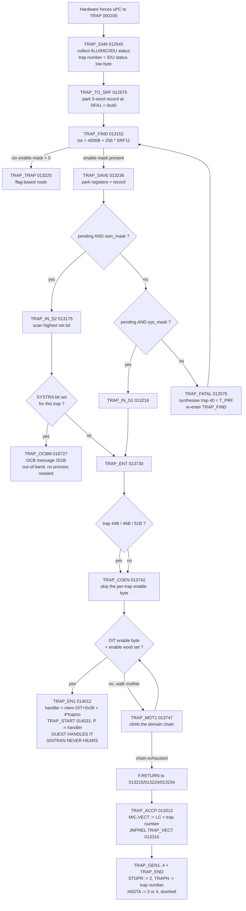
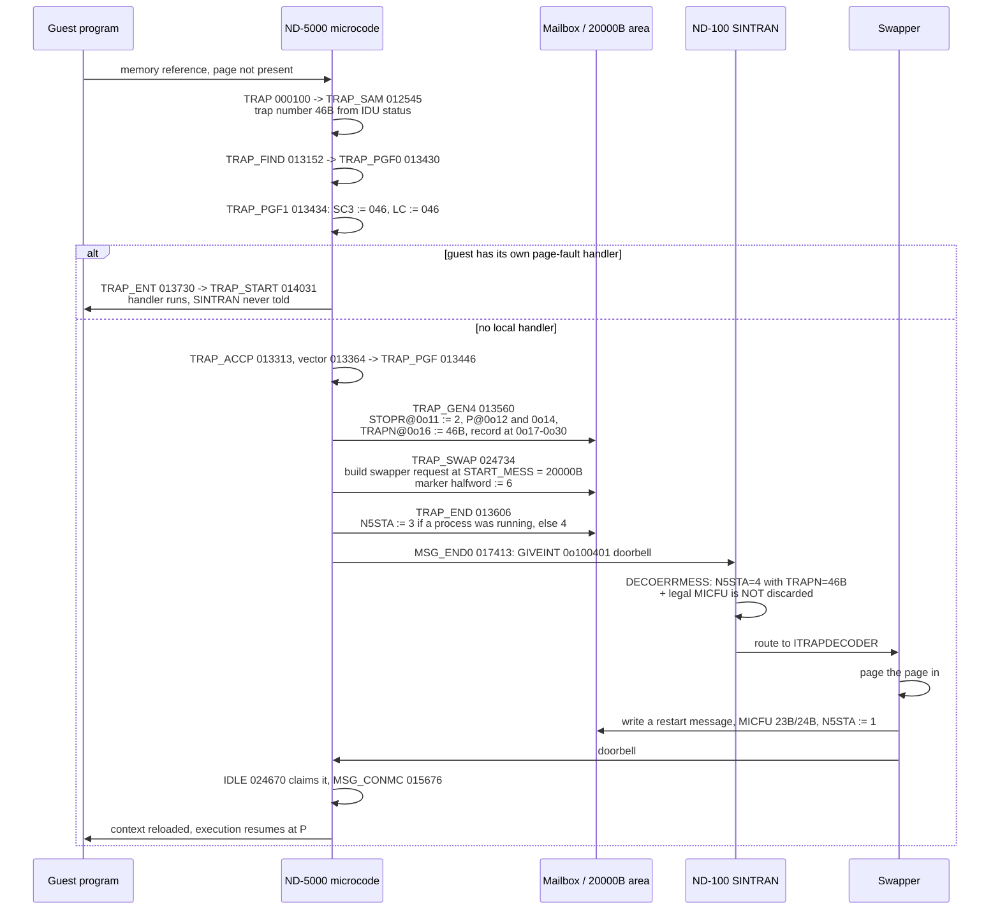
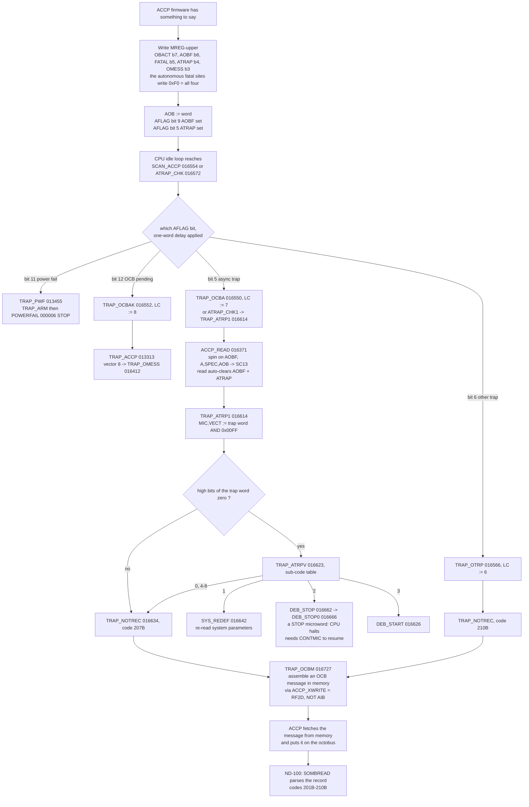

# ND-100 ↔ ND-5000 message processing — a technical reference

**Date:** 2026-08-23
**Scope:** how a request the ND-100 sends is picked up and carried out by the ND-5000 microcode, down to individual microwords, and how everything the ND-5000 starts by itself — monitor calls, traps, page faults, error messages — gets back to the ND-100.

## How to read this document

| If you want to know | Read |
|---|---|
| Who talks to whom, and who is in charge | Chapter 1 |
| The whole thing in two minutes | Chapter 2 |
| Where the shared memory is and how a message block is found | Chapter 3 |
| How the classic ND-500 and the ND-5000 differ (and how little they differ) | Chapter 4 |
| The inbound path, microword by microword | **Part II** — "Inbound Transport & Dispatch" (the signalling layer, `TRAP_OMESS`, `SCAN_ACCP`, the kick decode, the idle-loop doorbell poll) |
| What each request actually does, per function code | **Part II** — "The 5MPM Mailbox" (memory geometry, the service loop, the complete MICFU handler catalogue) |
| The outbound path — MON calls | **Part III** — "Outbound — MON Calls" (the `CALLG` trap, argument marshalling, the stop record, the restart) |
| The outbound path — traps, page faults, out-of-band messages | **Part III** — "Outbound — Traps, Faults, and CPU-initiated Signalling" |
| A number, a bit, a code | Appendix A |
| Whether a claim is proven, and what is still unknown | Appendix B |
| The mistakes that already cost this project weeks | Appendix C — **read this before investigating anything** |

**Evidence grades** are used throughout: `[V]` verified from the real bytes or a live run, `[M]` from a manual, `[D]` derived from verified facts plus one stated inference, `[OPEN]` not known. The scheme is spelled out in Appendix B. An honest `[OPEN]` is worth more than a plausible guess.

---

## 1. Introduction

### The machines

**The ND-100** (in later systems the ND-120) runs SINTRAN III. It owns every disc, every terminal, every tape and every file. It has the operating system, the file system, the drivers and the users.

**The ND-5000** — internal name **SAMSON** — is a compute engine. It has a fast microcoded CPU, its own memory management, its own caches, and a 128-bit microword control store. What it does not have is any I/O at all, and no operating system of its own. It cannot read a disc, print a line or open a file. `[M ND-05.020.01 ch.1]`

It also has **no microcode ROM**. The control store is RAM. On a cold machine the ND-5000 cannot execute a single microword until something else loads the control store for it. `[M ND-05.020.01 §5.1.1, manual:3345-3356]` `[V octobus-nd5000 skill, "the ND-5000 has NO microcode ROM at all; without the ACCP the CPU cannot even start"]`

**The ACCP** — *Access Module Processor*, a Motorola MC68000 on a baby card — is the ND-5000's front door. Part **324702** (print 5602), later **324716** (print 5616). `[M manual:905]` `[V ACCP-COMPLETE-REFERENCE.md:104]` The manual is careful about two terms that are easy to blur: the **access module** is the baby card; the **access processor (ACCP)** is the MC68000 sitting on it. `[M manual:3336-3338]`

**Shared memory** — the MPM (classic) or 5MPM/MFbus memory (ND-5000) — is dual-ported RAM both machines can read and write. Messages live there. Nothing is copied over a wire; both sides address the same bytes.

### The problem the messaging system solves

Because the ND-5000 has no I/O and no operating system, **every service it needs must be asked for**. A program running on the ND-5000 that wants to write a line to a terminal cannot write it. It stops, leaves a record of what it wanted in shared memory, and lets the ND-100 do the work.

The messaging system is the arrangement that makes that possible in both directions.

### Who is master, who is servant

Say this plainly, because both halves are true at once and people keep collapsing them into one:

- **For work: the ND-100 is master.** Nothing runs on the ND-5000 that the ND-100 did not start. Nothing leaves the microcode idle loop except an activation or a terminate from the ND-100 side. `[D ND500-BUS-INTERFACE-REFERENCE.md:340-345]` The ND-100 loads the control store, loads the swapper, starts the swapper, places domains and starts processes.
- **For services: the ND-100 is servant.** Once a program is running, the ND-5000 raises the requests and the ND-100 performs them — file opens, terminal output, page-ins. Every one of those is the ND-5000 asking and the ND-100 doing.

The one thing that is never true in either direction: **the ACCP is not in charge of anything.** It carries words. It does not read the message, does not know what MICFU means, and does not decide anything about it (see chapter 2c).

---

## 2. Executive summary

**(a) Inbound — how a request reaches the ND-5000.** SINTRAN builds a message block in shared memory, links it onto a per-CPU queue, and rings a doorbell. There are two doorbells. The normal one is a plain memory write: SINTRAN stores zero into the `X5ACT` halfword of this CPU's extension block, and the microcode's idle loop, which spins reading that halfword, sees the zero, re-arms the cell to 1, and walks the queue. `[V MAILBOX-MICROCODE-PSEUDOCODE.md §3.1a, µ024712-024722]` `[V MP-P2-N500.NPL:3027 ACT51]` The second is an octobus **kick** — a framed control word delivered into the AOB register with ATRAP and OMESS set, which traps the running microprogram. The kick is the **preempt** path, used when the CPU is already busy; it is the exception, not the rule. `[V CARVE-ANSWER-OCTOBUS-MAILBOX-ACTIVATION-2026-07-19.md:20-27]` Either way, the microcode reads the message's function code (**MICFU**) and jumps through a 64-entry dispatch table to a handler.

**(b) Outbound — how the ND-5000 talks back.** There are three ways.

1. **Monitor calls.** The ND-500 instruction set has **no MON instruction**. A monitor call is a `CALLG` into a trampoline table in segment 31 (`EQU 37B9 + n`). That call target lies in protected space, so it raises an instruction-fetch trap; trap code 6 routes to `CALL_MON`. The microcode copies the arguments into the message, writes the saved P, sets `STOPR := MOCALL(1)`, `NUMPA := argc`, `MCNO := n`, and answers. `[V MAILBOX-MICROCODE-PSEUDOCODE.md §3.8, µ003744-004012]`
2. **Traps and page faults.** Either a local handler runs (SINTRAN never hears about it), or the process stops with `STOPR := TRAPCODE(2)` plus a trap number; a page fault is trap `0o46` and *also* builds a message to the swapper. `[V §3.9, µ013501-013612]`
3. **Out-of-band octobus messages.** For events with no running process to answer through — system traps, CPU-unavailable, protocol errors — the microcode builds an octobus message itself and pushes it frame by frame through the ACCP. `[V §3.9.5, µ016727]`

The model that ties (b) together and surprises everyone: **the microcode does not build a new message for a stop.** It answers the process's own activation message in place — same block, same MICFU, new `STOPR`. That is exactly why SINTRAN's `DECOMESS` accepts any of `{3MONCO, 3TRACO, 3START, 3WMONCO}` and then dispatches on `STOPR`. `[V+X §3.8]`

**(c) The microcode is what answers.** Not the 5015, not the ACCP, not the swapper. The command field is literally named `MICFU` = **MIC**ro **FU**nction. `[V ND500-WHO-ANSWERS-THE-MAILBOX.md:4-5]` The 5015 "CONTROL II" card has no intelligence at all — it clocks registers when the 3022 strobes a TAG-IN code. `[V WHO:110]` The ACCP answers only multibyte messages addressed to OMD 0 and OMD 3; everything else it hands straight to the microprogram through AOB, and everything the microprogram writes to AIB goes straight out to the octobus. The manual says so in as many words: *"no data checking or protocol handling is done by the ACCP."* `[M manual:3930-3932]` The swapper is a client — process 0, nothing more.

**(d) One protocol, two transports.** The message layout, the MICFU set, the `N5STA` lifecycle, the FUNCS/MON-60 command set and the servicer's role are the **same** on the classic ND-500 (3022 + 5015) and on the ND-5000 (octobus + ACCP). Only the plumbing differs: how the doorbell is rung and how the answer is signalled. In the emulator this shows up as one class, `Nd500MicrocodeServicer`, constructed twice — once as `Nd500Generation.Classic` and once as `Nd500Generation.Samson5800`. `[V Nd500MicrocodeServicer.cs:16-20; NDBusND500IF.cs:959; OctobusND5000Station.cs:633]`

### The six facts a reader must not get wrong

- **The microcode answers the mailbox.** The ACCP and the 5015 are transport. No loaded control store means no servicer at all — that is why nothing works before `LOAD-CONTROL-STORE`.
- **There is no MON instruction.** A monitor call is a `CALLG` that traps. Looking for a MON opcode in an ND-500 instruction table is looking for something that does not exist.
- **The normal doorbell is a memory write (`X5ACT := 0`), not a kick.** The kick is the preempt path.
- **A stop answers the process's own message in place.** `MICFU` is left untouched; `STOPR` carries the reason.
- **Microcode and control-store addresses are OCTAL.** `025522` octal is `0x2B52`, not `0xB52`. Getting this wrong dumps a different routine that still looks plausible.
- **The same message block and MICFU set serve both machines.** A fix in the message layer is not interface-local; it lands on both transports.

---

## 3. Hardware and address model

### 3.1 The ACCP

A MC68000 baby card carrying, in one place: the 68000 itself (10 MHz, clocked at twice the ND-5000 clock period), EPROM firmware, local RAM, the octobus controller gate array, a real-time clock, and a dual UART giving a current-loop and an RS-232 console. `[M manual:3496, :3575]` `[V ACCP-COMPLETE-REFERENCE.md:99-105]` The firmware is 128 KB (two AM27C512s interleaved), compiled by ND's PLANC-MC compiler, and has been dumped and disassembled in full (`octo.bin`, SHA-256 `0EA81716AD81984B…`). `[V ACCP-COMPLETE-REFERENCE.md:99-105]`

It has three jobs `[M manual:3345-3356]`:

1. **Message router at runtime.** Consumes multibyte messages to OMD 0 (octobus test programs) and OMD 3 (its own command library). Everything else — kicks, idents, multibyte messages to other OMDs — is written straight into **AOB** with ATRAP and OMESS set. Outbound, the microcode writes **AIB**; the **ACCPTRAP** bit in the modus register decides whether that word is an ACCP command or goes straight onto the octobus. `[M manual:3930-3932, :3777]`
2. **Bootstrapper and test master.** In AMODE the ACCP stops the ND-5000 and owns its buses, clocking MIR/MAR/IAR/ALU through the ACON decoder and shifting the control store in and out over the APR/ASR serial loops. This is how `LOCSD`/`LOCSM` load the microprogram.
3. **Command library on OMD 3** — presence, selftest, control-store load/dump, parameter pointer, start/stop/continue/restart microprogram, microtrap. This is what SINTRAN's bring-up path drives.

The CPU-facing seam is small, which is why it can be modelled rather than emulated: **AIB** (CPU→ACCP), **AOB** (ACCP→CPU), the **AIBF/AOBF** handshake flags, the **ATRAP/FATAL** trap signals, and the APR/ASR serial loops (test mode only).

### 3.2 The octobus fabric and stations

Up to **64 stations** on one bus; station numbers are architecturally assigned, not negotiated; the lowest-numbered global station becomes MASTER. `[M manual:10740, :10746, :10781]`

| Station (octal) | Device |
|---|---|
| 1 | ND-120 CPU (SINTRAN's `N1OCTDEST = 1`) |
| 2–7 | MFbus controllers |
| 10–13 | SCSI controllers |
| 14–15 | Matra VME |
| 16–17 | Multifunction communication |
| 20 | Hyperchannel |
| 21–23 | FDDI |
| 24–27 | FPS-5000 |
| 30–33 | Free / graphic controllers (30–33 graphics, 34–67 free) |
| **70–76** | **ND-5000 CPU** (CPU *n* at `70B + n − 1`) |

`[M manual Appendix 2, :10748ff]` Cross-checked against `FN5DEST=0o70` / `LN5DEST=0o77` in the L07 symbol table and `RP-P2-N500.NPL:132221`. `[V]`

**Watch the base.** "2–7" reads the same in octal and decimal, but "10–13" is decimal 8–11.

The software-visible 16-bit frame `[M manual:10880-10905]`:

```
 15  14  13........08   07  06  05  04   03....00
  C   B   dest/source    E   K   M   S    payload
```

`C` = control word, `B` = broadcast, `E` = emergency, `K` = kick, `M` = multibyte (`S`=1 start / `S`=0 end). Bits 13:8 carry the **destination** when sending and are **rewritten by the fabric to the source station** on delivery. `[M manual:10892-10893]` `[V NDBusOctobus.cs:284-286]`

**MFbus is the follow-up to MPM-5** — the MFbus controller card *is* the shared-memory controller, not a peripheral. `[M manual:862]`

### 3.3 The MPM / 5MPM shared window and ADRZERO

The ND-100 sees the shared window at a **configurable physical base called ADRZERO**; the ND-5000 sees the same memory from its address 0. Both ports are big-endian — no byte swap between the sides.

`ADRZERO` is a SINTRAN concept and appears nowhere in ND-05.020.01. `[V — verified absence]` It is set by the monitor command **`DEFINE-MEMORY-CONFIGURATION`** = MON 60 subfunction **`MEMDEF = 40B`**, whose operator parameter is literally *"ND-100 page for ND-500 phys addr 0"*; `CHMEMDEF` stores it with `5D12 =: ADRZERO`. `[V 5P-P2-MON60.NPL:587 (026733)]` It is displayed by the `MEMORY-CONFIGURATION` command (**not** "list-memory-configuration", which errors with "TOO LONG PARAMETER").

Live value measured on a SINTRAN-L system: `ND-500 address zero: ND-100 PAGE 004100B, WORD 010200000B` = **ND-100 byte `0x420000`**. `[V CARVE-ANSWER-OCTOBUS-MAILBOX-ACTIVATION-2026-07-19.md:337-341]`

**Two bases, only one configurable.** The *window* base is ADRZERO. The *mailbox* base inside the window is `5MBBANK = 5FPMAILBOX << 10`, dynamically allocated by `5GBUFF` at `INZ500` — it is not in the memory configuration and is never at window offset 0. `[V :300-311]`

### 3.4 Per-CPU extension-block geometry

```
header      = ADRZERO + START_MESS
ext(cpu)    = header + SAMSON_CPU * 256          bytes
```

`START_MESS` is control-store page-0 **word 0o26**, patched by SINTRAN before the ACCP burns the store; `SAMSON_CPU` is **word 0o25**. `[V live CS dump; OctobusND5000Station.cs:1253-1260]` `[V microcode INIT_ADRP µ025646]` Both are **full 32-bit LARG values** — reading only halfword 7 truncates a real K-pack offset and breaks the watchdog. `[V OctobusND5000Station.cs:1245-1252]`

`SAMSON_CPU` is **1-based on the SINTRAN side**: CPU 0 (station 70B) occupies the *first* block, slot 1; slot 0 is the global header. `[V CARVE-ANSWER-…-2026-07-19.md:102-103]` Whether the B30 microcode image treats it the same way is `[OPEN]` — the image carries constant 0. `[OPEN :294-296]`

Block layout — **word** offsets, so byte offset = word × 2 `[V RP-P2-N500.NPL:752-767]`:

| Word | Byte | Symbol | Meaning |
|---|---|---|---|
| 0–1 | +0x00 | **X5BEX** | ex-queue chain head, 32-bit, init `-1,-1` = empty |
| 2–3 | +0x04 | X5NAC | |
| 4 | +0x08 | X5CPU | |
| **5** | **+0x0A** | **X5ACT** | the doorbell halfword: `-1` init, `0` = work pending, microcode re-arms to `1` |
| **6** | **+0x0C** | **X5PRO** | current process on this CPU; `-1` = idle |
| 7 | +0x0E | X5STA | this CPU's octobus station |
| 0o10 | +0x10 | X5CLR | clear-functions mask (read it, never assume `0o77`) |
| 0o11 | +0x12 | X5CCL | cache-clear counter |
| 0o20–21 | +0x20 | X5ACC | |
| 0o22–23 | +0x24 | X5OCT | |
| 0o24–25 | +0x28 | X5HWB | |

`5EXTDFSIZE` (`5EXTD`) = `0o200` **words** = 128 words = **256 bytes** — that is where the `*256` in the byte formula comes from. `[V :102]`

Three ORCON displacements in the real microcode match this table independently: IDLE polls `+0x0A` (X5ACT), `PRNOWR` writes `+0x0C` (X5PRO), `MSG_CCINCR` bumps `+0x12` (X5CCL). `[V MAILBOX-MICROCODE-PSEUDOCODE.md §3.1a]`

> **Live discrepancy, do not paper over it.** On the SINTRAN-K pack the measured extension block sits at `0xB90610` — `START_MESS`-mapped base `0xB90000` plus `0x610`, and `0x610` is **not** `cpu*256`. `[OPEN OctobusND5000Station.cs:1194-1196]` Treat the formula as the microcode's rule, not as a guarantee about SINTRAN's layout.

The *global* header reuses the same small word numbers for different fields — `@4/@5/@6` there are `X5FYL / X5MXF / X5FIF`. Same numbers, different base. `[V :110-111]`

### 3.5 Block diagram



---

## 4. The two transports side by side

| | Classic ND-500 (3022 / 5015) | ND-5000 / SAMSON (octobus / ACCP) |
|---|---|---|
| ND-100-side hardware | **PCB 3022** IOX device, hard-wired to **interrupt level 12**, device number by thumbwheel: base 60/1060/660/760/560, ident 16/116/36/114/76 (octal) `[V BUS:63-68, :142-146]` | octobus fabric card; stations 70B–76B = ND-5000 CPU 1–4 `[M manual Appx 2]` |
| CPU-side front door | **PCB 5015 "CONTROL II"** — DATA-IN/OUT (32-bit), WA, BREAK, CSCNT, TAG registers. No intelligence. `[V BUS:69-71]` | **ACCP** MC68000 baby card + octobus gate array `[M manual ch.5]` |
| Control store | 8192 × 144-bit words (9 × 16-bit parts), RAM, no ROM | 16384 × 128-bit words, RAM, no ROM |
| Microcode load | 3022 TAG-IN strobes WA + BREAK + CSCNT, 9 parts per word; loader verifies words 0–7 by read-back `[V BUS:542-546]` | ACCP commands `LOCSD` (direct) / `LOCSM` (via memory) over the octobus, using the APR/ASR serial shift loops `[M 5.3.17/5.3.18]` |
| Micro start / stop | `MPSTA`: `RETG5 := 0` restarts the clock (5CLOST clears); `MPSTO`/`5MCST`: `RETG5 := 2` sets the stop bit `[V BUS:589-599]` | `STARTMIC` (0x36) / `STOPMIC` (0x1C) / `CONTMIC` (0x1D) / `RESTMIC` (0x1E) ACCP commands |
| "CS not loaded" gate | STATUS bit 9 `5CLOST` → MON-60 error `ECSLOAD` 2032B → auto-load and retry `[V BUS:719-721]` | no bit-9 gate; `ALIVE` returns nak 7, or the microcode raises OCB fault 203B |
| **Doorbell (activate)** | `ACT50`: `LMAR5 := bank(MS)`, `LMAR5 := addr(LS)`, `LCON5 := 5` — MAR points at the message, CONTROL bit 2 activates and locks `[V BUS:316-318]` | `X5ACT := 0` in the per-CPU extension block; the microcode IDLE loop polls it. Kick = preempt only. `[V MP-P2-N500.NPL:3027]` |
| Answer return | microcode TAG-OUT DMA write-back (codes 6/7) + **level-12 interrupt**, ident 16B `[V BUS:685-689, :444-451]` | mailbox write + ACCP command word `100401B` out of AIB, delivered as an octobus message/ident to station 1 `[V µ017421]` |
| **Message block** | **IDENTICAL** — same 5MPM block, same offsets | **IDENTICAL** |
| **MICFU set** | **IDENTICAL** values (3START=23B, 3MONCO=24B …) — but see the generation notes below | **IDENTICAL** sender side; a few codes have different *meanings* in the B30 image |
| **FUNCS / MON 60 set** | **SAME** `FUNCS` table @142031B in `030-S3SM5`, 128 entries `[V FUNCS-dispatch-table.md]` | **SAME** table — `N500:` and `ND-5000:` commands are transport-blind `[D]` |
| **Who answers** | **the MICROCODE** (5015 is dumb glue) | **the MICROCODE** (ACCP routes, does not answer) |
| Shared memory | MPM dual-port RAM, ND-100 window at ADRZERO | 5MPM via the MFbus controller, same ADRZERO model |

**The bring-up rhythm is identical on both** — this is the load-bearing similarity:

`SET-ND-500-UNAVAILABLE` → `DEFINE-MEMORY-CONFIGURATION` (40B) → `GIVE-ND-500-PAGES` → **`LOAD-CONTROL-STORE` (37B)** → `DEFINE-SWAP-FILE` (46B) → **`LOAD-SWAPPER` (7B)** → **`START-SWAPPER` (54B)** → `SET-ND-500-AVAILABLE`. Neither generation has microcode ROM, so nothing runs before the control-store download. The swapper is the first program either machine ever executes.

### What is generation-dependent

The *sender* (`N5XXC`, SINTRAN L07) is common to both machines and emits the same codes regardless. What differs is whether the target microcode honours them `[V ND500-MAILBOX-MESSAGE-CATALOG.md:390-392]`:

| MICFU | Classic ND-500 | ND-5800 B30 |
|---|---|---|
| 05 `3SWMESS` | in the symbol table, **never on the wire** | `MSG_ILLEG` — consistent |
| 17B `3DEPR` | deposit one register `[D — family inference, not byte-pinned]` | presumed illegal `[OPEN]` |
| 21B `3WREG` | register block write | **`MSG_ILLEG`** |
| 27B `3FITRNSF` | **never sent** | `MSG_ILLEG` — consistent |
| 34B | `3MONO` / `RMEMP` | **`MSG_IMEMRD`** — instruction-memory read, *not* a mon-call variant |
| 46B | `MILLFU` / `33MON` | **`MSG_DUDC`** — dump dirty + clear data cache |
| 47B | `MILLFU` | `MSG_IDLE` |
| 50B/51B/52B | `MILLFU` / `NKREL` | `UNIX5RE` / `UNIX5CM` / `UNIX5REL` |

`[V ND500-MAILBOX-MESSAGE-CATALOG.md:226-237, :339-395, :620-635]`

### Only the octobus path can be validated

**We have microcode for the ND-5000 and only for the ND-5000.** `MICRO-5800-B30` is a real, dumped, reassembly-validated 128-bit image, and `CpuND5000` executes it one microword per tick. That makes the octobus path checkable against a genuine oracle: run the real microcode and the C# servicer on the same message and compare.

There is **no surviving ND-500 microcode for the message path**. (`CONT-STORE-10611.DATA` is the only classic 144-bit control store we have, and it is a different question.) Without an oracle, any statement about how a real ND-500 answers a message over the 3022 would be a guess. That is why the octobus lane is where testable progress lives, and why classic-only claims in this document carry `[D]` or `[X]` rather than `[V]`.

---

## Appendix A — reference tables

### A.1 ACCP octobus command codes — the carved 46-arm dispatcher

Source of record: `E:\Dev\Ronny\NDInsight\SINTRAN\ND5000\ACCP-OCTOBUS-COMMAND-TABLE-2026-08-02.md`, from `octo.bin`. All 46 arm addresses are `[V]` — every `cmpi.b` immediate was read out of the image and all 46 matched the `0C 00 00 <imm>` + `66` shape with zero mismatches.

**The dispatcher is a linear PLANC `cmpi.b` / `bne` CASE chain, not a jump table**, and arm order in the image is *not* code order.

| Code | Octal | `CM*` | Name | What it does | Grade |
|---|---|---|---|---|---|
| `0x0D` | 015B | — | read back system parameters (**not RECO**) | returns the three words `0x0E` wrote | `[V]` |
| `0x0E` | 016B | `CMSYS` | **LSYSPAR / CMSYSPAR** | 3 words → `1143A0/A2/A4`; also clears the selftest status word | `[V]` |
| `0x0F` | 017B | `CMTEC` | **ECHO** | returns the test pattern; the only arm with no guard at all | `[V]` |
| `0x10` | 020B | `CMREA` | undocumented | returns 16 words from `114550` (signature block) | `[OPEN]` |
| `0x11` | 021B | `CMLPA` | **LPARP** — load parameter pointer | stores the 4-byte MFbus parameter-area pointer | `[V]` |
| `0x12` | 022B | `CMVER` | **VPARP** — verify parameter pointer | echoes the 32-bit word from the parameter area | `[V]` |
| **`0x13`** | 023B | `CMWWC` | **LOCSM** — load control store via memory | issues ACON `0x06` = WCS | `[V]` |
| `0x14` | 024B | `CMDWW` | **LOCSD** — load control store directly | 8 words = 128 bits + checksum | `[V]` |
| `0x15` | 025B | `CMADR` | **DUCS** — dump control store via memory | | `[V]` |
| `0x16` | 026B | `CMDRW` | **DCSD** — dump control store directly | 14-bit address; Messnak 3 above `0x3FFF` | `[V]` |
| `0x17` | 027B | — | undocumented — a fourth "start" variant | latch enable then sets the running flag | `[OPEN]` |
| `0x18` | 030B | — | **AMICTRAP** | writes MREG-upper `0xD0` = ATRAP **without** OMESS | `[V]` |
| `0x19`,`0x1A` | — | — | **hole** — no arm, no symbol | | |
| **`0x1B`** | 033B | `CMRUN` | **RUNTST** — run selftest. **NOT StartMic** | runs `0xF22C`, returns `0x001131E2` | `[V]` |
| `0x1C` | 034B | `CMSTO` | **STOPMIC** | clears MRUN + sets AMODE; inverse guard, Messnak 0 | `[V]` |
| `0x1D` | 035B | `CMCON` | **CONTMIC** | re-enables the latch pair, sets the running flag | `[V]` |
| `0x1E` | 036B | `CMRES` | **RESTMIC** | two words = CS address + interval | `[V]` shape |
| `0x1F` | 037B | `CMALI` | **ALIVE** | polls the ALIVE flip-flop; nak **7** = "not alive" | `[V]` |
| `0x20` | 040B | `CMLMA` | LMAR | one word | `[I]` |
| `0x21` | 041B | `CMLMI` | **LMIR** | word list, no checksum | `[V]` |
| `0x22` | 042B | `CMRMI` | RMIR | | `[I]` |
| `0x23` | 043B | `CMBUS` | TBUS | one long | `[I]` |
| `0x24` | 044B | `CMATE`/`CMR16` | **RAIB16** | AIB read + ACON 5 (RAIBF) | `[V]` |
| `0x25` | 045B | `CMR32` | **RAIB32D** | 32-bit pair read + RAIBF | `[V]` |
| `0x26` | 046B | `CML16` | **LAOB16** | | `[V]` |
| `0x27` | 047B | `CML32` | **LAOB32D** | | `[V]` |
| `0x28` | 050B | `CMRAS` | **RASTS** — read ACCP status | returns one status word | `[V]` |
| `0x29` | 051B | `CMLDM` | **LMODE** — load modus register | | `[V]` |
| **`0x2A`** | 052B | `CMTMA`/**`CMLDC`** | **LCON** — load the ACON decoder. **NOT LOCSM** | one word → ACON port; "nothing is stored" | `[V]` |
| `0x2B` | 053B | `CMWMP` | **WMPM** — write multiport | two longs | `[V]` |
| `0x2C` | 054B | `CMRMP` | **RMPM** — read multiport | one long | `[V]` |
| `0x2D` | 055B | `CMSET` | SETTRAC | three words | `[I]` |
| `0x2E`,`0x2F` | — | — | **hole** | | |
| `0x30` | 060B | `CMRSE` | **RTEST** | reads `1131E2` **without** running the test | `[V]` |
| **`0x31`** | 061B | `CMENK` | **ENKICK** — enable kicks | sets the kicks flag; issues **undocumented ACON `0x08`** | `[V]` |
| **`0x32`** | 062B | `CMDIS` | **DISKICK** — disable kicks | clears the flag; issues **ACON `0x07` = MASKAIBF** | `[V]` |
| `0x33` | 063B | `CMBUF` | TBUF | | `[I]` |
| `0x34` | 064B | — | **LAOB32M** | via memory | `[I]` strong |
| `0x35` | 065B | — | **RAIB32M** | via memory | `[I]` |
| **`0x36`** | 066B | `CMMIC` | **STARTMIC / STAMIC0**. **NOT RUNTST** | CS-address word; ARMA reclocks MAR; sets MRUN; only arm answering Messnak **9** | `[V]` |
| `0x37` | 067B | `CMLOO` | **LOOP** | sets `113138`, the loop flag | `[V]` |
| `0x38` | 070B | `CMSPE` | set clock speed | one byte | `[I]` |
| `0x39` | 071B | `CMCPU` | **CPURES** — CPU master clear | also clears the selftest status word | `[V]` |
| `0x3A` | 072B | `CMTES` | TESTMPM | two longs | `[I]` |
| `0x3B` | 073B | `CMCCD` | **DCCD** — dump control cache directly | | `[V]` |
| `0x3C` | 074B | — | **DUCC** — dump control cache via memory | | `[V]` |
| `0x3D` | 075B | `CMRPR` | read ACCP PROM version | | `[I]` |
| `0x3E` | 076B | — | **READ CPU MODEL** | reads class byte `1131F6`, replies packed | `[V]` |

Counts: **34 `[V]`, 10 `[I]`, 2 `[OPEN]`**. Codes run `0x0D`–`0x3E` with exactly four holes: `0x19`, `0x1A`, `0x2E`, `0x2F`. **TERM and ARES have no arm at all** — they carry the emergency bit (bit 7), are decoded by hardware, and bypass the dispatcher.

#### Names this project recorded WRONG — do not re-adopt them

| Code | Wrong name (still printed in older docs) | Correct | Why the wrong one was wrong |
|---|---|---|---|
| `0x1B` | **STARTMIC** | **RUNTST** | STARTMIC needs a CS address; this arm reads no parameter at all |
| `0x36` | `[OPEN]` / "unknown" | **STARTMIC** (`STAMIC0`) | it is the arm that reclocks MAR and sets MRUN |
| `0x2A` | **LOCSM** | **LCON / CMLDC** | one direct word straight to the ACON decoder, no parameter-pointer guard |
| `0x0D` | **RECO, "Read ECO Levels"** | read-back of the system parameters `0x0E` writes; the RECO reading is now `[OPEN]` | name came from manual-order elimination |
| `0x24` | "RAIB16 has no arm" | it does — arm `0x24` | the arm sat in bytes Ghidra had not defined, so xrefs undercounted |
| `0x34`/`0x35` | swapped | `0x34` = LAOB32M, `0x35` = RAIB32M | |
| `0x15`/`0x16` | "control-store **loads**" | **dumps** | taken from the worker name `ControlStoreWriteWithVerify`, which issues AMIRCK, never WCS |
| `0x795A` | "octobus re-init" | **STOPMIC** — a latch *disable* | name-based guess |

#### `0x07` and `0x08` are ACON codes, not command codes — a correction

These two numbers do **not** belong in the table above. They are **ACON decoder command codes** (manual Table 9, `manual:4045ff`), issued *by* command arms:

- **ACON `0x07` = MASKAIBF**, "mask AIB-flag interrupt" — issued inside arm `0x32` **DISKICK** (site `0x6540`) and inside arm `0x36` STARTMIC. `[V]`
- **ACON `0x08` = undocumented.** It is issued inside arm `0x31` **ENKICK** (site `0x6512`) and is **absent from the manual's Table 9**, which lists 0,1,2,5,6,7,9,A,C,D,F,10,11,13,14,15,16,17,18,1A. Since a kick arrives as an AIB-flag interrupt, enabling kicks means **unmasking** it: `0x08` is the unmask counterpart of MASKAIBF. `[D — strong, from the ENKICK/DISKICK pairing]`

Documented ACON codes worth having to hand `[M manual Table 9]`: `0` DUMMY, `1` TRIG, `2` CLRALIVE, `5` RAIBF, `6` **WCS** (write control store), `7` MASKAIBF, `9` CAIB, `A` ALWAD, `C` ADWRQ, `D` ADRRQ, `F` ADCLK, `10` MDCLK, `11` CAPR, `13` CAPRAIB, `14` SHIFT, `15` ARMA, `16` ARIA, `17` ARMI, `18` AMIRCK, `1A` ARAL.

#### ACCP reply forms and Messnak error codes

**Messack** = a single `0x00`, sent as a multibyte message even with no return parameters; return data follows the ack in the same message. **Messnak** on the real card = `FF <error code> 10 11` (4 bytes). The high byte **must** be `0xFF` — sending the error code as byte 0 is read as "no answer". `[V measured on octo.bin under a 68000 core, 2026-08-02]`

| Code | Meaning `[M manual §5.3.11]` |
|---|---|
| −2 (`0xFE`) | illegal when kicks are enabled |
| −1 (`0xFF`) | illegal when the microprogram is running |
| 0 | microprogram is not started |
| 1 | no parameter pointer given |
| 2 | illegal word count |
| 3 | illegal address |
| 4 | checksum error |
| 5 | control store / control cache hardware error |
| 6 | undefined command |
| 7 | not alive |
| 8 | memory error |
| 9 | CS not initialized |
| **13** | **not in the manual** — emitted by arm `0x0D`. The published 0–9 list is incomplete. `[V]` |

Measured real-card replies (use these when the stub disagrees): `CMSYSPAR 0x0E` → `00`; `CPURES 0x39` → `00`; `ALIVE 0x1F` → `FF 07 10 11`; `RTEST 0x30` → `00 <status hi> <status lo>`.

**The selftest status word is `0x001131E2`, and there is only one.** `CMSYSPAR` and `CPURES` **clear** it. Send `RTEST` first or you will measure your own clearing.

### A.2 AFLAG bits (CPU-side status word, A-source `0151`)

The microcode's `SCAN_ACCP` (`0o16554`) reads AFLAG into `SC13` and tests bits 5, 6, 11, 12. Bit numbering is octal in the microcode's `BMnn` names: `BM05` = bit 5, `BM11` = bit 9, `BM12` = bit 10, `BM13` = bit 11, `BM14` = bit 12.

| Bit | Meaning / destination | Set by | Grade |
|---|---|---|---|
| 5 | async-trap word pending → `TRAP_OCBA` @ `0o16550`; also the `ATRAP_CHK1` async-trap gate → `TRAP_ATRP1` @ `0o16614` | **`[OPEN]`** | `[V]` destination, corrected |
| 6 | "other" path — **falls through to `0o16565`** | **`[OPEN]`** | `[V]` destination, corrected |
| 7 | data-fault indication → `TRAP_DFC` | MMS hardware (IMM/DMM trap input) | **`[OPEN]`** — never re-verified after the off-by-one |
| 8 | instruction-fault indication → `TRAP_IFC`/`TRAP_NIF` | MMS hardware | **`[OPEN]`** — same |
| 9 | **AOB has data** (AOBF) | ACCP strobing the MREG latch after writing AOB | `[V]` loop polarity proven |
| 10 | **AIB busy** (AIBF) | CPU writing AIB; cleared by ACCP's ACON 5 = RAIBF | `[V]` |
| 11 | power-fail warning → `TRAP_PWF` | `[OPEN]` | `[V]` destination |
| 12 | OCB kick / message pending → `TRAP_OCBAK` / `TRAP_OMESS` | `[OPEN]` | `[V]` destination |

**AFLAG is a CPU-side hardware register. The ACCP firmware never composes it** — the 68000 only writes the latches at `0x330000`/`0x330001`. So `octo.bin` is the wrong artifact for the "what sets bit 5 vs bit 6" question, and that is why it is still `[OPEN]`. `[V ACCP-COMPLETE-REFERENCE.md:2426-2443]`

**ATRAP and FATAL have no AFLAG position at all.** `AflagAtrapBit = 5` `[V]`; `AflagFatalBit` stays "not modelled" `[V]` — **FATAL is a payload, not a flag**: the ACCP raises ATRAP, the CPU reads the trap word out of AOB, and `TRAP_ACCP` @ `0o13313` classifies normal-vs-fatal from that word. Composing FATAL into AFLAG would be wrong.

The microcode tests **exactly** bits 5–12 and nothing outside that range. **Nothing reads AFLAG before STARTMIC** — the scan lives in the running microprogram's idle loop.

> **Carry this warning with the table.** The four dispatch bits (5, 6, 11, 12) were each **wrong by one position** in the first catalogue, because the B30 has a one-word condition delay: a word's `COND` tests the flags the *previous* word left. Read naively the dispatch comes out shifted by one and still looks entirely plausible. See Appendix C.

### A.3 MREG — the ACCP modus register

Two write-only halves. **Lower byte** is reset by hardware master clear; **upper byte** is reset when the ND-5000 reads AOB. Each half has its own byte address: odd for the lower, even for the upper. `[M manual Table 8, :3793-3816]`

| MREG bit | Upper-byte bit | Name | Function |
|---|---|---|---|
| 8 | 0 | BUSTEST | route DB via XB/IB back through MPC (AMODE only) |
| 9 | 1 | AECC | ACCP enable control cache |
| 10 | 2 | AECS | ACCP enable control store |
| 11 | **3** | **OMESS** | octobus message in AOB |
| 12 | **4** | **ATRAP** | ACCP trap signal to the ND-5000 |
| 13 | **5** | **FATAL** | ACCP fatal trap signal to the ND-5000 |
| 14 | **6** | AOBF | AOB contains valid data |
| 15 | **7** | OBACT | octobus activity LED (must be set by the ACCP) |

**Both numberings are in circulation.** Project notes say "MREG-upper: 7 OBACT, 6 AOBF, 5 FATAL, 4 ATRAP, 3 OMESS" — those are bit positions *within the upper byte*, i.e. MREG bits 15, 14, 13, 12, 11. Same facts, different origin. Use `WriteModeRegisterUpper(byte)`.

Every literal the firmware writes to the upper half — five sites, enumerated not pattern-matched `[V]`:

| Site | Value | Decode |
|---|---|---|
| `0x056C` (auto-IRQ 3) | `0xF0` | OBACT + AOBF + **FATAL** + **ATRAP** |
| `0x084A` (auto-IRQ 7 / NMI) | `0xF0` | same |
| `0x061C` (AOB send, kick timeout) | `0xD8` | OBACT + AOBF + **ATRAP** + OMESS — the kick shape |
| `0x5958` (inside arm `0x18` AMICTRAP) | `0xD0` | OBACT + AOBF + **ATRAP**, no OMESS |
| `0x7C10` | `0x00` | all cleared |

**Lower half** `[V ACCP-COMPLETE-REFERENCE.md:433-436]`: bit 1 = SLOW, bit 2 = **AMODE (polarity 0 — clearing asserts it)**, bit 3 = MRUN. A mandatory two-phase write drives bits 1 and 3 low first.

**Naming clash to avoid.** The ND-5000 CPU also has a "modus register" (Appendix 4: SIFGO, PONP, POND, … ACPTRAP at bit 23). That is a completely different register from the ACCP's MREG. Say which one you mean.

### A.4 ACCP status register (ASTS)

`[M manual Table 7, :3766-3782]`

| Bit | Name | Polarity | Function |
|---|---|---|---|
| 0 | AIBF | 1 | access module input buffer flag |
| 1 | AOBF | 1 | access module output buffer flag |
| 2 | OBREC | 1 | octobus receive-FIFO flag |
| 3 | OSTOP | 0 | octobus emergency interrupt (used by TERMINATE) |
| 4 | DMBUSY | 0 | data memory busy |
| 5 | IMBUSY | 0 | instruction memory busy |
| 6 | DMMBUSY | 0 | data memory management busy |
| 7 | IMMBUSY | 0 | instruction memory management busy |
| 8 | CSERR | 0 | control store error (duplicated bits not equal) |
| 9 | EDD | 0 | data memory cycle — distinguishes I- vs D-channel memory error |
| 10 | ALIVE | 1 | CPU alive watchdog |
| 11 | ACCPTRAP | 0 | AIB data is for the ACCP, not for the octobus. Set by the microprogram |
| 12 | STOP | 1 | microprogrammed stop |
| 13 | POWFAIL | 0 | power failure |
| 14 | ARMED | 0 | from the tracer; goes off when it triggers |
| 15 | TEST | 1 | production-test sync bit |

Note that ASTS numbering (`0` = AIBF, `1` = AOBF) is **not** AFLAG numbering (`9` = AOBF, `10` = AIBF). They are different registers.

### A.5 Message block — field offsets

Block lives in ND-100 physical memory, bank `5MBBANK`. `55MESSIZE = 200B` = 128 words. Header = 6 words + data part. **MAR carries the message's ND-100 WORD address** on the classic transport (live-proven). Offsets below are **octal word** offsets.

| Off | Symbol(s) | Meaning | Grade |
|---|---|---|---|
| −10 | `500TU` | CPU time used | SYMBOL |
| −6 | `5CPUN` | CPU number | SYMBOL |
| −5 | `5PRIO` | priority | SYMBOL |
| −3 | `MAGNO` | magic number shown by list-active-processes; **writer NOT FOUND** | `[OPEN]` |
| −1 | `5MSFL` | flags: `5IEXQUEUE`=bit15, `5SYSRES`=14, `5CPUBOUND`=13, + `5IBRK`, `52ESCSET`, `5ITMQUEUE` | SYMBOL+NPL |
| 0–1 | `LINK`/`LINK2` | forward queue link, 32-bit; **sentinel −1 ends the chain** | `[V]` |
| **2** | **`N5STA`** | status word (A.7). SINTRAN reads it twice with a cache flush — "fool the cache" | `[V]` |
| 3 | `SENDE` | sender; **watchdog = −1** | SYMBOL+NPL |
| 4 | `X5CPU` | receiver CPU; precondition `= MPACTIVE` | `[V]` |
| 5 | `X5ACT` | size / activation field | SYMBOL+NPL |
| **6** | **`MICFU`** | **the command the ND-5000 executes** | `[V]` |
| 7 (–10) | `N500A` / `H500A` / `MESSB` | ND-500 logical address; **also the saved P at a MON stop**; also the 3RMICV version answer | `[V]` |
| **0o11** | `STOPR` / `N100A` / `ACPRO` / `KFLIP` | **overlay**: transfer = ND-100 phys addr; answer = **stop reason**; restart = error flag | `[V]` write, overlay `[D]` |
| 0o12 | `NUMPA` | parameter count / write-back mask (bit *k* ⇒ parameter *k*+1); on a trap stop, a status word | `[V]` |
| 0o13 | `MCNO` / `NRBYT` / `FUNCV` | **overlay**: MON-call number / byte count / function return value | `[V]` |
| 0o14 | `MSWMC` | swapper mon-call subfield; on a trap stop, a second status word | SYMBOL |
| **0o16** | **`TRAPN`** | trap number; **page fault = `0o46`** | `[V]` |
| 0o17–0o30 | — | trap record and fault parameters | `[V]` |
| 0o22 | `MAILINK` | exec-queue head (in the CPU datafield, not the message) | SYMBOL |
| 0o37 | `SMCNO` | saved mon-call number | SYMBOL+NPL |
| **0o40 + 2k**, k<16 | `5PPA1`=40, `5PPA2`=42, `OSTRA`=44 … | **MON parameter ADDRESSES** — a strided array | `[V]` |
| 0o57 | `CNTXP` | per-message context page | SYMBOL |
| **0o100 + 2k**, k<16 | `5APn` (high halfword) / `5DPn` (low) | **MON parameter VALUES, 32-bit** — a second strided array | `[V]` |
| 0o140 | `ABUFA` | auxiliary com-buffer address (32-bit ND-100 physical), max `0o4000` bytes | `[V]` |
| 0o141 | `LBUFA` | buffer length reference | SYMBOL |
| 0o143 | `SPFLA` | special flag: nonzero ⇒ `DECOMESS` jumps to **that routine address** | `[V]` |
| 0o144 | `XADPR` | process-descriptor address | `[V]` |
| 0o147 | `PLINK` | backward queue link | SYMBOL+NPL |

**Two hard warnings on this table.**

1. The MON parameters are **two strided arrays** — addresses at `0o40+2k`, values at `0o100+2k` — **not** consecutive (address, value) pairs. This was ambiguous until the lossless disassembly closed it. `[V µ003777/004000]`
2. `MP-P2-N500.md` section 7.6 "Message Buffer Fields" is a **different, conflicting** table (`5MSFL`=0, `XADPR`=1, `FUNCV`=2, … `N5STA`=15). It describes a working layout, not the 5MPM block. **Do not implement from 7.6.**

### A.6 MICFU codes

The dispatch is a **64-entry table indexed by MICFU** (`0o00`–`0o77`); the microcode range-checks `64 − MICFU` and, before rejecting, strips **bit 15** of the MICFU halfword and retries — bit 15 is a flag, not part of the function number. `[V µ015214, µ015224-015323]`

| MICFU | SINTRAN symbol / routine | Meaning | B30 handler |
|---|---|---|---|
| 00 | `STUPR` | — | `MSG_ILLEG` |
| **01** | `3RMICV` / `RMICVE` | **read microprogram version — the watchdog** | `MSG_VERSRD` |
| 02–04 | `MILLFU` | illegal | `MSG_ILLEG` |
| **05** | `3SWMESS` / `SWMESS` | message to swapper — **never put on the wire**; translated into 23B or 24B | `MSG_ILLEG` (consistent) |
| 06 / 07 | `3EXAD` / `3DEPD` | examine / deposit memory descriptor | — |
| **10 / 11** | `3RMED` / `3WMED` | data-memory read / write | `MSG_DMEMRD` / `MSG_DMEMWR` |
| **12** | `CACHE` | cache operation | `MSG_CACHE` |
| **13 / 14** | `RAMED` / `WAMED` | resident/absolute memory read / write — **the swapper delivery path** | `MSG_RESIRD` / `MSG_RESIWR` |
| 15 | `RNEWCO` / `3RESO` | **not a register op** — microprogram reload-restart handler | — |
| 16 / 17 | `3EXAR` / `3DEPR` | examine / deposit ONE register | — |
| **20 / 21** | `3RREG` / `3WREG` | register block read / write | 21B = `MSG_ILLEG` on B30 |
| **22** | `P0START` | start process 0 (the swapper) | `MSG_STARTP0` |
| **23** | `3START` / `STAOPP` | start process | `MSG_START` |
| **24** | `3MONCO` / `MONCO` | restart after monitor call — delivers the result into **X1** | `MSG_CONMC` |
| **25** | `3TRACO` / `MTRACO` | trap continue — **shares the handler with 3START** | `MSG_START` |
| **26** | `3WMONCO` / `WMONCO` | wait monitor call — block-copies answer data first | `MSG_CONWR` |
| **27** | `3FITRNSF` / `5RLBH` | file transfer — **never sent** | `MSG_ILLEG` (consistent) |
| **30 / 31** | `3PHSR` / `3PHSW` | physical memory read / write (paging off but **walks**) | `MSG_PHYSRD` / `MSG_PHYSWR` |
| 32 / 33 | `3EXAP` / `3DEPP` | examine / deposit physical | — |
| **34 / 35** | `3RMEP` (`3MONO`) / `3WMEP` | on B30: **instruction-memory** read / write | `MSG_IMEMRD` / `MSG_IMEMWR` |
| 36 / 37 / 40 | `FQUEUE` / `RAMEP` / `WAMEP` | queue op, absolute physical read/write | — |
| 41 / 43 | `RLIMI` / `WLIMI` | read / write limits | — |
| **42** | `PRTRAP` | print/protect trap | `MSG_PRT` |
| **44** | `3RPREG` | **read P register — histogram** | `MSG_HISTOG` |
| **45** | `MPCLR` | master / programmed clear | `MSG_CLEAR` |
| **46** | `33MON` (illegal to SINTRAN) | on B30: **dump dirty + clear data cache** | `MSG_DUDC` |
| **47** | illegal to SINTRAN | on B30: drop process, go idle | `MSG_IDLE` |
| **50 / 51 / 52** | illegal / `NKREL` | on B30: UNIX-500 context ops | `MSG_UNIX5RE` / `UNIX5CM` / `UNIX5REL` |
| 53–67 | — | illegal | `MSG_ILLEG` |
| 60 | `CLRPROC` | clear process | — |
| **70–75** | `TRC70..TRC75` | tracer: init / clear / arm / disarm / dump / clear address | `MSG_INITTR` … `MSG_CLRADC` |
| **76** | `SCACHEMODE` | set cache mode | `MSG_CACI` |
| **77** | `RSCRREG` | read scratch register file | `MSG_LOOKSRF` |

**What SINTRAN actually transmits in normal running:** 1, 10, 11, 22, 23, 24, 25, 26, 44 — plus the monitor/debug functions (06–21, 30–37, 40–43, 45, 70–77) issued through `N500C` for LOOK-AT and friends. `[V]`

**Never quote a MICFU count without naming the stage.** The swapper delivery uses 13B/14B (measured live: 8×13B, 44×14B); PLACE+RUN uses 30B/31B. The swapper goes into raw physical memory; the user domain goes **through** the segment machinery.

> **COUNT CAVEAT, added 2026-08-29.** This line is reliable for **WHICH** MICFU values mean swapper-delivery versus user-domain. It is **NOT** reliable for **HOW MANY**. Re-measured twice on the classic lane inside hard bus-event boundaries: `14B` came out **44**, matching exactly — and `13B` came out **14**, against the 8 recorded here, off by 75%. So the `8` was measured under some configuration that is not reproduced (different pack, domain, or point in the boot).
>
> **Why this matters more than the number:** the 44 was quoted as confirmation of a conclusion while its sibling from the same measurement was not mentioned. A count that agrees is not a witness when a count from the same source disagrees. Quote this line for the STAGE SPLIT; do not quote it for magnitudes.

### A.7 N5STA — message status

| Value | Symbol | Meaning | Grade |
|---|---|---|---|
| 0 | — | block free | `[D]` |
| **1** | `MSGN500` | message queued **to** the ND-500; the value the microcode requires before servicing | `[V µ015143]` |
| **2** | `WAITING` | in process — the microcode writes this **unconditionally** before dispatching, and SINTRAN can observe it | `[V µ015205]` |
| **3** | `ANSWER` | answered normally. **This alone is the alive gate** — on the watchdog path SINTRAN reads neither answer halfword | `[V µ, SC10 := 3]` |
| **4** | `5ERANSWER` | error return | `[V µ015221]` |
| 5 | `SWPWAIT` | swapper state | SYMBOL |
| 6 | `SWPPING` | swapper state | SYMBOL |
| 7 | `PSWWAIT` | "swapper free" — the observable success state | SYMBOL+NPL |
| 15 | `PSW1WAIT` | swapper state | SYMBOL |
| `160000B` | — | power-fail bits in the high halfword — **always preserved** | `[V]` |
| > `100B` | — | class meaning "restart the ND-100 process" | `[V]` |

`DUMMESS` is **not a constant** — it is the *address* of a sentinel message heading the exec queue; walkers skip it by address compare. `7DUMM = 30` is unrelated; do not conflate them.

**The conditional an emulator must reproduce:** a `5ERANSWER(4)` carrying `TRAPN = 0o46` and a legal MICFU is still routed to `ITRAPDECODER` → the swapper. The discriminator SINTRAN uses is **TRAPN + MICFU, not STOPR** — `DECOERRMESS` never reads STOPR. `[V]`

### A.8 STOPR — stop reasons (message offset `0o11`)

| Value | Symbol | Meaning |
|---|---|---|
| 1 | `MOCALL` | monitor call → `MCHANDLE` |
| 2 | `TRAPCODE` | trap → `TRAPDECODER` |
| 3 | `5FMOCALL` | file-transfer monitor call → `MCHANDLE` |
| other | — | → `5RRTWT`, "restart the ND-100 process" |
| 65 | `TPSTRA` | **UNVERIFIED** — listed as a stop reason, value not confirmed `[OPEN]` |

Written by the microcode: MON path `STOPR := 1` at `µ004007`; trap path `STOPR := 2` at `µ013513` and `µ013571`.

**Stop reasons live in two places** on the classic transport — hardware STATUS bits 10–14 and the message field. The driver dispatches only on the **message field**.

Trap numbers are a separate axis: legal range `0..0o53`, `0o46` = page fault (special-cased into the swapper path). No symbolic trap-name table has been found in the carve — it is `[OPEN]`, not guessed.

### A.9 ST1 status-flag bits

| Bit | Flag |
|---|---|
| 1 | PIA |
| 2 | PD |
| 3 | M |
| 4 | T |
| 5 | Z |
| 6 | C |
| 7 | S |
| 8 | K |
| 9 | O |

Source of record: nd500x `src/cpu/instruction_helpers.h` ("matching RetroCore format"), recorded in `GROUND-TRUTH.md:18` and independently in `HANDOFF-TO-OCTOBUS-SESSION-2026-07-21.md:28-29`. `[V — two committed docs; `[OPEN]` on a re-read of the WSL header itself]`

**The ND-5000 hardware manual is not a source for this.** `ST1` appears in it once, in a microword field table, with no bit layout. Do not cite the manual here.

### A.10 The FUNCS / MON 60B command set

`N500: <command>` → `MON 60B` → `MCTAB[60B] = N500M` → range check ≤ `177B` → `5IFUNC[subfn]` → `FPT2ENTRY` → `FUNCS[subfn]` @ `142031B` in `030-S3SM5`. 128 entries; entries pointing at `ERRFP` are handled entirely on the ND-100 side. `[V FUNCS-dispatch-table.md]`

The ones that matter for messaging:

| Code | Routine | Operation |
|---|---|---|
| 006 | `SGLOA` | place one segment — records the disc location only, **no content transfer** |
| **007** | `LDSWA` | **LOAD SWAPPER** |
| 012 | `PROGS` | start ND-500 program |
| 023 / 024 | `CSREA` / `CSWRI` | read / write control store |
| 025 | `MPSTA` | **MICRO START** (`RETG5 := 0`) |
| 034 / 035 | `MPSTO` / `5MCLE` | micro stop / master clear |
| **037** | `CSLOA` | **LOAD CONTROL STORE** — the download and the gate |
| **040** | `DEFMC` | **DEFINE MEMORY CONFIGURATION** — sets ADRZERO |
| 041 | `RSTAT` | read interface status (the only live `RSTA5` read) |
| 046 / 047 | `SWFDE` / `SWFDL` | define / delete swap file |
| 052 / 053 | `G5PAG` / `T5PAG` | give / take ND-500 pages |
| **054** | `RUNSW` | **START (RUN) SWAPPER** |
| 057 | `RMVER` | read microprogram version (CPU-DF cached, no hardware access) |
| 060 | `LIMEM` | list memory configuration |
| 076 | `TOSWP` | message to swapper |
| 102 | `500SR` | stop ND-500 system |
| 162–167 | `INITR`…`CLRAD` | tracer family |
| 170 | `GETCP` | read CPU type + microcode version (cached) |

MON-60 error status values live in the `2000B`–`2100B` range: `ECSLOAD = 2032B` "control store must be loaded", `EIMDCONF = 2054B`, `SWPFA = 2047B`, `EILOCS = 2103B`.

**Is the set the same on both transports?** Yes — the `FUNCS` table is shared and the `N500:` / `ND-5000:` commands are transport-blind. Grade **`[D]`**: the FUNCS dispatch carve and the sender-side `N5XXC` table are common to both machines, but none of the four primary message documents states the equivalence in so many words. If you need it `[V]`, that is a carve to run.

---

## Appendix B — evidence grades and open questions

### The grading scheme

| Tag | Meaning |
|---|---|
| **`[V]`** | **Verified.** Read out of the real bytes — the raw microcode word, the firmware image, the carved SINTRAN segment — or observed in a live run that could have come out the other way. The strongest form is *executing* the routine and reading what it did. |
| **`[M]`** | **From a manual.** True as printed, and printed manuals contradict themselves (see the AOB question below). A manual statement is a claim about the hardware, not the hardware. |
| **`[D]`** | **Derived.** Follows from `[V]` facts plus one stated inference rule, and the rule is named where it is used. A `[D]` that cannot name its rule is a guess wearing a badge. |
| **`[OPEN]`** | **Not known.** No source settles it. This is a finding, not an omission — writing `[OPEN]` is always better than writing something plausible. |

Two further tags appear in the source documents and are worth recognising: **`[X]`** = cross-confirmed, matches an independently verified analysis on the other side of the interface but is not provable from this artifact alone; **`[I]`** / **`[inh]`** = inferred, or inherited from an earlier carve without re-checking. Treat `[inh]` as a claim awaiting audit — five of six inherited ACCP command names survived audit and two did not.

### Standing open questions

1. **What sets AFLAG bits 5 and 6?** The *destinations* are settled `[V]` by executing the microcode one bit at a time: bit 5 → `TRAP_OCBA` @ `0o16550`, bit 6 → falls through to `0o16565`. The **cause** — which hardware condition raises each — is `[OPEN]`. It cannot be answered from `octo.bin`, because the ACCP firmware never composes AFLAG; AFLAG is a CPU-side register at A-source `0151`. Answering it needs the ACCP to assert FATAL **without** ATRAP, and a settled auto-clear reading (see next item).

2. **AFLAG bits 7 and 8** — the data-fault and instruction-fault inputs, believed to be set by MMS hardware. Never re-verified after the off-by-one correction. Deliberately not modelled, which is right for octobus work and wrong once MMS traps are modelled. `[OPEN]`

3. **The AOB auto-clear contradiction in ND-05.020.01 — narrow vs wide.** The manual disagrees with itself. Table 8's note says **bits 8–15** of MREG reset when the ND-5000 reads AOB (**wide**). The prose at `manual:3484` (§5.1.3) and `manual:3683` names only **AOBF and ATRAP** (**narrow**). We ship the narrow reading (`AobReadClearsWide = false`), and the B30 microcode does not contradict it.
   The trap this sets is nasty: **under narrow, every `0xF0` delivery followed by an AOB read leaves FATAL set and ATRAP clear — which is exactly the BM05/BM06 cause stimulus.** Run the cause experiment on it and you measure your own auto-clear and publish it as hardware behaviour. `AflagComposerTests` asserts the artefact exists so it cannot be forgotten. **Always run that experiment under both readings and report the pair.** Two project documents currently give opposite recommendations on which to ship — `[OPEN]` on the schematic.

4. **The "answer result block at 40B–47B" — CLOSED, and the closure matters.** This was carried for months as an unevidenced structure. It is **not a message structure at all.** Resolved 2026-08-10 (`CARVE-ANSWER-RESULT-BLOCKS-2026-08-10.md`): the `FUNCS ,X 40/41/43/46/47` stores are the MON 60 **info block** parameter records `5DD1..5DD5` (values at 40/43/46/51/54B) and `5P1..5P5` (user addresses at 42/45/50/53/56B), based at `B-11 = S500DF-ZPREG = 165777B`. `[V bytes + L07 SYMBOL]` Separately, the *message* region 40B–47B does have symbols — `5PPA1=40, 5PPA2=42, OSTRA=44` — and is the MON parameter-address array. **Two different base structures.** Do not assume one base; the source documents do not reconcile them explicitly. `[OPEN]` on the reconciliation only.

5. **Generation-dependent MICFU meanings on the 5800.** `34B` and `46B` are `IMEMRD` and `DUDC` in the B30 image, not mon-call variants. Whether the classic ND-500 microcode assigns them the same way is **UNVERIFIED** and cannot be checked — we have no classic message-path microcode. Likewise `17B` `3DEPR` being classic-only is a **strong family inference, not an independently carved B30 fact**, and the sender that stores `MICFU := 17B` is not locatable in the available NPL. Not guessed. `[OPEN]`

6. **`SAMSON_CPU`: 0-based or 1-based in the B30 image?** SINTRAN's layout is settled 1-based `[V]`. The B30 image carries constant 0. `[OPEN]`

7. **Why SINTRAN-K's real extension block sits at `+0x610`** rather than `cpu*256` from `START_MESS`. Measured, unexplained. `[OPEN]`

8. **The ACCP command-word bit fields.** Observed constants only: `0o100001`, `0o100102`, `0o100401`, `0o100501`. What the individual bits mean is `[OPEN]`.

9. **Per-subtype TRAP_OCB payloads** for codes 203B and 204B–210B. The ND-100 receiver (`5OMBREAD` @ `146550`) handles them generically, so the microcode listing is the only source. 201B is closed. `[OPEN]`

10. **The DIT layout** consumed by `TRAP_ENT`/`TRAP_START` — needed only if the emulator must run local ND-500 trap handlers. `[OPEN]`

11. **`TPSTRA = 65`** as a stop reason, **`SWACTIVE`** as a number, **IOX offset 20 `5MODE`**, and the **`MAGNO` writer** — all UNVERIFIED. Do not use "magic != 0" as an acceptance criterion.

12. **`PFECSLOAD`**: recorded as `2063B` octal in the symbol table but as `0x080F` (= 2063 **decimal**) in the disassembly. A base confusion somewhere; which reading is right is `[OPEN]`.

13. **`RESTMIC` and `ALIVE` at the CPU seam.** For RESTMIC only the parameter shape is carved (CS address + interval); what the arm body then drives is `[OPEN]`. For ALIVE only the *negative* answer is carved (nak 7); what it probes to decide "alive" is `[OPEN]`.

---

## Appendix C — traps for the reader

Every item here is a mistake that has already been made on this subsystem and already cost time. They are not hypothetical.

**1. Status headings in the source tree lie. Check the code, not the heading.**
An audit on 2026-08-01 found **eleven** items still headed OPEN / HIGH / TOP-OPEN-ITEM that were already fixed — an entire ACCP defect list, several octobus gaps, and two sections of the skill that sends people there. The pattern is always the same: someone fixes a thing and writes it up **where they were working**, never in the list that points the next person at it. **Before investigating any "open" item, grep the code and the tests for it.** More than half the time it is done. Some documents deliberately keep their original alarming headings under a correction banner, so that the wrong version is not silently re-adopted — read the banner.

**2. Before recording a negative, check that your setup has not made the positive invisible.**
`OCB_WAITSEX` "was never entered" — but it spins on a cell every test pre-zeroes, so it was entered and left in the same instant. `OCB_CLNUP`'s body "never ran" — true, and for nineteen probes the reason was the harness, not the machine. **"Did not happen" and "could not have been observed" look identical in a log.** A probe that cannot tell its two hypotheses apart is not evidence.

**3. `State.Mpc` reports the same address for a word and its EXUC sneak word.**
`ExecuteBody` runs **twice** per tick: once for the fetched microword, and again for a **sneak word** at that word's `ABS_ADDR` when `EXUC` is set (`CpuND5000.cs:808`). **Both report the same `Mpc`.** So a register write can appear to come from a word whose `DEST` is `NONE`. Low control-store addresses hold a shared constant pool: 345 words set EXUC, 51 of them sneak-target a constant-to-register word, and there are only **nine distinct constants**. Before attributing any microword write, **check `EXUC` on the fetched word**.
The EXUC rules are documented — stop deriving them. ND-05.022.1 §7.3.4: the sneak exists after NEXT/RETURN/JMPREL and its own stack and sequence fields are ignored. §7.4: the jump field is the target whatever the sequence type. §7.3.5 rule 2: EXUC on a conditional word *and* on its sneak releases a **second** sneak (EXCYC2) — `CpuND5000` runs only one, which is a live defect, measured at three hits per cold boot.

**4. Kick words must be FRAMED `0o1005nn`. A bare kick number dispatches nowhere — and nobody complains.**
`OCB_MES_K` fast-paths an exact match on `0o100501` (`0x8141`) and `OCB_DEC_K` indexes on `word AND 0o77`. `CLRKICK` is `0x8143`. A bare `0x0003` dispatches nowhere **and is silently swallowed**: the microprogram still reads it out of AOB, so AOBF clears and the ACCP never reports a kick timeout either. **Neither end complains.** That is why the station logs unrecognised kick numbers unconditionally.
Decomposition: `0o100501 = 0x8000 (C) | 0x0100 (station field 1) | 0x0040 (K) | 0x01 (kick number)`.
Related: **drive kicks through the dispatch, not by jumping at a handler.** Deliver a framed word into AOB with ATRAP, set AFLAG bit 12, and enter at `TRAP_OMESS` (`0o16412`). Jumping straight at `OCB_KICK06` skips `SCAN_ACCP` and the decode, so the handler runs against state the machine never presents.

**5. Adjacency in the label file is NOT dispatch.**
`SCAN_ACCP`'s bit 5 was documented as reaching `TRAP_OCBAK` purely because `OCBAK` neighbours `OCBA` in the label file. Executing the microcode refuted **both** halves of that reading. Any claim of the form "this label is near that label, so it must do this" carries the same defect.
**The control that catches it:** assert one input, enter the routine the microcode itself uses, record where it actually goes — and **fail the run if two different inputs reach the same destination**, because that means the routine never discriminated and the measurement proves nothing.

**6. The ONE-WORD CONDITION DELAY.**
In the B30, a word's `COND,*` test reads the flags left by the **previous** word's ALU. Read naively, the dispatch comes out **shifted by one and still looks entirely plausible**. This is the single decoding rule that made the AFLAG bit map correct — before it was applied, all four dispatch bits were off by one position. It was proven by reproducing the independently known "bit 5 → `TRAP_OCBA`".
Sibling pipeline rule, same shape: a memory operation on microword *N* uses the address computed by the `ADACT` on microword *N−1*.

**7. The rendered `MICRO-5800-B30.md` mis-renders ORCON, MARG, SARG and SCAL. Read the RAW word.**
For any of those four fields go to `MICRO-5800-B30.DATA` (`mcread <octal-addr>`), never the `.md` listing. The old JavaScript export dropped fields silently — about **45% of lines changed** when the disassembly was regenerated losslessly. The `.md` is fine for structure and useless for field values.
Riding along with this: **radix.** Microcode and control-store addresses are **octal**. `025522` octal is `0x2B52`, not `0xB52`; `327` read as decimal becomes `0o507`. Getting it wrong dumps a completely different routine that still looks plausible.

**8. A search whose method cannot match the encoding returns a confident EMPTY SET.**
Hunting FATAL by looking for `bset #5` on the MREG shadow found nothing — because both real sites are literal whole-byte writes that bypass the shadow entirely. It was found only by enumerating every reference to the raw address. **A search that finds nothing is evidence about your pattern, not about the code** — but it feels like proof, which is what makes it dangerous. Use grep to find *where* to look; never let it be the analysis.
Two siblings that also return confident results rather than holes:
- **A measurement whose premise is wrong looks exactly like a subject behaving wrongly.** `RTEST` "contradicted" the console selftest print; the card was perfectly consistent, and the probe had sent `CMSYSPAR`/`CPURES` first, which **clear** the status word.
- **When you acquire a register map or decoder key, re-scan the carve for every literal already written to that register.** `0xF0` was recorded correctly, then Table 8 arrived later the same day, and nobody re-read the constants already on the page with the new key in hand. `0xF0 = OBACT+AOBF+FATAL+ATRAP` sat unread for a week. Not a gap and not a wrong claim — a correct observation whose meaning arrived afterwards. No other rule here catches that one.

**9. A worker's own name is exactly as unreliable as a caller's name.**
`ControlStoreWriteWithVerify` says "write". Its ACON command is `0x18` = AMIRCK, a MIR **reclock**; the write-control-store command is `0x06` = WCS, which it never issues. The function neither writes nor merely verifies. **Check the hardware code the worker actually issues.**

**10. Two command enums overlap numerically.** The ACCP console chain (43 arms, codes `0x03`–`0x46`) and the octobus OMD-3 chain (46 arms, codes `0x0E`–`0x3E`) are **different enums**. Console `0x3C` is TRACE-COMMUNICATION-DATA; octobus `0x3C` is DUCC. Refuted by execution, not by reading.

**11. Watch for octal at an octal prompt.** On the ACCP console, typing `20` where you meant `0x20` asserts ATRAP (because 20 there is octal) and fakes a clean result of the form "FATAL behaves exactly like ATRAP". `0x20` is **40 octal**.

**12. Two registers called "modus register".** The ACCP's MREG (Table 8: BUSTEST/AECC/AECS/OMESS/ATRAP/FATAL/AOBF/OBACT) and the ND-5000 CPU's MODUS register (Appendix 4: SIFGO/PONP/POND/…/ACPTRAP) are unrelated. Conflating two registers has been the recurring defect on this card — three times in one day on 2026-08-04.


---

# Part II — Inbound: from the ND-100 into the ND-5000

## Chapter — Inbound Transport & Dispatch

*How a message from the ND-100 reaches a handler in the ND-5000 microcode.*

**Radix.** Every microprogram address in this chapter is **OCTAL**, written with the `0o` prefix. Bit numbers are decimal, LSB = 0. Microword mask constants keep their microcode names (`BM05`, `BM14`, …), which are **octal** names for decimal bit positions — `BM11` is bit 9, `BM14` is bit 12. Where I write a data value in hex it is marked as hex.

**How the microwords in this chapter were read.** Raw 128-bit words out of `MICRO-5800-B30.DATA` (16 bytes per word, word *N* at byte offset *N*×16, big-endian), decoded with the same field table the CPU model uses (`src\Generated\MicroFields.g.cs`), and cross-referenced against `MICRO-5800-B30.LABE`. The rendered `MICRO-5800-B30.md` listing was **not** used — it mis-renders the overlapping `MARG`/`SARG`/`SCAL`/`ORCON` group, which is exactly the group that carries the kick constants and the address displacements this chapter depends on.

---

### 1. Overview

The ND-100 has no direct line into the ND-5000. It talks to the **ACCP**, a 68000-based access processor sitting on the octobus, and the ACCP talks to the ND-5000 microprogram through a two-register letterbox called the **Access Module**: `AIB` going out, `AOB` coming in, plus a handful of flags the microprogram can read as one word (`AFLAG`).

When the ND-100 wants something, its word lands at the ACCP. The ACCP drops the word into `AOB`, sets `AOBF` (data waiting), and raises one or both of two signals: `ATRAP` ("trap the microprogram") and `OMESS` ("what's in AOB came off the octobus, it is not an answer from me"). Those two signals reach the microprogram in two different ways.

The **fast way** is a hardware trap. `OMESS` fires the trap vector at `0o13326`, which jumps straight to `TRAP_OMESS` @ `0o16412`. That routine reads `AOB`, checks the word is *framed* (top bit set), pulls the low six bits out as a **kick number**, and dispatches through a 64-entry jump table.

The **slow way** is polling. `SCAN_ACCP` @ `0o16554` reads `AFLAG` and tests four bits in a pipelined chain, sending each to its own handler. Idle code calls `SCAN_ACCP` on every pass of every spin loop, so a signal is never missed even if the trap was masked or deferred.

Separately from all of this, an idle ND-5000 does **not** need a kick at all: it spins on a doorbell halfword in shared memory (`X5ACT`, at comm-block byte offset `0x0A`) that SINTRAN writes directly. The kick is the *preempt* mechanism; the doorbell is the *wake* mechanism.

---

### 2. The signalling layer

#### 2.1 AIB and AOB

| Register | Direction | Microcode access |
|---|---|---|
| `AIB` | microprogram → ACCP | written as a special destination `D,SPEC,AIB`; `AIBF` sets automatically |
| `AOB` | ACCP → microprogram | read as an A-operand `A,SPEC,AOB`; `AOBF` and `ATRAP` clear automatically |

[M] ND-05.020.01, line 3482 ("When the microprogram writes data to AIB, the flag AIBF is automatically set … AIBF must be explicitly reset by ACCP after AIB is read") and line 3484 ("The flag AOBF and the trap signal ATRAP are automatically reset when the ND-5000 reads AOB").
[V] The microcode uses exactly these operand forms: `0o16374` is `A,SPEC,AOB → SC13`, `0o16405` is `A,SC12 → D,SPEC,AIB`.

The ACCP side is the mirror image: it polls `AOBF` and only loads `AOB` when the flag is *clear* (ND-05.020.01 line 4729), which is what makes multi-word replies flow with no intervening command — the microprogram's read frees the buffer and the ACCP tops it up. [M]+[V]

#### 2.2 AFLAG — the one word the microprogram reads

`AFLAG` is not a hardware register with a datasheet page; it is the flag word presented to the microprogram as `A,SPEC,AFLAG`. Its bit positions were established by sweeping the B30 control store for every `ALU,AND A,BMnn B,SC13` word and following each branch to its handler.

| AFLAG bit | Mask name | Meaning | Reached by | Grade |
|---|---|---|---|---|
| 5 | `BM05` | ACCP `ATRAP` — asynchronous trap word pending | `SCAN_ACCP2` @ `0o16562` → `TRAP_OCBA` @ `0o16550`; `ATRAP_CHK1` @ `0o16601` → `TRAP_ATRP1` @ `0o16614` | [V] |
| 6 | `BM06` | "other trap" | `SCAN_ACCP3` @ `0o16564` falls through to `0o16565` | [V] position, [D] meaning |
| 7 | `BM07` | **not ACCP** — data fault, MMS hardware | `TRAP_NDF` scan @ `0o12563` | [V] |
| 8 | `BM10` | **not ACCP** — instruction fault, MMS hardware | `TRAP_NDF` scan @ `0o12570` | [V] |
| 9 | `BM11` | `AOBF` — AOB holds data for the microprogram | `ACCP_READ1` @ `0o16372` spins on it | [V] |
| 10 | `BM12` | `AIBF` — AIB not yet consumed by the ACCP | `ACCP_WRIT1` @ `0o16403` spins on it | [V] |
| 11 | `BM13` | power-fail warning | `SCAN_ACCP` @ `0o16555` → `0o16557` → `TRAP_PWF` @ `0o13455` | [V] |
| 12 | `BM14` | `OMESS` — octobus kick/message pending | `SCAN_ACCP1` @ `0o16560` → `0o16561` → `TRAP_OCBAK` @ `0o16552` | [V] |

Two things worth stating plainly:

- **Bits 7 and 8 are deliberately not composed** in our model. They are MMS memory-management trap inputs, not ACCP signals. Leaving them out is correct for octobus work and becomes wrong only when MMS traps are modelled. [V]
- **The microcode tests exactly bits 5–12 and nothing outside that range.** The sweep found no `ALU,AND A,BMnn B,SC13` word with `nn` outside 5–12, so the composer is complete for this seam. [V]
- **The same bit means different things to different readers.** Bit 5 in the idle scan (`SCAN_ACCP2`) dispatches to `TRAP_OCBA`; bit 5 in the deferred scan (`ATRAP_CHK1`) is the async trap and goes to `TRAP_ATRP1`. One bit, two call sites, two destinations. [V]

**FATAL has no AFLAG bit, and that is a positive finding, not a gap.** The sweep looked for any masked test whose branch reaches `TRAP_FATAL` @ `0o12575`. There is none — `TRAP_FATAL` is reachable from exactly one place, `0o13217`, an arm of a fixed dispatch fan whose other three arms go to `TRAP_ACCP` @ `0o13313`, the trap-word *classifier*. So the ACCP raises `ATRAP` (bit 5) for both ordinary and fatal traps; the microprogram reads the trap **word** over `AOB` and `TRAP_ACCP` decides normal-versus-fatal from the word's value. FATAL is a payload, not a flag. [V]

#### 2.3 MREG-upper — the ACCP's side of the same signals

The ACCP raises all of this by writing the upper byte of the Access Module modus register (`MREG`). Table 8 of ND-05.020.01 numbers the whole 16-bit register; the upper-byte bit *n* is whole-register bit *n*+8.

| MREG-upper bit | Whole-register bit | Name | Function |
|---|---|---|---|
| 7 | 15 | `OBACT` | Octobus Activity LED (must be set by ACCP) |
| 6 | 14 | `AOBF` | AOB contains valid data |
| 5 | 13 | `FATAL` | ACCP fatal trap signal to the ND-5000 |
| 4 | 12 | `ATRAP` | ACCP trap signal to the ND-5000 |
| 3 | 11 | `OMESS` | Octobus Message in AOB |
| 2 | 10 | `AECS` | ACCP Enable Control Store |
| 1 | 9 | `AECC` | ACCP Enable Control Cache |
| 0 | 8 | `BUSTEST` | data routing for AMODE bus test |

[M] ND-05.020.01, Table 8 (page 112 region, source line 3795 ff.).

The firmware only ever writes four literals to this byte, enumerated (not pattern-matched) from the dumped ACCP image: `0xF0` at `0x056C` (IRQ3) and `0x084A` (IRQ7/NMI) = OBACT+AOBF+FATAL+ATRAP; `0xD8` at `0x061C` = OBACT+AOBF+ATRAP+OMESS — **the kick shape**; `0xD0` at `0x5958` = OBACT+AOBF+ATRAP; `0x00` at `0x7C10`. No literal sets FATAL with ATRAP clear. [V, ACCP-init carve 2026-08-02]

The manual states the rule the microcode relies on: *"If OMESS is not set together with ATRAP, it is a message from the ACCP itself"* (ND-05.020.01 line 4061), and again at line 4099 — if `ATRAP` is not set, what is in `AOB` is the answer to the microprogram's own command; if `ATRAP` **is** set, it is octobus traffic that must be handled before the awaited answer. [M] That is why the octobus path and the command path can share one `AOB` without mixing.

Also from the manual: *"ATRAP is always set during asynchronous messages to the microprogram (octobus kicks, etc.). ATRAP is not set when the microprogram asks for data from the ACCP (BADAP status)"* (line 3936). [M]

#### 2.4 What an AOB read clears — narrow versus wide

**ND-05.020.01 contradicts itself.**

- **Wide reading**, Table 8's own note: *"Bits 8-15 are reset by hardware when the ND-5000 reads AOB"* — that would take down `OMESS`, `ATRAP`, `FATAL`, `AOBF`, `OBACT`, `AECS`, `AECC` and `BUSTEST` all at once.
- **Narrow reading**, the prose at lines 3484 and 3683: only `AOBF` and `ATRAP` reset.

**We implement NARROW** (`AccessModule.ReadAob`, `AobReadClearsWide` defaults false). [V, our code]

Does the microcode settle it? **No.** The microprogram's normal read is `ACCP_READ` @ `0o16371`: spin on `AOBF`, then `0o16374` reads `AOB` into `SC13` and **returns without re-testing anything**. There is no microword anywhere that reads `AOB` and then re-tests an `AFLAG` trap bit to see whether it survived. So the microcode gives no evidence either way. Narrow stands because nothing contradicts it, not because anything proves it. **[OPEN] pending the schematic.** [V for the absence of evidence]

One practical warning that follows from the choice: under narrow, a `0xF0` delivery (FATAL+ATRAP together) becomes FATAL-set/ATRAP-clear the moment the microprogram reads `AOB` — which is indistinguishable from a deliberately injected FATAL-without-ATRAP. Any experiment on FATAL causation must be run under **both** readings and reported as a pair, or it measures our code and publishes it as hardware.

---

### 3. `TRAP_OMESS` entry and the `SCAN_ACCP` polling spine

#### 3.0 Two idioms you must know before reading any of the walks

**(a) The one-word condition delay.** On the B30 a word's `COND,*` test looks at the ALU flags left by the **previous** word, not at its own ALU result. So the standard bit-test chain is *pipelined*: word *N* performs the AND for test *N*, and word *N+1* branches on it while performing the AND for test *N+1*.

Read naively (each word branching on its own AND), every dispatch in this chapter comes out shifted by one bit position and **still looks entirely plausible**. Two independent checks pin the delayed reading:

1. `OCB_DECODE` @ `0o16417` tests `COND,MSGN` while its own ALU is `BM07 AND SC5`. A mask-AND with bit 7 can only produce 0 or 0x80 — never negative — so under the naive reading `MSGN` is always false, the branch is always taken, and `0o16420` is dead code. Under the delayed reading `MSGN` is the sign of `SC5` from `0o16415`, i.e. bit 15 of the message word, and `0o16420` is the "unframed word" error. Only the delayed reading gives a working routine. [V]
2. The delayed reading independently reproduces the known result "SCAN_ACCP bit 5 → `TRAP_OCBA` @ `0o16550`". [V]

**(b) `DUMMY_2` is a two-cycle filler, not a routine.** Reading the raw words at the bottom of the store:

| Addr | Label | Word |
|---|---|---|
| `0o0100` | `TRAP` | JMP `0o12545` |
| `0o0101` | `NOTHING` | JMP `0o0101` (self-loop) |
| `0o0102` | `FATAL` | JMP `0o0102` (self-loop) |
| `0o0103` | `DUMMY` | JMP `0o0103` (self-loop — a hang trap) |
| `0o0104` | `DUMMY_2` | JMP `0o0105` |
| `0o0105` | `DUMMY_1` | RETURN + POP |

[V, raw words at byte offsets 0x400–0x450]

So there are two idioms built on it:

- **`CALL DUMMY_2`** — sequence type JMP with stack PUSH, `ABS_ADDR = 0o0104`. Pushes *current+1*, runs `0o0104`→`0o0105`, returns to *current+1* and pops. Net effect: **two microcycles burned, stack unchanged, execution carries on at the next word.** This is how the microcode buys a delay slot — for the condition pipeline, for a `VECT` latch to settle, or for an address-arithmetic result.
- **`JMP DUMMY_2`** — sequence type JMP with stack HOLD, same address. Runs `0o0104`→`0o0105`, which RETURNs to the caller and pops. Net effect: **"return to my caller, two cycles late."**

An `ABS_ADDR` of `0o0103` or `0o0104` in a word whose sequence type is NEXT (type 3) is simply an unused field — don't read it as a target.

**Sequencer encodings used throughout** (`src\Sequencer.cs`, from ND-05.022.1 ch. 7): sequence type `0=JMP 1=JMPREL 2=RETURN 3=NEXT`; stack op `0=HOLD 1=POP 2=LOAD 3=PUSH`. RETURN reads the stack top and does **not** pop by itself; the unwind idiom is RETURN+POP. `INVSEQ` inverts the tested condition so the predicted path can stay on the TRUE arm. In the walks below I write these as `T=(type,stack)` / `F=(type,stack)`.

---

#### 3.1 The hardware trap fan @ `0o13324`–`0o13326`

Three adjacent words of a fixed dispatch fan, each a bare `JMP`:

| Addr | Target | Meaning |
|---|---|---|
| `0o13324` | `0o16566` | the AFLAG bit-6 "other trap" handler |
| `0o13325` | `0o16612` `TRAP_ATRP` | ACCP async trap |
| `0o13326` | `0o16412` `TRAP_OMESS` | **octobus message from the ND-100** |

[V] `.LABE` confirms the direction: `TRAP_OMESS 016412* 013326` and `TRAP_ATRP 016612* 013325`.

---

#### 3.2 `ACCP_READ` @ `0o16371` — the primitive every inbound path uses

| Addr | Label | Word (decoded) | Effect |
|---|---|---|---|
| `0o16371` | `ACCP_READ` | `ALU,A A=BM11 → SC13`; `T=(0,0) ADDR=0o16372` | `SC13 := 0o2000` (bit 9 mask = AOBF) |
| `0o16372` | `ACCP_READ1` | `ALU,AND A=SPEC,AFLAG B=SC13 → NONE`; `TIMING=SLOW2` | test `AFLAG & AOBF`; **`SLOW2` because reading `AFLAG` crosses to the Access Module and needs the long cycle** |
| `0o16373` | | `COND,MZRO`; `T=(0,0) ADDR=0o16372`, `F=(3,0)` | branches on `0o16372`'s AND. Zero (no data) → jump back to `0o16372` and retest; else fall through |
| `0o16374` | | `ALU,A A=SPEC,AOB → SC13`, `Q:=F`; `T=(2,1)` | read `AOB` into `SC13` (this is what clears `AOBF` and `ATRAP`), **RETURN + POP** |

[V, all four words]

`ACCP_WRITE` @ `0o16402` is the mirror: `SC13 := BM12` (bit 10 = AIBF), spin on it at `0o16403`/`0o16404` (note `INVSEQ=1` here — it waits for the flag to go **clear**), then `0o16405` writes `SC12` to `D,SPEC,AIB` and returns via `JMP DUMMY_2`. [V]

---

#### 3.3 `TRAP_OMESS` @ `0o16412` — walk

| Addr | Label | Word | What it does |
|---|---|---|---|
| `0o16412` | `TRAP_OMESS` | `T=(0,3) ADDR=0o16371` | **CALL `ACCP_READ`**, push return `0o16413`. Pull the octobus word out of `AOB` into `SC13`. |
| `0o16413` | `TRAP_OMESS1` | `ALU,A A=SC13 → SC5`, `TYP,HW`; `T=(0,3) ADDR=0o17357` | Save the message word into `SC5` as a **halfword** — 16 bits is the whole octobus word. Then **CALL `ADR_PROC0`**, push `0o16414`. |
| `0o16414` | | `ALU,A A=RF1 → NONE` | Read the "process 0 pending" cell (`RF1`, addressed by `RFA1 = 0o2013`, set by `ADR_PROC0`) purely to set flags. |
| `0o16415` | | `ALU,A A=SC5 → NONE`, `TYP,HW`; `COND,MZRO`, `T=(0,0) ADDR=0o16417`, `F=(3,0)` | Branches on **`0o16414`'s** result. Cell zero → **JMP `OCB_DECODE`** and decode the kick inline. Cell non-zero → fall through. Its own ALU (`A=SC5`, halfword) sets the flags `OCB_DECODE` will branch on. |
| `0o16416` | | `T=(0,0) ADDR=0o16540`, `TYP,HW` | Non-zero cell: go to the stash-and-defer path at `0o16540`. |

[V] `ADR_PROC0` @ `0o17357` is two words: `0o17357` is a NEXT filler, `0o17360` loads `RFA1 := SARG = 0o2013` (= 0x40B) and returns with `JMP DUMMY_2`. [V, raw overlay `AB=2 ORCON=0x0B SARG=0o2013`]

The deferred branch `0o16540`–`0o16545`: `RFA1 := 0o40`; `RF1 := SC5` (stash the message word in scratch cell `0o40`); `SC12 := SRF11`; conditionally `CALL CNTXTSAVE` @ `0o14666` if a process is loaded; `RFA1 := 0o40` again; `JMP TRAP_PROC0` @ `0o16700`. [V words] [D] reading: "a message arrived while process-0 work was already outstanding — park it and let `TRAP_PROC0` handle it."

---

#### 3.4 `SCAN_ACCP` @ `0o16554` — the polling spine, microword by microword

Called from seven sites (`.LABE`: `005212 012627 015440 017462 024702 025502 025546`) — every spin loop in the microprogram calls it so that a signal is never missed while waiting on something else.

| Addr | Label | ALU this word performs | Condition this word branches on (previous word's flags) | Outcome |
|---|---|---|---|---|
| `0o16554` | `SCAN_ACCP` | `SC13 := AFLAG` (`TIMING=SLOW2`) | — (unconditional) | Snapshot the whole flag word once. `SLOW2` for the cross-module read. |
| `0o16555` | | `BM13 AND SC13` (bit 11) | — (unconditional) | Prime test 1. |
| `0o16556` | | `BM14 AND SC13` (bit 12) | bit 11 zero → `T=(0,0)` **JMP `0o16560`**; else `F=(3,0)` fall through | Prime test 2 while branching on test 1. |
| `0o16557` | | `SC14 := 0` | — | Bit 11 set: **JMP `TRAP_PWF` @ `0o13455`** (power fail). |
| `0o16560` | `SCAN_ACCP1` | `BM05 AND SC13` (bit 5) | bit 12 zero → **JMP `0o16562`**; else fall through | |
| `0o16561` | | `SC14 := 0` | — | Bit 12 (`OMESS`) set: **JMP `TRAP_OCBAK` @ `0o16552`**. |
| `0o16562` | `SCAN_ACCP2` | `BM06 AND SC13` (bit 6) | bit 5 zero → **JMP `0o16564`**; else fall through | |
| `0o16563` | | `SC14 := 0` | — | Bit 5 (`ATRAP`) set: **JMP `TRAP_OCBA` @ `0o16550`**. |
| `0o16564` | `SCAN_ACCP3` | (none) | bit 6 zero → **JMP `DUMMY_2`** = return to caller; else fall through | Nothing pending: quiet return. |
| `0o16565` | | `SC14 := 0` | — | Bit 6 set: fall into the "other trap" handler at `0o16566`. |

[V, all ten words]

Note the shape: each of the four test words is a **branch on the previous test** plus **the AND for the next test**. Four bits tested in five words with no wasted cycle. The filler here is not a `DUMMY_2` call — the pipelining *is* the filler.

**Correction to a common anchor.** AFLAG bit 12 is `OMESS`, but in `SCAN_ACCP` it does **not** go to `TRAP_OMESS`. It goes to `TRAP_OCBAK` @ `0o16552`. `TRAP_OMESS` is only entered from the hardware trap vector `0o13326` and (indirectly) from the deferred re-scan at `0o16603`. [V]

#### 3.5 `TRAP_OCBA` / `TRAP_OCBAK` — the two arm-and-classify entries

| Addr | Label | Words | Effect |
|---|---|---|---|
| `0o16550` | `TRAP_OCBA` | `LC := BM03 - 1` (= 7); `T=(0,3) ADDR=0o12731` | Set loop counter to 7, **CALL `TRAP_ARM1`**, then `0o16551` **JMP `TRAP_ACCP` @ `0o13313`**. |
| `0o16552` | `TRAP_OCBAK` | `LC := BM03` (= 8); `T=(0,3) ADDR=0o12731` | Same, with LC = 8, then `0o16553` **JMP `TRAP_ACCP`**. |
| `0o16546` | (unlabelled) | `LC := MARG = 6`; CALL `TRAP_ARM1` | Same family, LC = 6, then `0o16547` JMP `TRAP_ACCP`. |

[V] So `LC` carries a trap identifier (6, 7, 8) into a shared arm-and-classify tail. The `MARG` immediate at `0o16546` is `6` read from the **raw** word (`ORCON=0x06`, `MARG=0x06`), not from the rendered listing.

#### 3.6 The deferred re-scan @ `0o16572`–`0o16611`

This is `SCAN_ACCP` again, but reading a **saved** copy of the flag word out of `RF2` rather than live `AFLAG` — it is how work queued during a trap gets picked up later. `IDLE` @ `0o24670` calls it as its very first act.

| Addr | Word | Effect |
|---|---|---|
| `0o16572` | `T=(0,3) ADDR=0o17377` | CALL `ADR_ATRAP` (sets `RFA2 := 0o2024`, `RFA1 := 0o2025`) |
| `0o16573` | `SC13 := RF2` | load the saved flag word |
| `0o16574` | `RF2D := 0` | clear the saved copy |
| `0o16575` | `BM13 AND SC13` | prime bit-11 test |
| `0o16576` | `BM14 AND SC13`; bit 11 zero → JMP `0o16601` | |
| `0o16577`–`0o16600` | `SC13 := RF2`; `RF2 := 0`; JMP `0o13455` | bit 11 → `TRAP_PWF` |
| `0o16601` (`ATRAP_CHK1`) | `BM05 AND SC13`; bit 12 zero → JMP `0o16604` | |
| `0o16602`–`0o16603` | `SC13 := RF2`; `RF2 := 0`; **JMP `0o16413` = `TRAP_OMESS1`** | bit 12 → decode the saved message. **It enters at `TRAP_OMESS1`, skipping `ACCP_READ`, because the word was already read and stashed.** |
| `0o16604` | `BM06 AND SC13`; bit 5 zero → JMP `0o16607` | |
| `0o16605`–`0o16606` | `SC13 := RF2`; `RF2 := 0`; **JMP `TRAP_ATRP1` @ `0o16614`** | bit 5 → async trap word |
| `0o16607` | bit 6 zero → **JMP `DUMMY_2`** (return) | |
| `0o16610`–`0o16611` | `SC13 := RF2`; `RF2 := 0`; JMP `0o16566` | bit 6 → other-trap handler |

[V, all words]

---

### 4. `OCB_DECODE` / `OCB_MES_K` / `OCB_DEC_K` — kick decode and dispatch

#### 4.1 The classification chain

Every word in this chain branches on the **previous** word's AND. Reading the pairs of labels makes the structure obvious: each test either falls through to `OCB_MES_x` (bit set) or jumps to `OCB_NOT_x` (bit clear).

| Addr | Label | ALU this word performs | Branches on | Set → | Clear → |
|---|---|---|---|---|---|
| `0o16417` | `OCB_DECODE` | `BM07 AND SC5` (bit 7) | **sign of `SC5`** (bit 15), from `0o16415` | fall to `0o16421` | `0o16420` |
| `0o16420` | | `SC6 := 0o205` | — | — | **error 205B: word not framed** |
| `0o16421` | `OCB_AND_C` | `BM06 AND SC5` (bit 6) | bit 7 | fall to `0o16422` (`OCB_MES_E`) | JMP `0o16423` (`OCB_NOT_E`) |
| `0o16422` | `OCB_MES_E` | `SC6 := 0o206` | — | **error 206B** | — |
| `0o16423` | `OCB_NOT_E` | `BM05 AND SC5` (bit 5) | bit 6 | fall to `0o16424` (`OCB_MES_K`) | JMP `0o16532` (`OCB_NOT_K`) |
| `0o16532` | `OCB_NOT_K` | `SC14 := 0` | bit 5 | fall to `0o16533` (`OCB_MES_M`) | JMP `0o16537` (`OCB_NOT_M`) |
| `0o16533` | `OCB_MES_M` | CALL `ACCP_READ` | — | drain: `0o16534` tests `BM17 AND SC13` (bit 15), `0o16535` loops back to `0o16533` while bit 15 is clear — swallow the whole multi-word body — then `0o16536` sets `SC6 := 0o205` and reports | — |
| `0o16537` | `OCB_NOT_M` | `SC6 := 0o205` | — | — | **error 205B** |

[V, every word; error codes read from the **raw** `SARG` overlay, e.g. `0o16420` has `SCAL=2 ORCON=0x05 → SARG=0o205`]

**So a word is a kick if and only if: bit 15 set, bit 7 clear, bit 6 set.** Everything else is reported back to the ND-100 as a not-recognised message. [V]

**This contradicts the carve note.** `ND5800-MICROCODE-ACCP-OCTOBUS-CATALOG.md` §4 says "bit7 clear → NOTREC 205; bit6 → OCB_MES_E → NOTREC 206; bit5 → OCB_MES_K". That is the **naive, un-shifted** reading — each claim is one bit position off from what the delayed reading gives. The *same document*'s §"corrections" table (its lines 123–126) does apply the delay to the AFLAG bits, so the file is internally inconsistent. **I trust the delayed reading**, on the `MSGN`-can-never-fire argument in §3.0(a): under the catalog's reading `0o16420` is unreachable dead code. The real control store wins over the note.

#### 4.2 Framing, and the constants

The observed kick words on the wire:

| Constant | Hex | Bit 15 | Bit 8 | Bit 7 | Bit 6 | Kick no. (`& 0o77`) | Where |
|---|---|---|---|---|---|---|---|
| `0o100501` | `0x8141` | 1 | 1 | 0 | 1 | 1 | fast-path literal in `OCB_MES_K` @ `0o16424` [V] |
| `0o100503` | `0x8143` | 1 | 1 | 0 | 1 | 3 | `CLRKICK` [V raw value, [D] name] |
| `0o100101` | `0x8041` | 1 | 0 | 0 | 1 | 1 | `SEND_14` tail @ `0o5245` [V site] |
| `0o100102` | `0x8042` | 1 | 0 | 0 | 1 | 2 | `SENKICK` @ `0o25142`, `0o25006` [V sites] |

Two honest notes:

- The framing that the decoder actually enforces is **bit 15 set, bit 7 clear, bit 6 set**. The often-quoted "`0o1005nn`" prefix is one *family* of framed kicks; `0o1001nn` is another and decodes identically. [V]
- **Bit 8 (`0o400`) is [OPEN].** It differs between the two families and the decode chain never tests it. It only matters because the fast path matches the *whole* word.

#### 4.3 The fast path and the vector extraction

| Addr | Label | Word | Effect |
|---|---|---|---|
| `0o16424` | `OCB_MES_K` | `ALU,XOR A=SARG B=SC5 → NONE`, `TYP,HW`; raw overlay `AA=4 SCAL=5 ORCON=0x01` ⇒ `SARG = 0o100501` | XOR the message word against the exact literal `0o100501`. Result zero means an exact match. |
| `0o16425` | | `ALU,A-1 A=BM06 → SC13`; `COND,MZRO`, `T=(0,0) ADDR=0o24723`, `F=(3,0)` | Branches on `0o16424`'s XOR: exact match → **JMP `ACTIVATE` @ `0o24723`**, bypassing the table entirely. In the same cycle it loads `SC13 := BM06 - 1 = 0o100 - 1 = 0o77` — the kick-number mask. |
| `0o16426` | | `ALU,AND A=SC13 B=SC5 → D,MIC,VECT`, `TYP,HW`; `T=(0,3) ADDR=0o0104` | `VECT := SC5 AND 0o77`. Then **CALL `DUMMY_2`** — two cycles so the `VECT` latch settles before it is used as a jump operand. |
| `0o16427` | | `T=(1,0) ADDR=0o16430` | **JMPREL**: next address = `0o16430 + VECT`. |

[V, all four; the `0o100501` literal read from the raw word, never from the rendered listing]

#### 4.4 `OCB_DEC_K` @ `0o16430` — the 64-entry table

Each entry is a single unconditional `JMP`. The table runs `0o16430` … `0o16527` — exactly `0o100` = 64 words, which is exactly the range of `SC5 & 0o77`. The word immediately past the table, `0o16530`, carries the label `OCB_KICK64` — the microcoder's own confirmation that entries 0…63 are the table. [V; entries `0o16461`–`0o16517` were dumped and all 31 carry `ADDR=0o16530`]

| Kick | Table entry | Target | Handler | What it does | Grade |
|---|---|---|---|---|---|
| 0 | `0o16430` | `0o16634` | (error report) | Falls into the not-recognised reporter. Note `SC6` is **not** loaded on this arm, so the code reported is whatever `SC6` last held. | [V] |
| 1 | `0o16431` | `0o24723` | `ACTIVATE` | Wake/schedule: lock the queue, save context if a process is loaded, take work off the CPU's comm block. | [V target] |
| 2 | `0o16432` | `0o24723` | `ACTIVATE` | Same handler as kick 1. | [V] |
| 3 | `0o16433` | `0o25522` | `OCB_KICK03` | Unlock queue; `CALL ADR_MESS`; read this CPU's definition word (`ORCON=0x10`, extension-block word `0o10`); if flagged, write into the message region and spin in `OCB_WAITSEX`; then resume or fall through to the KICK06 tail. | [V] flow, [D] = the cache-clear / `CLRKICK` protocol, matching SINTRAN's `X5CLR` write |
| 4 | `0o16434` | `0o25553` | `OCB_KICK04` | **Same address as kick 5** — `.LABE` gives `OCB_KICK04 025553*` and `OCB_KICK05 025553*`, two names on one word. There is no separate kick-4 code. | [V] |
| 5 | `0o16435` | `0o25553` | `OCB_KICK05` | `SET_IDLE` (`0o17332`); `LOCK_QUE` (`0o25442`); `OCB_CLNUP` (`0o25570`); `UNLOCK_QUE` (`0o25505`); `PRNOWR(0)` (`0o25416`); then `0o25560` sets `SC6 := 0o204` and reports. | [V] flow, [D] = stop + clean the queue |
| 6 | `0o16436` | `0o25561` | `OCB_KICK06` | `SC12 := SRF11`; if a process is loaded, `CALL CNTXTSAVE` @ `0o14666`; then `KICK06` @ `0o25563`: `SET_IDLE`, `OCB_CLNUP`, `UNLOCK_QUE`, `PRNOWR(SC14)`, `JMP IDLE` @ `0o24670`. | [V] flow, [D] = forced de-schedule |
| 7–63 | `0o16437`–`0o16527` | `0o16530` | `OCB_KICK64` | Catch-all: `CALL UNLOCK_QUE` @ `0o25505`, then `0o16531` sets `SC6 := 0o204` and jumps to the reporter. | [V] |

**The reporter** `0o16634`: writes `BM02` to `D,SPEC,CTRACE`, `CALL DUMMY_2`, `RFA2 := BM05`, `RF2 := SC5` (the offending word), `SC5 := SC6` (the code), then `CALL TRAP_OCBM` @ `0o16727` — which builds an octobus message and sends it back to the ND-100 with `ACCP_XWRITE`. Every unrecognised kick becomes a message on the wire. [V]

**Reported codes seen on the inbound paths:**

| `SC6` (octal) | Set at | Meaning |
|---|---|---|
| `0o204` | `0o16531`, `0o25560` | unknown kick number (7–63), or KICK05 completion |
| `0o205` | `0o16420`, `0o16536`, `0o16537` | word not framed / unsupported message type |
| `0o206` | `0o16422` | bit 7 set — reserved/`E`-type message |
| `0o207` | `0o16620` | async trap word with bits above the low byte |
| `0o210` | `0o16571` | "other trap" (AFLAG bit 6) report |

[V values, read from raw `SARG`]

#### 4.5 The neighbouring async-trap dispatch (`TRAP_ATRP`)

Worth naming because it sits next door and uses the same `JMPREL` machinery, on a **different** width:

| Addr | Label | Effect |
|---|---|---|
| `0o16612` | `TRAP_ATRP` | `SC4 := BM10 - 1 = 0o377`; `0o16613` CALL `ACCP_READ` → returns to `0o16614` |
| `0o16614` | `TRAP_ATRP1` | `SC4 := 0o377` (entry point for callers that already have the word) |
| `0o16615` | | `VECT := SC13 AND SC4` — the **low 8 bits** of the trap word |
| `0o16616` | | `SC4 := SC13 AND SC4` |
| `0o16617` | | `SC13 ANDCB SC4` — what is left in the upper bits |
| `0o16620` | `TRAP_ATRP2` | `SC6 := 0o207`; upper bits zero → JMP `0o16622`; else `0o16621` reports error 207B |
| `0o16622` | `TRAP_ATRPV` | `SC5 := SC13`; `T=(1,0) ADDR=0o16623` — **JMPREL into a 256-entry table at `0o16623`** |

Table head: entry 0 → `0o16634` (error), 1 → `0o16642`, 2 → `0o16662`, 3 → `0o16677`, 4–8 → `0o16634`. [V] So async-trap subcodes are 8 bits wide with only the first few defined, whereas kicks are 6 bits wide over a full 64-entry table.

---

### 5. The idle-loop mailbox poll — a different mechanism entirely

An idle ND-5000 is not waiting for a kick. It is spinning on a doorbell halfword in shared memory. **The kick is the preempt path; the doorbell is the wake path.**

#### 5.1 Finding the comm block

`ADR_#CPUDF` @ `0o17367` is two words: a NEXT filler, then `0o17370` loads `RFA2 := SARG = 0o2017` and returns with `JMP DUMMY_2`. Octal `0o2017` = **`0x40F`**. So `srf[0x40F]` is the SRF cell holding the pointer to **this CPU's mailbox/comm block** in shared memory. [V, raw overlay `AB=2 ORCON=0x0F SARG=0o2017`]

Its neighbours in the same little block of address-setters:

| Routine | Addr | Loads | SRF cell | Hex |
|---|---|---|---|---|
| `ADR_PROC0` | `0o17357` | `RFA1` | `0o2013` | `0x40B` |
| `ADR_#CPUDF` | `0o17367` | `RFA2` | `0o2017` | `0x40F` |
| (next) | `0o17371` | `RFA2` | `0o2020` | `0x410` |
| (next) | `0o17373` | `RFA2` | `0o2021` | `0x411` |
| (next) | `0o17375` `ADR_CPUFLG` | `RFA2` | `0o2022` | `0x412` |
| `ADR_ATRAP` | `0o17377` | `RFA2` | `0o2024`, then `RFA1 := 0o2025` | `0x414` / `0x415` |

[V, raw `SARG` overlays for each]

#### 5.2 The idle anchors and the spin

| Addr | Label | Word | Effect |
|---|---|---|---|
| `0o24670` | `IDLE` | CALL `0o16572` | First act: run the **deferred re-scan** — pick up anything queued during the last trap. |
| `0o24671`–`0o24673` | | CALL `ADR_#CPUDF`; `DPA := RF2`; `COND,MZRO` → `0o24700` | Point the data-address register at the comm block; if the pointer is zero take the short path. |
| `0o24674`–`0o24677` | | CALL `ADR_CPUFLG`; `ADACT` with `ORCON=0x1E` (byte +30); `RD,POF → RF2`; CALL `UNLOCK_QUE` | Read a CPU flag word out of the block and release the queue lock. [V words] [D] meaning. |
| `0o24700`–`0o24701` | | CALL `SET_IDLE` @ `0o17332`; write `D,SPEC,TRPARM`; CALL `DUMMY_2` | Mark this CPU idle and arm traps. |
| **`0o24702`** | **`IDLE_1`** | `SC14 := 0`; `T=(0,3) ADDR=0o16554` | **CALL `SCAN_ACCP`** — every pass of the idle spin polls the ACCP. |
| `0o24703`–`0o24711` | | seven consecutive `CALL DUMMY_2` | **Fourteen microcycles of deliberate nothing.** This is the idle pause: it stops the spin hammering shared memory and the Access Module. [V — seven identical words] |
| `0o24712`–`0o24713` | | CALL `ADR_#CPUDF`; `DPA := RF2 XOR SC14` | `DPA := srf[0x40F]` = the comm-block base. |
| `0o24714` | | `COND,MZRO`, `T=(0,0) ADDR=0o24702` | Base pointer zero (no comm block) → straight back to `IDLE_1`. |
| `0o24715` | | filler | Lets the address arithmetic settle. |
| `0o24716` | | `ADACT`, raw overlay `AA=2 AB=1 SCAL=0 ORCON=0x0A` | Form the address **base + 0x0A**. Byte offset `0x0A` = **halfword index 5** = the `X5ACT` cell of the comm block. |
| `0o24717` | | `A=DATA B=SC14`, `MEMOP=RD,POF`, `TYP,HW` | Read that halfword. |
| `0o24720` | | `COND,MZRO`, `INVSEQ=1`, `T=(0,0) ADDR=0o24702`, `F=(3,0)` | `INVSEQ` makes the taken arm "value **non**-zero" → **JMP `IDLE_1`, keep spinning**. Value **zero** → fall through: there is work. |
| `0o24721`–`0o24722` | `IDLE_2` | `ADACT ORCON=0x0A` again; `ALU,XOR A=BM00 B=SC14`, `MEMOP=WR,POF`, `TYP,HW` | **Re-arm the doorbell: write `1` back to base+0x0A** (`BM00 XOR 0` = 1) — *before* consuming the work, so a doorbell rung during the handler is not lost. [V, raw word `hi=5000000801718000`] |
| `0o24723` | `ACTIVATE` | CALL `LOCK_QUE` @ `0o25442` | Also the direct target of kicks 1 and 2 and of the `0o100501` fast path. |
| `0o24724`–`0o24725` | | `SC12 := SRF11`; `COND,MSGN INVSEQ=1` → CALL `CNTXTSAVE` @ `0o14666` | If a process is loaded (`SRF11` non-negative), save its context first. |
| `0o24726`–`0o24733` | | `PRNOWR` @ `0o25416`; `SET_IDLE`; `OCB_CLNUP` @ `0o25570`; re-derive `DPA` from `srf[0x40F]`; `EA1SAVE`; JMP `0o17442` | Take the work and dispatch it. |

[V, every word above]

**The doorbell polarity, stated plainly:** `X5ACT` is initialised to `-1` by `XMSINIT`. **Non-zero = nothing pending; zero = work pending.** The microcode re-arms it by writing `1`, not `-1`. SINTRAN's `ACT51` path wakes an idle CPU by writing `X5ACT := 0` and sends **no kick at all**; the `XKICK500` octobus kick is used only to *preempt* a CPU that is already running something. [V for the microcode side — `0o24720`'s `INVSEQ` and `0o24722`'s literal 1; [V+X] for the SINTRAN side, from the mailbox carve.]

**Comm-block displacements confirmed from raw `ORCON` values in this chapter:**

| Site | `ORCON` | Byte offset | Halfword index | Cell | Grade |
|---|---|---|---|---|---|
| `0o24716` read, `0o24721` write | `0x0A` | +10 | 5 | `X5ACT` — the doorbell | [V]+[X] |
| `0o25416`–`0o25421` `PRNOWR` write | `0x0C` | +12 | 6 | `X5PRO` — current process on CPU | [V]+[D] |
| `0o25525`, `0o25535` (`OCB_KICK03`) | `0x10` | +16 | 8 | `X5CLR` — cache-clear mask | [V]+[D] |
| `0o25543` `OCB_WAITSEX` | `0x28` | +40 | 20 | message-region semaphore | [V]+[D] |
| `0o24675` | `0x1E` | +30 | 15 | CPU flag word | [V]+[OPEN] name |

**`OCB_WAITSEX` @ `0o25543`** is the same pattern one level down: form `base + 0x28`, read the halfword (`0o25544`), branch out if zero (`0o25545` → `0o25550`), otherwise `0o25546` **CALL `SCAN_ACCP`** and `0o25547` jump back to `0o25543`. A spin loop that polls the ACCP on every turn — same discipline as `IDLE_1`. [V]

---

### 6. Flow diagrams

#### (a) Inbound dispatch decision tree — ACCP signal to handler



#### (b) The exchange: ND-100 → ACCP → microcode

```mermaid
sequenceDiagram
    participant N100 as ND-100 / SINTRAN
    participant ACCP as ACCP (68000)
    participant AM as Access Module (AIB/AOB/AFLAG)
    participant MC as ND-5000 microcode

    Note over MC: idle in IDLE_1 0o24702,<br/>calling SCAN_ACCP each pass
    N100->>ACCP: octobus kick word (bit15 set, bit7 clear, bit6 set)
    ACCP->>AM: write AOB = kick word
    ACCP->>AM: MREG-upper = 0xD8<br/>(OBACT+AOBF+ATRAP+OMESS)
    AM-->>MC: hardware trap via 0o13326
    MC->>MC: TRAP_OMESS 0o16412 -> CALL ACCP_READ
    MC->>AM: spin on AFLAG bit 9 (AOBF), 0o16372
    AM-->>MC: AOBF set
    MC->>AM: read A,SPEC,AOB (0o16374)
    Note over AM: AOBF and ATRAP clear<br/>automatically (NARROW reading)
    AM-->>ACCP: AOBF now clear - free to load next word
    MC->>MC: TRAP_OMESS1: SC5 := word (halfword)
    MC->>MC: OCB_DECODE bit 15 / 7 / 6 chain
    MC->>MC: VECT := word AND 0o77 ; JMPREL 0o16430+VECT

    alt kick recognised (1,2,3,4,5,6)
        MC->>MC: run handler (ACTIVATE / KICK03 / KICK05 / KICK06)
    else kick 0 or 7-63, or word not framed
        MC->>MC: SC6 := 204B/205B/206B ; 0o16634 reporter
        MC->>AM: ACCP_XWRITE frames a report into AIB
        AM->>ACCP: AIBF set, ACCP consumes (RAIBF)
        ACCP->>N100: not-recognised message back over octobus
    end
```

#### (c) Idle loop versus trap entry



---

### 7. Reference tables

#### 7.1 AFLAG bits

| Bit | Mask | Signal | Handler | Source |
|---|---|---|---|---|
| 5 | `BM05` | ATRAP / async trap word pending | `TRAP_OCBA 0o16550` (idle scan) or `TRAP_ATRP1 0o16614` (trap scan) | [V] `0o16562`, `0o16601` |
| 6 | `BM06` | "other trap" | `0o16565` → `0o16566` | [V] `0o16564` |
| 7 | `BM07` | data fault (MMS, **not ACCP**) | `TRAP_NDF` @ `0o12563` | [V] |
| 8 | `BM10` | instruction fault (MMS, **not ACCP**) | `TRAP_NDF` @ `0o12570` | [V] |
| 9 | `BM11` | AOBF — AOB has data | spin at `ACCP_READ1 0o16372` | [V] |
| 10 | `BM12` | AIBF — AIB not yet taken | spin at `ACCP_WRIT1 0o16403` | [V] |
| 11 | `BM13` | power-fail warning | `TRAP_PWF 0o13455` | [V] `0o16555`/`0o16556` |
| 12 | `BM14` | OMESS — octobus kick/message pending | `TRAP_OCBAK 0o16552` (idle scan); `TRAP_OMESS 0o16412` (hardware trap) | [V] `0o16560`/`0o16561`, `0o13326` |

Nothing outside bits 5–12 is ever tested. [V]

#### 7.2 MREG-upper bits (the ACCP's raising side)

| MREG-upper bit | Whole reg bit | Name | Function | Source |
|---|---|---|---|---|
| 7 | 15 | OBACT | Octobus activity LED | [M] Table 8 |
| 6 | 14 | AOBF | AOB contains valid data | [M] Table 8 |
| 5 | 13 | FATAL | ACCP fatal trap signal | [M] Table 8 |
| 4 | 12 | ATRAP | ACCP trap signal | [M] Table 8 |
| 3 | 11 | OMESS | Octobus message in AOB | [M] Table 8 |
| 2 | 10 | AECS | ACCP enable control store | [M] Table 8 |
| 1 | 9 | AECC | ACCP enable control cache | [M] Table 8 |
| 0 | 8 | BUSTEST | AMODE bus-test routing | [M] Table 8 |

Firmware literals: `0xF0` (fatal), `0xD8` (**kick shape**), `0xD0`, `0x00`. [V]

#### 7.3 Kick numbers

| Kick | Table entry | Handler entry | What it does | Grade |
|---|---|---|---|---|
| 0 | `0o16430` | `0o16634` | error report (with a **stale** `SC6`) | [V] |
| 1 | `0o16431` | `ACTIVATE 0o24723` | wake / schedule; also the `0o100501` fast path | [V] |
| 2 | `0o16432` | `ACTIVATE 0o24723` | same as kick 1 | [V] |
| 3 | `0o16433` | `OCB_KICK03 0o25522` | read `X5CLR` (`+0x10`), sync via `OCB_WAITSEX`, resume | [V] flow, [D] = cache-clear/`CLRKICK` |
| 4 | `0o16434` | `0o25553` | **shares the kick-5 word** — no distinct kick-4 code | [V] |
| 5 | `0o16435` | `OCB_KICK05 0o25553` | SET_IDLE, LOCK_QUE, OCB_CLNUP, UNLOCK_QUE, PRNOWR(0), report 204B | [V] flow, [D] = stop + clean |
| 6 | `0o16436` | `OCB_KICK06 0o25561` | CNTXTSAVE if loaded, SET_IDLE, OCB_CLNUP, UNLOCK_QUE, PRNOWR, back to IDLE | [V] flow, [D] = forced de-schedule |
| 7–63 | `0o16437`–`0o16527` | `OCB_KICK64 0o16530` | UNLOCK_QUE, then report 204B | [V] |

Whether kicks 4/5/6 **requeue** the work or **discard** it is **[OPEN]** — the control flow is verified, the queue semantics are not.

#### 7.4 Key octal addresses in this chapter

| Address | Label | Role |
|---|---|---|
| `0o0100` | `TRAP` | fixed trap entry (JMP `0o12545`) |
| `0o0101` / `0o0102` / `0o0103` | `NOTHING` / `FATAL` / `DUMMY` | self-loops (hang traps) |
| `0o0104` / `0o0105` | `DUMMY_2` / `DUMMY_1` | the two-cycle filler / RETURN+POP pair |
| `0o12731` | `TRAP_ARM1` | shared trap-arming tail |
| `0o13313` | `TRAP_ACCP` | ACCP trap-word classifier (normal vs fatal) |
| `0o13324`–`0o13326` | — | hardware trap fan: other-trap / ATRAP / **OMESS** |
| `0o13455` | `TRAP_PWF` | power-fail handler |
| `0o14666` | `CNTXTSAVE` | save the loaded process's context |
| `0o16371` / `0o16372` | `ACCP_READ` / `ACCP_READ1` | spin on AOBF, read AOB into `SC13` |
| `0o16375` / `0o16376` | `ACCP_WAITI` / `ACCP_WAITI1` | wait for input, return AFLAG in `SC13` |
| `0o16401` | `ACCP_XWRITE` | frame-write helper (report/answer path) |
| `0o16402` / `0o16403` | `ACCP_WRITE` / `ACCP_WRIT1` | spin on AIBF, write `SC12` to AIB |
| `0o16406` / `0o16407` | `ACCP_WAITO` / `ACCP_WAITO1` | wait for output buffer |
| **`0o16412`** | **`TRAP_OMESS`** | octobus-message trap entry |
| `0o16413` | `TRAP_OMESS1` | entry that already has the word (used by the deferred re-scan) |
| **`0o16417`** | **`OCB_DECODE`** | framing/classification chain head |
| `0o16421` / `0o16422` / `0o16423` | `OCB_AND_C` / `OCB_MES_E` / `OCB_NOT_E` | bit-7 arm |
| **`0o16424`** | **`OCB_MES_K`** | kick path: exact `0o100501` fast match |
| **`0o16430`–`0o16527`** | **`OCB_DEC_K`** | the 64-entry kick jump table |
| `0o16530` | `OCB_KICK64` | catch-all for kicks 7–63 |
| `0o16532` / `0o16533` / `0o16537` | `OCB_NOT_K` / `OCB_MES_M` / `OCB_NOT_M` | bit-5 arm (message drain, 205B) |
| **`0o16550` / `0o16552`** | **`TRAP_OCBA` / `TRAP_OCBAK`** | arm-and-classify, LC = 7 / 8 |
| **`0o16554`–`0o16565`** | **`SCAN_ACCP`…`SCAN_ACCP3`** | the polling spine |
| `0o16572`–`0o16611` | (unlabelled) + `ATRAP_CHK1 0o16601` | deferred re-scan from the saved copy in `RF2` |
| `0o16612` / `0o16614` / `0o16622` | `TRAP_ATRP` / `TRAP_ATRP1` / `TRAP_ATRPV` | async-trap read and 256-entry vector |
| `0o16634` | (reporter) | not-recognised report → `TRAP_OCBM` |
| `0o16700` | `TRAP_PROC0` | deferred process-0 message handler |
| `0o16727` | `TRAP_OCBM` | builds and sends the octobus report |
| `0o17332` / `0o17334` | `SET_IDLE` / `ADR_MESS` | |
| `0o17357` | `ADR_PROC0` | `RFA1 := 0o2013` (`0x40B`) |
| `0o17367` | `ADR_#CPUDF` | `RFA2 := 0o2017` (**`0x40F`**) — the comm-block pointer cell |
| `0o17375` | `ADR_CPUFLG` | `RFA2 := 0o2022` (`0x412`) |
| `0o17377` | `ADR_ATRAP` | `RFA2 := 0o2024`, `RFA1 := 0o2025` |
| `0o24670` | `IDLE` | idle entry |
| **`0o24702`** | **`IDLE_1`** | the spin: SCAN_ACCP + 14-cycle pause + X5ACT poll |
| `0o24721` | `IDLE_2` | re-arm `X5ACT := 1` |
| **`0o24723`** | **`ACTIVATE`** | the wake/schedule handler (kicks 1, 2, fast path, idle wake) |
| `0o25416` / `0o25442` / `0o25505` | `PRNOWR` / `LOCK_QUE` / `UNLOCK_QUE` | |
| `0o25522` / `0o25553` / `0o25561` / `0o25563` | `OCB_KICK03` / `OCB_KICK04+05` / `OCB_KICK06` / `KICK06` | |
| `0o25543` | `OCB_WAITSEX` | memory-semaphore spin that polls `SCAN_ACCP` each pass |
| `0o25570` | `OCB_CLNUP` | queue cleanup |

---

### 8. Open items in this chapter

| Item | Status |
|---|---|
| What an AOB read clears — narrow (AOBF+ATRAP) or wide (all of MREG bits 8–15) | **[OPEN]**. ND-05.020.01 contradicts itself (Table 8 note vs prose at 3484/3683). Microcode gives no evidence either way. We implement NARROW. Needs the schematic. |
| Meaning of bit 8 (`0o400`) in a kick word — `0o1005nn` vs `0o1001nn` | **[OPEN]**. The decoder never tests it. |
| AFLAG bit 6 ("other trap") — what raises it | **[OPEN]** on the raising side; the handler path `0o16565`→`0o16566`→report 210B is [V]. |
| `0o16430` (kick 0) reports with an un-loaded `SC6` | **[V]** as read. Whether that is a microcode bug or a deliberate "reuse the last code" is **[OPEN]**. |
| Do kicks 4/5/6 requeue or discard outstanding work | **[OPEN]**. Control flow verified; queue semantics not. |
| `0o24675`'s `ORCON=0x1E` comm-block cell (+30) | **[V]** displacement, **[OPEN]** name and meaning. |
| `ND5800-MICROCODE-ACCP-OCTOBUS-CATALOG.md` §4 bit assignments | **Wrong** — off by one, the naive un-delayed reading. §4 should be corrected to match §3 of this chapter. The corrections table later in that same file (its lines 123–126) is right. |


---

## The 5MPM Mailbox — Message Layout, the MICFU Function Set, and How Each Request Is Serviced

### Evidence grades used in this chapter

| Tag | Meaning |
|---|---|
| `[V]` | I read it myself in the raw microcode (`MICRO-5800-B30.DATA`, 16 bytes per word at `N*16`) or in the labels file, and say which word |
| `[M]` | Stated in a manual; the manual and section are named |
| `[D]` | Derived from something verified plus one stated step |
| `[OPEN]` | Not known. Not guessed |

Sources for this chapter:

- `E:\Dev\Ronny\ND5000UC\microcode\MAILBOX-MICROCODE-PSEUDOCODE.md` (the pseudo-C spine)
- `E:\Dev\Ronny\NDInsight\SINTRAN\ND500\ND500-MAILBOX-MESSAGE-CATALOG.md` (the SINTRAN-side spec)
- `E:\Dev\Ronny\NDInsight\SINTRAN\ND5000\OCTOBUS-MAILBOX-MICFU-SEQUENCE-REFERENCE-2026-07-28.md` (the live annotated run)
- `E:\Dev\Repos\Ronny\RetroCore\Nuget\HackerCorpLabs.Emulation.CPU.ND5000\tests\MC\MICRO-5800-B30.DATA` and `.LABE`
- `E:\Dev\Repos\Ronny\RetroCore\Emulated.HW\ND\CPU\ND500\Servicer\Nd500MicrocodeServicer.cs` and `N5MailboxProtocol.cs` (our implementation, used only as a cross-check)

---

### 1. Overview

The ND-100 and the ND-500 do not share a CPU, an interrupt system or an instruction set. They share **memory**. A window of ND-100 physical memory — the 5MPM bank — holds a set of fixed-size blocks called messages. Everything the ND-100 wants the ND-500 to do is written into one of those blocks. Everything the ND-500 says back is written into the same block. That shared area is the mailbox.

The ND-100 side is SINTRAN's ND-500 driver. It fills a message block, sets the status word to "for the ND-500", links the block onto a queue, and rings a doorbell. The ND-500 side is **microcode** — not a program. There is no operating system on the ND-500 answering these; the idle state of the machine literally *is* a microcode loop watching one halfword in shared memory `[V, spin at 0o024712-0o024720]`. When that halfword changes, the microcode walks the queue, reads one message, does what it says, writes the answer back into the same block, and interrupts the ND-100.

The command field in the message is called **MICFU** — short for **MIC**ro **FU**nction. That is the whole reason for the name: the value in that word selects one entry in a 64-way jump table inside the microcode `[V, table at 0o015224-0o015323]`. A MICFU is not a subroutine call and not a machine instruction; it is a request that the microengine itself carries out, which is why some of them (clear the instruction cache, read instruction memory, dump the dirty data cache, read the scratch register file) are things no macro program could do at all.

Two things are worth fixing in your head before the detail. First, the microcode **answers the message it was activated with** — it never builds a new one. A monitor call or a trap from a running ND-500 program comes back as an answer on that program's own activation message, with MICFU untouched `[V, section 3.8 of the pseudo-C; MSG_END writes only N5STA]`. Second, the intermediate status **WAITING(2)** is written unconditionally before the work starts `[V, 0o015205]`, so the ND-100 can see "the ND-500 has picked this up" as distinct from "not started" and from "done".

---

### 2. Memory geometry

Three nested bases, and they are not the same thing. Getting these confused is the classic way to spend a day chasing a mailbox that "is never walked".

| Name | What it is | Where the value comes from |
|---|---|---|
| `ADRZERO` | The base of the 5MPM/MFbus window as seen by the ND-500. Byte offset 0 of the shared window | Operator-set through `DEFINE-MEMORY-CONFIGURATION` `[M: 5P-P2-MON60.NPL:587]` — not a constant |
| `START_MESS` | Window-relative byte address of the mailbox **global header**. Control-store word `0o000026` | **Patched into control-store page 0 at load time** `[M: ND-05.017.01 HARDWARE MAINTENANCE:3961]`; live-dumped value `0x8800` on our rig, on-disk placeholder `0x2000` `[V live CS dump, OPEN-QUESTIONS-REGISTER-2026-07-20 §2.1e]` |
| `SAMSON_CPU` | This CPU's number, 1-based. Control-store word `0o000025` | Also patched; on-disk placeholder `0` `[V]`, live `0x0001` `[V]` |

**Never take `START_MESS`/`SAMSON_CPU` from the disk image or from a literal.** Read them from the *loaded* control store. The A30/B30 images ship placeholders `[V: the disassembled `LARG` in words 0o25/0o26]`.

#### 2.1 The per-CPU extension block

`INIT_ADRP` at `0o025646` computes the block base `[V]`:

```
cpu  = SAMSON_CPU                 // 0o025647
off  = cpu << 8                   // 0o025650-0o025653: four A+B doublings = *256 BYTES
srf[0o2017] = START_MESS + off    // 0o025655  (#CPUDF)
```

`0o200` words = 256 bytes is the block stride, and it matches SINTRAN's `5EXTDFSIZE = 0o200` exactly `[V microcode + SYMBOL]`.

```
ext(cpu) = ADRZERO + START_MESS + SAMSON_CPU * 256
```

Cells inside the block that the microcode actually touches:

| Byte off | Word off (octal) | Symbol | Meaning | Who writes it |
|---|---|---|---|---|
| `0x00` | 0 | `X5BEX` | Head of the execution-queue chain the microcode walks. Init `-1,-1` | ND-100 (`ITO500XQ`) |
| `0x0A` | 5 | `X5ACT` | **The doorbell flag.** `-1` = nothing pending, `0` = work pending | ND-100 writes 0 (`ACT51`, single `STZTX`); microcode re-arms it to 1 |
| `0x0C` | 6 | `X5PRO` | Current process on this CPU. Init `-1` = idle | Microcode (`PRNOWR` @ `0o025420-21`) |
| `0x12` | 0o11 | `X5CCL` | Cache-clear counter | Microcode (`MSG_CCINCR` @ `0o025622`) |
| `0x14` | 0o12 | — | Written by `SYS_DATAF`; unnamed in the SINTRAN carve | `[OPEN]` |

Raw check of the two that carry the protocol: microword `0o024716` ends `42 0a` and `0o024721` ends `42 0a` — displacement `0x0A` on both the poll read (`0o024717`, halfword read) and the re-arm write (`0o024722`, halfword write) `[V, raw words read this session]`. The spin exits when the cell reads **zero**, not when it reads non-zero; `INVSEQ` inverts the condition at `0o024720` `[V]`. An earlier pass of the pseudo-C had this polarity backwards — do not re-derive it from the label names.

The **global** header (at `START_MESS`, before the per-CPU blocks) carries the notification ring: `X5SEM` (word 0, the semaphore `LOCK_QUE` test-and-sets), `X5HEN` (word 3, consumer index), `X5FYL` (word 4, producer index), `X5MXF` (word 5, capacity), `X5FIF` (word 6, ring base) `[V microcode reads at `SYS_DATAF` 0o025630 and `GIVEINT` 0o025422-0o025437; X match to SINTRAN symbols]`.

#### 2.2 The message block

Size `55MESSIZE = 0o200` = 128 ND-100 words `[SYMBOL]`. Header is 6 words, then the data part `[M: ND-05.012.01 sec 13]`. **Offsets below are OCTAL WORD offsets**; the microcode addresses them as **bytes**, so byte displacement = word offset × 2.

| Word off (octal) | Symbol | Meaning | Written by |
|---|---|---|---|
| −6 | `5CPUN` | CPU number (housekeeping) | ND-100 |
| −3 | `MAGNO` | "magic" shown by list-active-processes. Writer NOT FOUND in the NPL tree `[OPEN]` | `[OPEN]` |
| −1 | `5MSFL` | Flags: `5IEXQUEUE` bit 15, `5SYSRES` 14, `5CPUBOUND` 13 | ND-100 |
| 0-1 | `LINK` | Forward queue link. End of chain = `-1` | ND-100 |
| **2** | `N5STA` | Status. See §6.2. High bits `0o160000` are power-fail flags and must be preserved | both sides |
| 3 | `SENDE` | Sender. **Watchdog message has `SENDE = -1`** | ND-100 |
| **4** | `X5CPU` | Target CPU. Precondition `= MPACTIVE (1)` | ND-100 |
| 5 | `X5ACT` | Size/activation field (message-local; distinct from the ext-block `X5ACT`) | ND-100 |
| **6** | `MICFU` | **The command.** See §4 | ND-100; microcode leaves it alone when answering a stop |
| 7-0o10 | `N500A` | 32-bit ND-500 address; **also** the saved-P slot on a MON stop; **also** the 3RMICV version answer (halfword @7) | both |
| 0o11 | `STOPR` / `N100A` / `KFLIP` | Overlay: stop reason on an answer, ND-100 physical address on a transfer, error flag on a restart | both |
| 0o12 | `NUMPA` | Parameter count on a MON stop; write-back bit mask on a restart | both |
| 0o13 | `MCNO` / `NRBYT` / `FUNCV` | Overlay: MON number / byte count / function return value | both |
| 0o14 | `MSWMC` | Swapper mon-call subfield; also the 4th parameter slot of the PHYS family | both |
| 0o16 | `TRAPN` | Trap number (page fault = `0o46`) | microcode |
| 0o22 | `MAILINK` | Ex-queue head — **this is a CPU-datafield field, not a message field**. Listed here because the symbol table is flat | ND-100 |
| 0o37 | `SMCNO` | Saved mon-call number (`MCHANDLE` copies `MCNO` here) | ND-100 |
| 0o40+2k | `5PPA1`/`5PPA2`/`OSTRA` … | MON parameter **addresses**, 16 slots | microcode |
| 0o57 | `CNTXP` | Per-message context page | `[OPEN]` |
| 0o100+2k | `5APn`/`5DPn` | MON parameter **values**, 32-bit, high halfword at even slot | microcode; ND-100 writes back on restart |
| 0o140 | `ABUFA` | Auxiliary buffer address (a pointer — the buffer is NOT inline) | ND-100 |
| 0o143 | `SPFLA` | If non-zero, `DECOMESS` jumps to that routine address instead of dispatching | ND-100 |
| 0o144 | `XADPR` | Process-descriptor address | ND-100 |
| 0o147 | `PLINK` | Backward queue link | ND-100 |

**Carried-over warning:** `MP-P2-N500.md` section 7.6 has a *different, conflicting* "Message Buffer Fields" table (`5MSFL=0, XADPR=1, FUNCV=2 … N5STA=15`). That is most likely the ND-100 process-descriptor working layout. **Do not implement from 7.6** `[M: catalog §1]`.

**Carried-over correction:** the catalog once listed "the answer result block at 0o40-0o47" as an unknown structure with no symbol evidence. It is **not** a message structure at all. Those `FUNCS ,X 40/41/43/46/47` stores are the MON 60 *info block* parameter records `5DD1..5DD5` and `5P1..5P5`, based at `B-11 = S500DF-ZPREG = 0o165777` `[V bytes + L07 SYMBOL, CARVE-ANSWER-RESULT-BLOCKS-2026-08-10.md]`. Separately, `0o40+2k` inside a message *is* a real region — the MON parameter **address** array. Do not model an "answer result block".

---

### 3. The service loop, microword by microword

#### 3.0 First, how to read a raw microword (this is load-bearing)

Do not read ORCON/MARG values off the rendered `MICRO-5800-B30.md`. Read the raw 16-byte word. Two fields matter here:

- **bytes 8-11** = the memory operation. `00000309` = 32-bit word access, `00000201` = halfword access, `0002` in the low position = halfword **write**. Calibrated against the known 13B byte-count halfword and the known 32-bit address words `[V]`.
- **byte 15** = the ADACT displacement in **bytes** from `EA1` (the message base).
- **Pipeline rule:** the memory operation on microword *N* uses the address the `ADACT` on microword *N−1* computed `[V, calibrated on 0o004005-0o004011]`.

**Correction to a common anchor:** the displacement is used **directly**, not as `EA + (n−4)`. Eight independent points line up on the direct reading and none on the offset one `[V, raw words read this session]`:

| Microword | byte 15 | Byte disp | = word off | Field | Operation |
|---|---|---|---|---|---|
| `0o015141` | `04` | 4 | 2 | `N5STA` | read at `0o015142` |
| `0o015202` | `08` | 8 | 4 | `X5CPU` | read at `0o015203` |
| `0o015203` | `0c` | 12 | 6 | `MICFU` | read at `0o015204` |
| `0o015204` | `04` | 4 | 2 | `N5STA` | **write WAITING** at `0o015205` |
| `0o015332` | `0e` | 14 | 7 | `N500A` | write version at `0o015333` |
| `0o015333` | `10` | 16 | 0o10 | — | write CPU parameter at `0o015334` |
| `0o017417` | `04` | 4 | 2 | `N5STA` | write ANSWER at `0o017420` |
| `0o024716` | `0a` | 10 | 5 | ext `X5ACT` | poll read at `0o024717` |

#### 3.1 The spine

| Addr (octal) | Label | Plain words | State effect |
|---|---|---|---|
| `0o024670` | `IDLE` | Service pending async traps, then read the ext-block head cell | — |
| `0o024673` | | If work is already queued, skip marking idle | — |
| `0o024700` | `IDLE_0` | Unlock the queue, mark this CPU idle | `srf[0o2003] := 0` |
| `0o024702` | `IDLE_1` | **The spin.** Poll the ACCP flags, then re-read the doorbell | — |
| `0o024716-17` | | Read halfword at `ext + 0x0A` = `X5ACT` | → condition |
| `0o024720` | | `JMP INVSEQ COND,MZRO` — loop back while **non-zero**; fall through on **0** | leaves the spin |
| `0o024721-22` | `IDLE_2` | **Re-arm before consuming**: write 1 into `X5ACT` | ND-100's `0` is consumed |
| `0o024723` | `ACTIVATE` | Take the queue lock; save macro context if one was running | `LOCK_QUE` |
| `0o024726-30` | | `PRNOWR` bookkeeping, mark idle, clean up OCB | `X5PRO` updated |
| `0o024731-33` | `ACTIVATE1` | `DPA := srf[0o2017]`, displacement 0 → read the chain head at `X5BEX` | → `MSG_NEXTL` |
| `0o017442` | `MSG_NEXTL` | Chain walk entry | — |
| `0o017453-54` | `MSG_NEXTL2` | Read the link at displacement 0 | `[V disp 0; the raw memory field on 0o017454 is the halfword pattern, while the pseudo-C models a 32-bit link — width `[OPEN]`, the −1 sentinel test is `[V]`]` |
| `0o017456-57` | `MSG_NEXT` | `link + 1 == 0`? → end of chain, return | sentinel `-1` |
| `0o017461` | `MSG_LINK0` | Service one message | → `MSG_LINK1` |
| `0o015141-42` | `MSG_LINK1` | Read `N5STA` (disp 4) | → `SC3` |
| `0o015143-45` | | `XOR BM00`; if it is not `MSGN500(1)`, **RETURN** — skip this block | not ours |
| `0o015147` | `MSG_LINK3` | CPU-target filter: compare against `SAMSON_CPU` and `srf[CPUFLG]`; mismatch returns | multi-CPU only |
| `0o015175` | `MSG_LINK7` | **The core fetch** | see below |
| `0o015176-0o015201` | | `srf[ADR_MESS] := message address`; `srf[ADR_MSGME] := 1` | "message in progress" |
| `0o015202-03` | | Read halfword at disp 8 = `X5CPU` → `SC4` | |
| `0o015203-04` | | Read halfword at disp 12 = `MICFU` → `SC3` | |
| `0o015204-05` | | **Write halfword `BM01` (=2, WAITING) at disp 4 = `N5STA`** | unconditional |
| `0o015206` | | `MIC,VECT := MICFU` | dispatch vector loaded |
| `0o015207-10` | | `PRNOWR`, then `UNLOCK_QUE` | lock released before the work |
| `0o015213-17` | `MSG_LINK8` | Range check `64 − MICFU`; if out of range strip bit 15 (`ANDCA BM17`) and retry once; still out of range → `MSG_ILLEG` | bit 15 is a flag, not part of the number |
| `0o015222-23` | `MSG_LINK9` | `JMPREL` into the 64-entry table based at `MSG_00` (`0o015224`) | handler runs |
| `0o017412` | `MSG_END` | Lock, `MSG_CCMOVE`, `DPA := srf[ADR_MESS]` | |
| `0o017417-20` | | **Write `SC10` (3 or 4) at disp 4 = `N5STA`** | the answer |
| `0o017421` | | `GIVEINT(0o100401)` — ring the doorbell | ND-100 gets level 12 |
| `0o017425-26` | | `srf[ADR_MSGME] := 0` | no longer in progress |
| `0o017430-35` | `MSG_END_1` | If nothing runnable → `IDLE` | |
| `0o017436-43` | `MSG_END_2` | Otherwise follow the link and service the next message | back to `MSG_NEXTL` |

All addresses `[V]` from the labels file (`E:\Dev\Repos\Ronny\RetroCore\Nuget\HackerCorpLabs.Emulation.CPU.ND5000\tests\MC\MICRO-5800-B30.LABE`), all displacements `[V]` from the raw `.DATA` words.

#### 3.2 The doorbell out

```c
// GIVEINT (0o025422): put the answered message's address in the shared ring, then strobe.
slot            = X5FIF_base + X5FYL * 4;        // 0o025427: 4-byte stride  [V]
mem[slot]       = srf[ADR_MESS];                 // 0o025431-32               [V]
X5FYL           = (X5FYL + 1) % X5MXF;           // 0o025436-37, wraps to 0   [V]
ACCP_WRITE(((SYSPAR & 0o037400) >> 3) | 0o100001);  // 0o025440-41            [V]
```

The whole thing runs under `LOCK_QUE` (`0o025442`), a test-and-set on header word 0 = `X5SEM` — the same semaphore SINTRAN's `SLOCK`/`SUNLOCK` uses `[V+X]`. `ACCP_WRITE` (`0o016402`) spins until `SPEC,AFLAG & BM12` says the output buffer is free, then writes `SPEC,AIB`. **That is the only hardware doorbell in the entire mailbox path** `[V]`.

The ring has **two producers** — the ND-100 at activation (`ITOFIFOQ`) and the microcode at answer (`GIVEINT`) — and one consumer (`XN500`), which retires by status, not by entry. A message appearing twice is harmless `[D model; both producer decodes are `[V]`]`.

#### 3.3 WAITING(2) then ANSWER(3), and the answer-in-place model

The status word walks `MSGN500(1) → WAITING(2) → ANSWER(3)` (or `5ERANSWER(4)`). `WAITING` is written **before** the handler runs and is visible to the ND-100; SINTRAN's `CHN5STATUS` treats `MSGN500` or `WAITING` seen *on the answer path* as an inconsistency and calls `XTER500` (terminate) `[V NPL]`. So a servicer that skips the intermediate write is not merely lazy — it removes a state SINTRAN can distinguish.

The deeper point is **answer in place**. When a running ND-500 program hits a monitor call or a trap, the microcode does not compose a new message. It writes the stop into the process's **own activation message**, whose address it has kept in `srf[ADR_MESS]` since `MSG_LINK7` `[V]`:

```
saved P     -> word 7-0o10 (N500A)      0o004006
STOPR       -> word 0o11 := MOCALL(1)   0o004007
NUMPA       -> word 0o12 := argc        0o004010
MCNO        -> word 0o13 := call number 0o004011
P := L      (so 3MONCO resumes after the CALLG)  0o004012
N5STA       -> 3 (ANSWER) + doorbell    CALL_END9 0o013635-40 -> MSG_END0
```

**MICFU is left untouched.** That is precisely why SINTRAN's `DECOMESS` accepts *any* of `{3MONCO, 3TRACO, 3START, 3WMONCO}` and then dispatches on `STOPR` — it cannot know from MICFU which kind of stop came back, because MICFU still says whatever started the process `[V microcode + V NPL]`.

The trap direction is the same shape: `STOPR := TRAPCODE(2)` (`0o013513`, `0o013571`), `TRAPN := trap number` (`0o013574`; page fault = `0o46`), then `TRAP_END` (`0o013606`) answers **3 or 4 depending on the run-state flag** `[V]`. A page-fault-shaped `5ERANSWER(4)` is **not** a throwaway: `DECOERRMESS` routes `TRAPN=0o46` plus a legal MICFU into `ITRAPDECODER` and on to the swapper `[V NPL]`. Any reimplementation must reproduce that conditional.

---

### 4. Per-MICFU handler catalogue

The dispatch table is 64 words at `0o015224`-`0o015323`. I decoded the next-address field (bytes 12-13) of all 64 raw words this session; the low 8 bits match the labels file on **all 31** non-illegal entries and every remaining slot points at `MSG_ILLEG` (`0o015221`) `[V]`.

Common shape for the copy family: read the parameters, run a word-copy loop with `LC` as counter and `Q` handling the byte/halfword tail, then `SC10 := 3; goto MSG_END`.

#### 4.1 The copy family — DMEMRD/DMEMWR, RESIRD/RESIWR, PHYSRD/PHYSWR, IMEMRD/IMEMWR

**Calibrated parameter geometry, raw-verified this session** `[V]`:

| Message word (octal) | Byte disp | Content | Verified at |
|---|---|---|---|
| 7-0o10 | `0x0E` | 32-bit **addrA** — the ND-500 side | `0o015516→17`, `0o015534→35`, `0o015337→40`, `0o015561→62`, `0o015600→01` |
| 0o11-0o12 | `0x12` | 32-bit **addrB** — the buffer/physical side | `0o015517→20`, `0o015535→36`, `0o015340→41`, `0o015562→63`, `0o015601→02` |
| 0o13 | `0x16` | **nrbyt**, halfword byte count (rounded up to words) | `0o015520→21`, `0o015536→37`, `0o015341→42`, `0o015563→64` |
| 0o14 | `0x18` | PHYS family only: extra halfword → `D,MM,PHS` (physical segment select) | `0o015564→65`, `0o015603→04` |

Direction is fixed by the handler, not by a flag: **WR copies B→A, RD copies A→B.**

> **Log the operands or the trace is useless.** A run of `PHYSWR` with no operands printed looks exactly like a stall. It is not. In the live capture of 2026-07-28, thirteen `PHYSWR` calls with `nrbyt=4` from the same source buffer `0x0000CC00` wrote targets `0xBC, 0xC0, 0xC4, 0xB6, 0x96, 0x9A … 0xB2`, and twelve `PHYSRD` read the *same addresses in the same order* into a different buffer — a write-then-read-back verify of a 13-word block, not a loop `[V live, OCTOBUS-MAILBOX-MICFU-SEQUENCE-REFERENCE-2026-07-28.md]`. Two of the three "corrections" that file exists to prevent are exactly this misreading. `Nd500MicrocodeServicer` logs `addrA`/`addrB`/`nrbyt` through `OnServicerMessage`; keep that on.

| Code | Symbol | Handler | Notes | Grade |
|---|---|---|---|---|
| `0o10` / `0x08` | `3RMED` / `RMEMD` | `MSG_DMEMRD` `0o015336` | Data-memory read **in the target process's context**: calls `NEWCNTXT()` then `MSG_DOMRD()` to resolve the domain. Ends via `MSG_KILL_P` | `[V]` |
| `0o11` / `0x09` | `3WMED` / `WMEMD` | `MSG_DMEMWR` `0o015355` | Mirror; word loop `MSG_DMEMWRW`, byte tail `MSG_DMEMWRBY` | `[V]` |
| `0o13` / `0x0B` | `RAMED` | `MSG_RESIRD` `0o015516` | "Resident": **no** `NEWCNTXT`, **no** domain resolve. A pure block copy — no validation, and `TRAPN` is never read | `[V]` |
| `0o14` / `0x0C` | `WAMED` | `MSG_RESIWR` `0o015534` | Exact mirror of 13B. The swapper image arrives as **44 × 14B** blocks of 2048 bytes | `[V microcode; V live trace]` |
| `0o30` / `0x18` | `3PHSR` / `MPHSREAD` | `MSG_PHYSRD` `0o015561` | Copy engine + the 4th halfword param into `D,MM,PHS` | `[V]` |
| `0o31` / `0x19` | `3PHSW` / `MPHSWRITE` | `MSG_PHYSWR` `0o015600` | Mirror | `[V]` |
| `0o34` / `0x1C` | `3MONO` / `RMEMP` | `MSG_IMEMRD` `0o015403` | **Instruction-memory read**, not a mon-call variant. Reads the halfword at word 7 first, then checks alignment: low 2 bits non-zero → `MSG_ILLEG` (`0o015406-07`). Ends via `MSG_KILL_P` | `[V]` |
| `0o35` / `0x1D` | `3WMEP` / `WMEMP` | `MSG_IMEMWR` `0o015442` | Clears the instruction cache first (`CLR_IC`, `0o015443`) | `[V]` |

Note the name collision the symbol table hands you: `3MONO = 0o34` and `33MON = 0o46` read like mon-call variants. On the 5800 they are not — 34B is instruction-memory read and 46B is dump-dirty cache `[V]`. Whether the *classic* ND-500 microcode assigns them the same way is `[OPEN]`; catalog UNKNOWN #1 stands for classic.

#### 4.2 `0o01` / `0x01` — `3RMICV`, `MSG_VERSRD` @ `0o015330`

The watchdog heartbeat. SINTRAN's `LCLTSB` stamps `MICFU := 3RMICV` into a dedicated WATCHDOG buffer (`SENDE = -1`) and arms a timer; when the timer fires and the message is not `ANSWER`, SINTRAN raises `N5TIMOUT` ("ACCP was terminated; Microprogram has stopped") and calls `RSTARTALL` `[V NPL: MP-P2-N500.NPL:1209, RP-P2-N500.NPL:127642]`.

Answer, both halfwords raw-verified `[V]`:

```
word 7    := VERSION   = 0o27232 = 0x2E9A   (0o015332 disp 0x0E -> write at 0o015333)
word 0o10 := CPU parameter, from srf[0o2015] (0o015333 disp 0x10 -> write at 0o015334)
SC10 := 3 -> MSG_END                        (0o015335)
```

`0x2E9A` is also visible directly in the raw image at control-store words `0o000000`/`0o000001` `[V]`.

**Do not read a burst of 3RMICV as a version negotiation.** It is a heartbeat, and its count is only elapsed time. In fact `CHN5STATUS` identifies the watchdog **by address** and reads *no* message offsets at all — not the version, not the CPU parameter `[V NPL @135024-135036]`. Writing them is harmless and unread on that path. The separate `RMICVE` monitor command does let an ND-100 program read the version out of the block afterwards. A genuine classic image must self-report its own version (10509/10609), so an emulator should source the version from the loaded control store rather than a constant `[D]`.

#### 4.3 `0o12` / `0x0A` — `CACHE`, `MSG_CACHE` @ `0o015640`

One parameter, and I pinned it this session: microword `0o015640` carries displacement `0x0E` and `0o015641` is a **halfword** read — so the parameter is the halfword at **message word 7** `[V raw]`. It feeds `MSG_CCONMC` (`0o016121`-`0o016131`), whose bits select `CLR_IC` / `CLR_DC` / `CLR_DUDC` `[V]`.

This closes part of the octobus reference's "UNVERIFIED: what CACHE's operand fields mean". The live trace's alarming `addrA=0xCFCF4000` is a **decoding artifact**: the servicer prints the copy-family 32-bit slot at word 7-0o10, and `0xCFCF` is the real halfword parameter — `0o147717`, exactly the value the live LOAD-SWAPPER trace sends `[V raw + V live]`. The low half is unrelated buffer content. `addrB`/`nrbyt` are meaningless for 12B; the microcode never reads them `[V]`.

SINTRAN sends this once, right after the 44 × 14B swapper-image blocks, to make the freshly written code coherent. Rejecting it aborts the load silently `[V live]`.

#### 4.4 The other cache handlers

| Code | Handler | What it does | Grade |
|---|---|---|---|
| `0o45` / `0x25` | `MSG_CLEAR` `0o015643` | Richer bit-by-bit variant. Same parameter position (disp `0x0E` at `0o015643` `[V raw]`). `MSG_CLEAR_1..CLR_5`: `BM04`→`CLR_DUDC`, `BM03`→`CLR_DC`, `BM02`→`CLR_IC`, `BM01`→`CLR_DTSB`, `BM00`→`CLR_ITSB` | `[V]` |
| `0o46` / `0x26` | `MSG_DUDC` `0o015655` | Dump-dirty **and** clear the data cache. This is `33MON`'s real meaning on the 5800 | `[V]` |
| `0o76` / `0x3E` | `MSG_CACI` / `MSG_CACHEM` `0o016202` | Set cache-inhibit mode. Validates the parameter (`(p & 0o174) != 0` → `MSG_ILLEG`), maps bits into `SPEC,MOD` via `MSG_CACI0`/`MSG_CACD0`, verifies against `MODMASK`; on reject `SC10 := 4` at `0o016240` | `[V]` |

#### 4.5 Start and continue

| Code | Symbol | Handler | Behaviour | Grade |
|---|---|---|---|---|
| `0o22` / `0x12` | `P0START` | `MSG_STARTP0` `0o015660` | Start process 0 (the swapper). Context save if a process was running, `srf[PROC0]` bookkeeping, then writes `SARG 0o100501` as a **soft OCB self-command** | `[V constants; D flow]` |
| `0o23` / `0x13` | `3START` | `MSG_START` `0o015671` | `if (!CPU_AVAIL()) return CPU_UNAVA();` (`0o015671-73`), then `NEWCNTXT(); EXECUTE();` — load context and run macro code. No parameter reads in the handler `[V raw: `0o015671`-`0o015675` carry no ADACT displacements]` | `[V]` |
| `0o25` / `0x15` | `3TRACO` | **`MSG_START` — the same handler.** Table slot 25 holds the same target as slot 23 | `[V raw dispatch decode]` |
| `0o24` / `0x14` | `3MONCO` | `MSG_CONMC` `0o015676` | `NEWCNTXT()`, then **the restart value goes into the process's `X1` register** (`0o015720-21`), and **KFLIP becomes the K flag** (`K,ZRO`/`K,ONE` at `0o015727`/`0o015731`). `MSG_CONMC_33/4/5` then walks `NUMPA` as a bit mask: for each set bit k, `DPA := mem[msg + 0o40 + 2k]`, `val := mem[msg + 0o100 + 2k]`, write `val` to `[DPA]`. `MSG_CON10` writes `0o23` back into `MICFU` before `EXECUTE` | `[V]` |
| `0o26` / `0x16` | `3WMONCO` | `MSG_CONWR` `0o015703` | Same fetch as 24B, plus a block copy of answer data into process memory (`MSG_CONWR_1/_2/_W/_B`, `0o015752`-`0o016004`) before `EXECUTE` | `[V]` |
| `0o47` / `0x27` | — | `MSG_IDLE` `0o015324` | Context save if needed, `SRF11 := -1` (nothing runnable), then `MSG_QUE_END1` → unlock → `IDLE` | `[V]` |

That `X1` register is the microcode-side proof of the manual's CALLG error convention — "on error K is set, error code in W1". That `X1` equals `FUNCV(0o13)` is the plausible but **uncarved** link `[OPEN]`.

#### 4.6 Everything else in the table

| Code | Handler | What it does | Grade |
|---|---|---|---|
| `0o42` / `0x22` | `MSG_PRT` `0o016005` | **Programmed TRap**, per the vendor function-value table `[M: ND-05.012.01 Micro Program Guide §13, lines 1090-1400]`. An earlier reading of "process/context probe" was a guess from the mnemonic and is wrong. Body: `GET_CNTXT`, read two context words, OR into `SC11`, answer via `MSG_KILL_P` | `[M] + [V body]` |
| `0o44` / `0x2C` | `MSG_HISTOG` `0o015626` | `3RPREG` — the histogram sample. Writes the **P register** into the message: disp `0x0E` → word 7 (`N500A`), then disp `0x12` → word 0o11 and disp `0x14` → word 0o12 `[V raw]`. Word 7 is exactly where SINTRAN's `HISTSAMPLE` reads it | `[V]` |
| `0o50/0o51/0o52` | `MSG_UNIX5RE` `0o016015`, `MSG_UNIX5CM` `0o016062`, `MSG_UNIX5REL` `0o016067` | UNIX-500 support: full context load/store, `NEW_CED`/`NEW_CAD` (new current/alternative domain), `WRITE_P` | `[V calls; D semantics]` |
| `0o70`-`0o75` | `MSG_INITTR` `0o016160`, `MSG_CLRTRM` `0o016166`, `MSG_ARMTR` `0o016170`, `MSG_DISARM` `0o016172`, `MSG_DUMPTR` `0o016174`, `MSG_CLRADC` `0o016200` | Trace-memory family. `INITTR` reads four halfword parameters then `MSG_INITRAC`; all funnel through `MSG_CACE` → `MSG_END` | `[V flow]` |
| `0o77` / `0x3F` | `MSG_LOOKSRF` `0o016245` | Debug read of the scratch register file: halfword start index (`SC4`), halfword count (`SC3`→`LC`), word destination address; loops `RFA1 := idx++` writing `RF1` out | `[V]` |
| all others | `MSG_ILLEG` `0o015221` | `SC10 := BM02` = 4 → `MSG_END`. Slots `00, 02-07, 15-21, 27, 32, 33, 36, 37, 40, 41, 43, 53-67` | `[V raw]` |

**Generational holes worth naming, because they have cost real debugging time:**

- `0o05` (`3SWMESS`) → `MSG_ILLEG` on B30 `[V]`. Consistent with SINTRAN: slot-05 `SWMESS` translates a swapper request into `3START(23)` or `3MONCO(24)` and **never puts 05 on the wire** `[V NPL]`. No version problem.
- `0o27` (`3FITRNSF`) → `MSG_ILLEG` on B30 `[V]`; also never sent — slot-27 `5RLBH` emits `3MONCO` `[V NPL]`.
- `0o16`, `0o17`, `0o20`, `0o21` (`3EXAR`, `3DEPR`, `3RREG`, `3WREG` — the register examine/deposit family) all → `MSG_ILLEG` on B30. I confirmed all four from the raw dispatch table this session `[V]`, which **upgrades** the previous "strong family inference" for 16B/17B to verified for this image. SINTRAN's sender `N5XXC` emits them regardless; the split is whether the target microcode honours them. On the classic path they must be answered `ANSWER(3)` (queue-only, no data read-back) or the ND-500 bring-up cannot advance `[V live D4 trace]`.
- SINTRAN's `N5XXC` marks `46/47/50/51` as illegal while B30 assigns them `DUDC/IDLE/UNIX5RE/UNIX5CM`, and slot `52` is `NKREL` on the ND-100 side vs `UNIX5REL` on B30 `[V NPL + V microcode]`. Decide which machine you are modelling before coding either.

---

### 5. Flow diagrams

#### (a) One complete request, end to end

```mermaid
sequenceDiagram
    autonumber
    participant S as SINTRAN driver (ND-100)
    participant M as Message block (5MPM)
    participant E as Ext block (per CPU)
    participant U as ND-5800 microcode
    participant A as ACCP / octobus

    S->>M: fill header (MICFU, params), N5STA := MSGN500(1)
    S->>M: ITO500XQ - link onto the X5BEX chain
    S->>E: ACT51 - X5ACT := 0 (single STZTX)
    Note over U: IDLE_1 spin 0o024712-0o024720<br/>polls ext+0x0A, exits on 0
    U->>E: IDLE_2 0o024722 - X5ACT := 1 (re-arm)
    U->>U: ACTIVATE 0o024723 - LOCK_QUE, save context
    U->>E: ACTIVATE1 - read chain head at ext+0
    U->>M: MSG_LINK1 - read N5STA (disp 4); must be 1
    U->>M: MSG_LINK3 - read X5CPU (disp 8); must be my CPU
    U->>M: MSG_LINK7 - read MICFU (disp 12)
    U->>M: 0o015205 - write N5STA := WAITING(2)
    U->>U: UNLOCK_QUE, JMPREL into MSG_TABLE
    U->>M: handler reads params / writes results
    U->>M: MSG_END 0o017420 - write N5STA := ANSWER(3) or 5ERANSWER(4)
    U->>M: GIVEINT - message address into the X5FIF ring
    U->>A: ACCP_WRITE(0o100401) - the only hardware doorbell
    A-->>S: level-12 interrupt on the connected ident
    S->>M: CHN5STATUS reads N5STA, then DECOMESS / DECOERRMESS
    U->>M: follow LINK; -1 ends the chain, else service the next
```

#### (b) MICFU dispatch



#### (c) N5STA lifecycle

```mermaid
stateDiagram-v2
    [*] --> Free : XMSINIT zeroes the mailbox pages
    Free --> MSGN500 : ND-100 fills the block (N5STA := 1)
    MSGN500 --> WAITING : microcode 0o015205, unconditional
    WAITING --> ANSWER : handler ok, SC10 := 3 (0o017420)
    WAITING --> ERANSWER : MSG_ILLEG / CACI reject / TRAP_END with run-flag clear
    WAITING --> WAITING : 3START - process runs; answer only at its stop
    ANSWER --> Free : DECOMESS / IFM500XQ retire the message
    ERANSWER --> Free : DECOERRMESS - but TRAPN=0o46 goes to the swapper, not the bin
    ANSWER --> MSGN500 : MCCO re-arms the same block (WN5STATUS)
    note right of WAITING
        Seeing MSGN500 or WAITING on the
        ANSWER path is an inconsistency:
        SINTRAN calls XTER500 (terminate)
    end note
```



---

### 6. Reference tables

#### 6.1 Message header offsets (octal words)

| Off | Symbol | Byte disp | Meaning |
|---|---|---|---|
| −6 | `5CPUN` | −12 | CPU number |
| −1 | `5MSFL` | −2 | Queue/state flags |
| 0-1 | `LINK` | 0 | Forward link, `-1` ends the chain |
| 2 | `N5STA` | 4 | Status |
| 3 | `SENDE` | 6 | Sender; `-1` = watchdog |
| 4 | `X5CPU` | 8 | Target CPU |
| 5 | `X5ACT` | 10 | Size / activation |
| 6 | `MICFU` | 12 | The command |
| 7-0o10 | `N500A` | 14 | ND-500 address / saved P / version answer |
| 0o11 | `STOPR`·`N100A`·`KFLIP` | 18 | Overlay |
| 0o12 | `NUMPA` | 20 | Param count / write-back mask |
| 0o13 | `MCNO`·`NRBYT`·`FUNCV` | 22 | Overlay |
| 0o14 | `MSWMC` | 24 | Swapper field; PHYS 4th param |
| 0o16 | `TRAPN` | 28 | Trap number |
| 0o37 | `SMCNO` | 62 | Saved mon-call number |
| 0o40+2k | `5PPA1`… | 64+4k | MON param addresses (16) |
| 0o100+2k | `5APn`/`5DPn` | 128+4k | MON param values (16, 32-bit) |
| 0o140 | `ABUFA` | 192 | Aux buffer pointer |
| 0o143 | `SPFLA` | 198 | Dispatch override address |
| 0o144 | `XADPR` | 200 | Process descriptor |
| 0o147 | `PLINK` | 206 | Backward link |

#### 6.2 N5STA codes

| Value | Symbol | Meaning | Evidence |
|---|---|---|---|
| 0 | — | Free | `[D]` — no symbol exists for it |
| 1 | `MSGN500` | For the ND-500 | `[V]` `0o015143` tests `XOR BM00` |
| 2 | `WAITING` | Picked up, in progress | `[V]` `0o015205` writes `BM01` |
| 3 | `ANSWER` | Done | `[V]` every handler sets `SC10 := 3` |
| 4 | `5ERANSWER` | Error / rejected | `[V]` `MSG_ILLEG` `0o015221`, `MSG_CACF` `0o016240` |
| 5,6,7,0o15 | `SWPWAIT`, `SWPPING`, `PSWWAIT`, `PSW1WAIT` | Swapper states, ND-100 only | `[SYMBOL]` |
| `> 0o100` | — | "Restart the ND-100 process" class | `[V NPL]` |
| `& 0o160000` | — | Power-fail flags — **always preserved** | `[V NPL: MP:992]` |

#### 6.3 The complete B30 MICFU table

Decoded from the raw dispatch words at `0o015224`+ and cross-checked against the labels file. All 64 slots `[V]`.

| Code | Hex | SINTRAN symbol | B30 handler | Address |
|---|---|---|---|---|
| 00 | 00 | `STUPR` | `MSG_ILLEG` | `0o015221` |
| **01** | 01 | `3RMICV` | `MSG_VERSRD` | `0o015330` |
| 02-07 | 02-07 | `MILLFU`,`SWMESS`,`EXAMD`,`DEPMD` | `MSG_ILLEG` | `0o015221` |
| **10** | 08 | `3RMED`/`RMEMD` | `MSG_DMEMRD` | `0o015336` |
| **11** | 09 | `3WMED`/`WMEMD` | `MSG_DMEMWR` | `0o015355` |
| **12** | 0A | `CACHE` | `MSG_CACHE` | `0o015640` |
| **13** | 0B | `RAMED` | `MSG_RESIRD` | `0o015516` |
| **14** | 0C | `WAMED` | `MSG_RESIWR` | `0o015534` |
| 15-21 | 0D-11 | `RNEWCO`,`3EXAR`,`3DEPR`,`3RREG`,`3WREG` | `MSG_ILLEG` | `0o015221` |
| **22** | 12 | `P0START` | `MSG_STARTP0` | `0o015660` |
| **23** | 13 | `3START` | `MSG_START` | `0o015671` |
| **24** | 14 | `3MONCO` | `MSG_CONMC` | `0o015676` |
| **25** | 15 | `3TRACO` | `MSG_START` (shared) | `0o015671` |
| **26** | 16 | `3WMONCO` | `MSG_CONWR` | `0o015703` |
| 27 | 17 | `3FITRNSF` | `MSG_ILLEG` | `0o015221` |
| **30** | 18 | `3PHSR` | `MSG_PHYSRD` | `0o015561` |
| **31** | 19 | `3PHSW` | `MSG_PHYSWR` | `0o015600` |
| 32,33 | 1A,1B | `EXAMP`,`DEPMP` | `MSG_ILLEG` | `0o015221` |
| **34** | 1C | `3MONO`/`RMEMP` | `MSG_IMEMRD` | `0o015403` |
| **35** | 1D | `3WMEP`/`WMEMP` | `MSG_IMEMWR` | `0o015442` |
| 36,37,40,41,43 | | `FQUEUE`,`RAMEP`,`WAMEP`,`RLIMI`,`WLIMI` | `MSG_ILLEG` | `0o015221` |
| **42** | 22 | `PRTRAP` | `MSG_PRT` (programmed trap) | `0o016005` |
| **44** | 2C | `3RPREG` | `MSG_HISTOG` | `0o015626` |
| **45** | 2D | `MPCLR` | `MSG_CLEAR` | `0o015643` |
| **46** | 2E | `33MON` | `MSG_DUDC` (dump-dirty + clear) | `0o015655` |
| **47** | 27 | — | `MSG_IDLE` | `0o015324` |
| **50** | 28 | — | `MSG_UNIX5RE` | `0o016015` |
| **51** | 29 | — | `MSG_UNIX5CM` | `0o016062` |
| **52** | 2A | `NKREL` (ND-100 name) | `MSG_UNIX5REL` | `0o016067` |
| 53-67 | | | `MSG_ILLEG` | `0o015221` |
| **70** | 38 | `TRC70` | `MSG_INITTR` | `0o016160` |
| **71** | 39 | `TRC71` | `MSG_CLRTRM` | `0o016166` |
| **72** | 3A | `TRC72` | `MSG_ARMTR` | `0o016170` |
| **73** | 3B | `TRC73` | `MSG_DISARM` | `0o016172` |
| **74** | 3C | `TRC74` | `MSG_DUMPTR` | `0o016174` |
| **75** | 3D | `TRC75` | `MSG_CLRADC` | `0o016200` |
| **76** | 3E | `SCACHEMODE` | `MSG_CACI` | `0o016202` |
| **77** | 3F | `RSCRREG` | `MSG_LOOKSRF` | `0o016245` |

Codes SINTRAN actually sends in normal operation: **1, 10, 11, 22, 23, 24, 25, 26, 44** (octal), plus the monitor/debug functions `06-21, 30-37, 40-43, 45, 70-77` issued through `N500C` for LOOK-AT and friends `[V NPL]`.

#### 6.4 Ext-block cells

| Byte off | Word off | Symbol | Init | Role |
|---|---|---|---|---|
| `0x00` | 0 | `X5BEX` | `-1,-1` | Ex-queue chain head the microcode walks |
| `0x0A` | 5 | `X5ACT` | `-1` | Doorbell. ND-100 writes 0; microcode re-arms to 1 |
| `0x0C` | 6 | `X5PRO` | `-1` | Current process on this CPU |
| `0x12` | 0o11 | `X5CCL` | 0 | Cache-clear counter |
| `0x14` | 0o12 | — | — | Written by `SYS_DATAF`; meaning `[OPEN]` |

Global header (at `START_MESS`, not per CPU): word 0 `X5SEM`, word 3 `X5HEN`, word 4 `X5FYL`, word 5 `X5MXF`, word 6 `X5FIF` `[V]`.

---

### 7. What is still open — carried over deliberately

1. **`3MONO=0o34` and `33MON=0o46` on the *classic* ND-500.** Settled for the 5800 (`IMEMRD`, `DUDC`) `[V]`; unverified for classic `[OPEN]`.
2. **The "answer result block at 0o40-0o47" has no message-structure evidence.** It is the MON 60 info block (`5DD1..5DD5`, `5P1..5P5`) at `S500DF-ZPREG`. Do not model it as part of a message `[V bytes]`.
3. **`CACHE`'s remaining operand slots.** The parameter at word 7 is now pinned `[V]`; whether the microcode ever looks at anything else for 12B — it does not in the handler I read, but I did not follow `MSG_CCONMC`'s full bit map to its end `[OPEN]`.
4. **The link-word width at `0o017454`.** The displacement is 0 `[V]` and the `-1` sentinel test is `[V]`, but the raw memory field on that word matches the halfword pattern, not the 32-bit pattern used for the copy parameters. The pseudo-C models a 32-bit link. Unresolved `[OPEN]`.
5. **`TPSTRA=65` as a stop reason** — unverified `[OPEN]`.
6. **ACCP command-word bit meanings.** Observed constants only: `0o100001`, `0o100102`, `0o100401`, `0o100501` `[OPEN]`.
7. **What ND-500 physical `0x96..0xC4` is** — the 13-word block SINTRAN writes and immediately verifies during `start-swapper`, after which it sends nothing further `[OPEN]`. This is the live blocker, not a protocol gap.
8. **`PRNOWR`'s cell semantics**, `SRF17`'s purpose at `0o015211`, and the per-subtype `TRAP_OCB00..20` payloads `[OPEN]`.
9. **Whether the classic microcode's fetch path differs** from this 5800/B30 image. An A30 image exists for diffing `[OPEN]`.


---

# Part III — Outbound: traffic the ND-5000 starts

## Outbound — MON Calls

**How a program running on the ND‑5000 asks SINTRAN on the ND‑100 to do something, and how it is restarted afterwards.**

> **Notation.** Every address and every call number in this chapter is **octal**, written with a trailing `B` (`003744B`, `504B`). Message field positions are given as **halfword offsets** into the message block, matching the SINTRAN symbol table (`STOPR` = `11B`, `MCNO` = `13B`), with the raw microcode's **byte** displacement shown alongside where it was read off the microword.
>
> **Evidence grades.** `[V]` = I read it myself out of the raw `MICRO-5800-B30.DATA` microwords or the `.LABE` cross‑reference, or out of the NDIX C source. `[M]` = manual, section cited. `[D]` = derived from something graded above. `[OPEN]` = not known; not guessed.

---

## 1. Overview

An ND‑5000 program cannot do its own input or output. It has no device registers, no interrupt lines to the disks or terminals, and no file system. All of that hangs off the **ND‑100**, which runs SINTRAN III. The ND‑5000 is a compute engine bolted onto the side of a SINTRAN machine, and every byte it reads or writes has to be fetched by the ND‑100 on its behalf.

So the ND‑5000 asks. The shape of the round trip is:

1. The program executes a `CALLG` to an address in **segment 31**. There is no `MON` instruction on this machine.
2. That address is an **indirect capability that points at another machine**. The memory management unit cannot resolve it, so it raises an instruction‑fetch trap with fault code `6`.
3. The **microcode** catches the trap. It does not build a new message. It fills in the process's **own activation message** — the one the ND‑100 sent to start or resume this process — with the call number, the arguments, and a stop reason, and marks it answered.
4. The microcode rings the doorbell. On the ND‑5000 that is an ACCP write that becomes a **level‑12 interrupt** on the ND‑100.
5. SINTRAN's level‑12 driver walks its queue, finds the answered message, sees the stop reason `MOCALL`, and hands it to `MCHANDEL`, which actually performs the disk read or terminal write.
6. SINTRAN writes the return value and the error flag back into the same message, sets the command field to `3MONCO`, marks the message as fresh, and re‑activates the ND‑5000.
7. The microcode picks that message up, loads the return value into register `X1`, sets or clears the `K` flag, copies any returned parameter values back into the program's variables, and resumes the program at the instruction after the `CALLG`.

The whole thing is one message block, used in both directions, edited in place. That is the single most important fact in this chapter and section 6 explains why.

---

## 2. Raising the call

### 2.1 There is no MON opcode

On the ND‑100, `MON n` is an instruction. On the ND‑500/ND‑5000 it is not. A monitor call is written as an ordinary group call:

```
ExitFromProgram : EQU 37B9 + 0B
...
CALLG ExitFromProgram, 0
IF K GO Error      % Possible if wrong number of parameters.
```

`[M]` — *SINTRAN III Monitor Calls*, ND‑860228.2 EN, p. 185, reproduced per call in the extracted MON catalogue (e.g. `Developer/MON/calls/0B_ExitFromProgram.yaml:24`).

The real ND‑500 Unix kernel does exactly the same thing in hand‑written assembler:

```
_fecall:
	ents	$36
	w1 phyladr ind(b.28)
	w add2 r1, _private
	w div3 r1, $2, b.28
fe1:
	w2 phyladr ind(b.32)
	w add2 r2, _private
	w div3 r2, $2, b.32
fe2:
	callg	$0xf8000180,$4,b.20,b.24,b.28,b.32
	ret
```

`[V]` — `E:\Dev\Ronny\NDIX-C\kernel\MASTER\machine\locore.c:227-239`.

`0xf8000180` decomposes as `31 << 27` (segment 31) plus offset `0x180`. **`0x180` = `600B`** — the MON number, sitting in the low bits of the target address. `[V]` This is the cleanest available proof of the "MON number = low halfword of the CALLG target" rule, because it is the *caller's* side of the same fact the microcode reads on the *callee's* side (section 3.2).

> **`[OPEN]` — the `37B9` scaling.** The manual writes the table base as `37B9`, i.e. `37B` shifted left 9 bits = `37000B`. The hardware address NDIX uses is `37B` shifted left **27** bits (`0xF8000000`). Both put segment `37B` (= 31) above a small offset field wide enough for the whole MON range, and both put the call number in the low bits, so the load‑bearing rule survives either reading — but I cannot reconcile the two shift counts from the sources in front of me and I am not going to invent a reconciliation.

### 2.2 What makes it trap

Segment 31 is reached through an **indirect** program capability. `pcb.h` gives the bits:

| Bit | Name | Meaning |
|---|---|---|
| `0x8000` | `PC_IND` | Indirect segment (a call vector, not memory) |
| `0x4000` | `PC_OMC` | **Other Machine** |
| `0x1FE0` | `PC_DOM` | Domain number |
| `0x1F` | `PC_SEG` | Segment number |

`[V]` — `E:\Dev\Ronny\NDIX-C\kernel\MASTER\machine\pcb.h:46,82-84`.

An indirect capability marked `PC_OMC` says: *the routine you are calling lives on the other machine.* The MMU cannot translate that into a fetch address, so it reports a fault. The manual's fault‑code table names the condition in those exact words:

| `TRAP3..0` | Octal | Manual description | Microcode destination |
|:---:|:---:|---|---|
| `0000` | 0 | Address out of range — need one more index level | (normal MMU walk) |
| `0001` | 1 | Alternative protect violation | trap path |
| `0010` | 2 | Write protect violation | trap path |
| `0011` | 3 | Index error | trap path |
| `0100` | 4 | Memory error | trap path |
| `0101` | 5 | Memory timeout | trap path |
| **`0110`** | **6** | **Indirect capability to another machine** | **`CALL_MON` (`003744B`)** |
| **`0111`** | **7** | **Indirect capability within the machine** | **`CALL_DOM` (`004020B`)** |
| `1000` | 10 | Zero in the capability | trap path |
| `1001` | 11 | Zero in the capability (DMM and ALTF protect viol) | trap path |
| `1010` | 12 | Zero in the capability (DMM and write protect viol) | trap path |
| `1011` | 13 | Zero in physical segment table entry for PS, or zero in the capability | trap path |
| `1100` | 14 | Zero in last level index entry for PS | trap path |
| `1101` | 15 | Zero in physical segment table entry | trap path |
| `1110` | 16 | Zero in second level index entry | trap path |
| `1111` | 17 | Zero in last level index entry | trap path |

Fault‑code column and descriptions `[M]` — ND‑05.017.01 EN *ND‑5000 Hardware Maintenance*, Appendix A, `TRAP3-0` table (the `LAMAT`/`TRAPS`/`TRAP3..0` status register). Destinations `[V]` — see below.

**Codes 6 and 7 are not really traps at all.** They are the machine's only mechanism for "call out of this address space", and the microcode treats them as a calling convention, not an error.

### 2.3 The dispatch, byte‑verified

`TRAP_IFC` (`012743B`) is the instruction‑fetch‑fault collector, entered from `TRAP_SAM` at `012572B`. It jumps straight to `TRAP_MONC` (`012740B`), which is three microwords:

```
012740B  50 00 00 01 d2 a1 80 00 00 00 00 00 | 15 e1 | 00 06   next=012741B  const=6
012741B  50 00 00 01 d2 a1 80 21 81 20 00 00 | 07 e4 | 00 07   next=003744B  const=7
012742B  00 00 00 00 00 01 80 21 01 20 00 00 | 08 10 | 00 00   next=004020B  const=0
012743B  20 00 00 00 6f 20 a0 06 00 00 00 00 | 15 e0 | 00 00   next=012740B
```

`[V]` — raw `MICRO-5800-B30.DATA`, words `012740B`–`012743B` (file offset `word × 16`; bytes 12–13 = the next‑address field, bytes 14–15 = the literal constant field).

The microword pipeline is **one word deep**: the constant loaded in word *N* is the constant compared in word *N+1*. So:

- constant `6` is loaded at `012740B`, compared at `012741B`, and on a match `012741B` branches to **`003744B` = `CALL_MON`** `[V]`
- constant `7` is loaded at `012741B`, compared at `012742B`, and `012742B` goes to **`004020B` = `CALL_DOM`** `[V]`

The cross‑reference agrees: `CALL_MON 003744* 012741` and `CALL_DOM 004020* 012742` `[V]` — `MICRO-5800-B30.LABE:388,381`.

This one‑word pipeline delay matters. It is the reason an earlier reading of the exit path came out shifted by one MON number (section 6.3).

---

## 3. Building the message, microword by microword

Everything in this section is read directly out of the raw 128‑bit microwords. The two fields I decode are:

- **bytes 12–13** — the next‑address field, big‑endian, a microcode word address
- **bytes 14–15** — the literal (`LARG`) field, consumed by the *following* word

Message‑relative writes carry a displacement in the low byte of the `LARG`, with `A2` in the high byte. That displacement is a **byte** offset into the message; halfword offset = byte ÷ 2. This is what pins the header slots below.

### 3.1 Entry and the legality gates — `CALL_MON` (`003744B`)

| Address | Label | What it does | Effect |
|---|---|---|---|
| `003744B` | `CALL_MON` | tests the saved condition; on failure the next word fires | falls to `003746B` |
| `003745B` | | `next=013036B` (`PROTVIOL`), **`const=44B`** | protect violation, trap number `44B` `[V]` |
| `003746B` | `CALL_MON0` | `next=017357B` (`ADR_PROC0`) — consult the current‑process cell | `[V]` reference, `[OPEN]` use |
| `003747B` | | | falls to `003750B` |
| `003750B` | | `next=012666B` = `TRAP_ISE` — already inside a monitor call | instruction‑sequence error `[V]` |
| `003751B` | | | |
| `003752B` | `NDIXPSD` | an NDIX‑specific step (label name = NDIX Process‑Switch‑Disable) | `[V]` label, `[OPEN]` body |
| `003753B` | | `next=012727B` = `TRAP_ARM` | re‑arm traps `[V]` |
| `003754B` | | `next=025442B` = `LOCK_QUE`; the `CALLG` argument count is taken from `LC` | queue locked `[V]` |

`[V]` label resolutions from `MICRO-5800-B30.LABE` (`PROTVIOL 013036*` referenced from `003745`; `TRAP_ISE 012666*` from `003750`; `TRAP_ARM 012727*` from `003753`; `LOCK_QUE 025442*` from `003754`).

Note that the protect‑violation constant `44B` is literally in the microword — it is not inferred.

### 3.2 Recovering the MON number

```
003755B  40 00 00 01 98 01 80 ...   next=003756B
003756B  40 00 00 01 98 00 a0 ...   next=003757B
003757B  50 00 00 09 dc a1 80 ...   next=003760B   const=600B
003760B  50 00 00 00 00 01 80 ...   next=003762B   (= CALL_MONX)
003761B  50 00 00 00 00 01 80 ...   next=025364B   (= CALL_600)
```

`[V]` raw words.

Both `003755B` and `003756B` select source field `0x198`. `CALL_MON9` below uses `0x194` and `0x196` for `L` and `P`. Three consecutive selectors for three consecutive instruction‑address registers makes `0x198` the **next‑PC (`NPC`)**, i.e. the resolved `CALLG` target `[D]`. The low halfword of that value becomes `MCNO`.

`003757B` loads the constant `600B` and `003760B` tests it. The polarity here is inverted relative to the `CALL_END` chain: on **no** match, `003760B` jumps forward to `003762B` (`CALL_MONX`, the normal path); on a match it falls through to `003761B`, which is the label `CALL600` and jumps unconditionally to `CALL_600` (`025364B`) `[V]`. `CALL_600` can itself reach `TRAP_ISE` at `025366B` `[V]`.

So MON `600B` — the NDIX front‑end call — is peeled off **before** anything else, and is peeled off again later in `CALL_END` (section 3.6). `[V]`

### 3.3 Argument checks — `CALL_MONX` (`003762B`)

| Address | Raw evidence | Meaning |
|---|---|---|
| `003762B` | `next=017334B` = `ADR_MESS` | `DPA` := the address of **this process's own message**, saved since the message was fetched `[V]` |
| `003764B` | `a4 00 00 00 08 b1 80` | the `argc ≤ 16` gate `[D]` |
| `003765B` | `const=41000B`, `next=003770B` (`CALL_MON1`) | test the sign of `L` |
| `003766B` | `next=025505B` = `UNLOCK_QUE` | failure path `[V]` |
| `003767B` | `next=003141B` = `INS_SEQ_ERR` | `L` was not a valid return address `[V]` |

The 16‑argument bound is not arbitrary. Sixteen 32‑bit addresses starting at halfword `40B` fill `40B`–`77B`; sixteen 32‑bit values starting at halfword `100B` fill `100B`–`137B`. Both arrays butt up against the next named field. `[D]`

### 3.4 Marshalling the arguments — `CALL_MON1` / `CALL_MON8` (`003770B`–`004000B`)

```
003770B  ... const=121074B (0xA23C)   next=003772B   <- EA3 := EA1 + 0x3C
003772B  CALL_MON8: loop top
003773B  ... G,OPS  — fetch the next operand specifier
003774B  ... const=11000B            — resolve the operand's address
003775B  ...                          — read the operand's value
003776B  ... const=161004B (0xE204)  — bump EA3 by +4 bytes
003777B  ... const=161100B (0xE240)  — write #1
004000B  ... next=003772B             — write #2, loop
```

`[V]` raw words `003770B`–`004000B`.

Decoded:

- `0xA23C` — the running pointer `EA3` starts at message byte `0x3C` (= 60). `[V]`
- `0xE204` — `+4` per iteration. After the first bump `EA3` = byte `0x40` = **halfword `40B`**. `[V]`
- `0xE240` — the second write goes `0x40` bytes further on = byte `0x80` = **halfword `100B`**. `[V]`

So each argument produces **two 32‑bit words**, written into two separate arrays:

| Array base (halfword) | SINTRAN symbols | Contents | Stride |
|---|---|---|---|
| `40B` | `5PPA1`=40, `5PPA2`=42, `OSTRA`=44 | the operand's **resolved address** | 2 halfwords |
| `100B` | `5AP1`=100/`5DP1`=101, `5AP2`=102/`5DP2`=103, … `5AP5`=110/`5DP5`=111 | the operand's **32‑bit value** (`5APn` high, `5DPn` low) | 2 halfwords |

Symbols `[V]` — carver response R1 in `ND500-MAILBOX-MESSAGE-CATALOG.md`, verified against the L07 `N500-SYMBOLS.SYMB`. Displacements `[V]` — the microwords above.

This settles a question that was previously ambiguous. The microcode writes an **(address, value) pair per argument**, but the two halves land in **two separate arrays 64 bytes apart**, not as adjacent words. The ND‑100 reads the values from `5APn`/`5DPn` and the buffer pointers from `5PPA1`/`5PPA2`/`OSTRA`, exactly as those two regions are laid out. `[V]` — the `0x40` gap between the `0xE204` and `0xE240` displacements is the direct measurement.

**Why both halves?** Because of the restart. On the way back the microcode has to write returned values into the *program's own variables*, and only it knows where those are. The address array is the microcode's private note to itself. Section 5.3 shows the same `0x3C` base and the same `+4` stride being replayed in the restart handler. `[D]`, with the byte evidence in section 5.3.

### 3.5 The inline‑copy cases — `CALL_MON9` → `CALL_5XX` (`004001B`, `004013B`–`004017B`)

```
004001B  50 00 00 09 dc a1 80 06 ... | 08 0b | 01 44   next=004013B  const=504B
...
004013B  CALL_5XX:  const=504B   next=004014B
004014B             const=511B   next=013667B  (CALL_5_MATCH)
004015B             const=512B   next=013667B
004016B             const=0      next=013667B
004017B  MISEQERR:  const=1003B  next=000000B
```

`[V]` raw words.

Applying the one‑word pipeline: `504B` is loaded at `004013B` and matched at `004014B`; `511B` at `004014B`, matched at `004015B`; `512B` at `004015B`, matched at `004016B`. All three go to `CALL_5_MATCH` (`013667B`). `[V]`

**So the inline‑copy set is exactly `{504B, 511B, 512B}`** `[V]` — matching `MICRO-5800-B30.LABE:376` (`CALL_5_MATCH 013667* 004014 004015 004016`).

Those three are, on the SINTRAN side, `NOUTSTR` (device output string), `DVIO` (device I/O) and `A5XMSG` (XMSG) `[V]` — the byte‑proven `GOSW` table at L07 `137625B`. They are the calls where the ND‑100 needs the program's **data**, not just a pointer, so the microcode copies the user's buffer into the communication buffer before it stops. The ND‑100 then sees `MIFLAG` bit `WSMC` set ("data buffer is in com‑buffer (by mic.prog)") and skips its own `3RMED` fetch. Buffer maximum `4000B` bytes, addressed through `ABUFA` = `140B`, not inline in the 128‑word header. `[V]` — R1c, from `DVIO/NOUTSTR @140627`.

The fall‑through at `004017B` is `MISEQERR` with constant `1003B`. The manual's error table reads: **`1003` — Error in monitor call** `[M]` (ND‑05.017.01 A.13). The microcode literally carries SINTRAN's user‑visible error code. Two neighbours in that table are worth noting: `1013` *Illegal monitor call number* and `1015` *Wrong number of parameters in monitor call* — the latter being the error the manual's own `CALLG` example warns about with `IF K GO Error`.

> **`[V]` asymmetry worth flagging.** `513B` (`B5XMSG`) shares the *ND‑100* handler body with `512B` (both `142253B`), but `513B` is **not** in the microcode's inline‑copy set. Only `504B`, `511B`, `512B` are. An emulator that treats `512B` and `513B` alike will be wrong on the ND‑5000 side.

### 3.6 The stop record — `CALL_MON9` (`004002B`–`004012B`)

This is the heart of the chapter. The raw words, with the `LARG` displacement decoded:

```
004002B  50 00 00 01 94 01 80 ...  const=0
004003B  40 00 00 01 94 01 60 ...  const=0            <- read L  (selector 0x194)
004004B  40 00 00 01 96 01 80 ...  const=0            <- read P  (selector 0x196)
004005B  40 00 00 01 96 01 00 ...  const=121016B      <- LARG 0xA20E : byte 14
004006B  40 00 00 00 60 01 80 ...  const=121022B      <- write at byte 14 ; LARG 0xA212 : byte 18
004007B  40 00 00 08 00 01 80 ...  const=121024B      <- write at byte 18 ; LARG 0xA214 : byte 20
004010B  40 00 00 08 56 01 80 ...  const=121026B      <- write at byte 20 ; LARG 0xA216 : byte 22
004011B  40 00 00 08 54 01 80 ...  const=0            <- write at byte 22
004012B  40 00 00 00 6c 0c 20 ...  next=013613B       <- P := L, go CALL_END
```

`[V]` raw words `004002B`–`004012B`.

Converting byte displacements to halfword offsets, and lining them up against the SINTRAN symbol table:

| Microword | Byte disp. | Halfword | SINTRAN symbol | Value written |
|---|---:|---:|---|---|
| `004006B` | 14 | **7** | `N500A` | **saved P** (32 bits) |
| `004007B` | 18 | **11B** | `STOPR` | **`MOCALL` = 1** |
| `004010B` | 20 | **12B** | `NUMPA` | **argc** |
| `004011B` | 22 | **13B** | `MCNO` | **the MON number** |

`[V]` — displacements from the raw microwords; symbol names and offsets from `ND500-MAILBOX-MESSAGE-CATALOG.md` §1 (SYMBOL grade, `swapper\N500-SYMBOLS.SYMB` cross‑checked against L07/M06).

Three consecutive halfword slots, `11B`/`12B`/`13B`, written by three consecutive microwords. This is a slot‑for‑slot match with the SINTRAN layout, now confirmed from the raw bits rather than inferred from control flow. It also independently re‑derives `STOPR` = `11B` and `TRAPN`'s neighbourhood, which the catalogue had flagged as its two "validated known slots".

Finally `004012B` performs **`P := L`** (source selector `0x6c`) `[V]`. The program's restart address is set past the `CALLG` **before** the message ever leaves. That is why SINTRAN never needs to read the saved P: `MCHANDLE`, `TRAPDECODER` and `DECOMESS` never touch it `[V]` — carver response R2. The saved P at halfword `7` is written for the histogram path (`3RPREG`, `HISTSAMPLE @135103`) and for a human staring at a message dump; on the normal MON path it is write‑only as far as the ND‑100 is concerned.

### 3.7 Screening before the answer — `CALL_END` (`013613B`–`013634B`)

`CALL_END` runs a straight compare chain on `MCNO` before it lets the message go. The raw words (constant field and next‑address field only):

| Word | Constant loaded | Word that tests it | Branch target | Label |
|---|---:|---|---|---|
| `013614B` | `515B` | `013615B` | `013641B` | `CALL_515` |
| `013615B` | `117B` | `013616B` | `025017B` | `CALL_RF` |
| `013616B` | `120B` | `013617B` | `025017B` | `CALL_WF` |
| `013617B` | `144B` | `013620B` | `025017B` | `CALL_MT` |
| `013620B` | `201B` | `013621B` | `013633B` | `CALL_DUDC` |
| `013621B` | `270B` | `013622B` | `013633B` | `CALL_DUDC` |
| `013622B` | `271B` | `013623B` | `013633B` | `CALL_DUDC` |
| `013623B` | `333B` | `013624B` | `013633B` | `CALL_DUDC` |
| `013624B` | `335B` | `013625B` | `013633B` | `CALL_DUDC` |
| `013625B` | `500B` | `013626B` | `025027B` | `CALL_STAP` |
| `013626B` | `501B` | `013627B` | `025246B` | `CALL_STOP` |
| `013627B` | `502B` | `013630B` | `025264B` | `CALL_SWIP` |
| `013630B` | `600B` | `013631B` | `025401B` | `CALL_NDIX` |
| — | (no match) | `013632B`/`013634B` | `013635B` | `CALL_END9` |

`[V]` — raw words `013613B`–`013635B`, cross‑checked against `MICRO-5800-B30.LABE` reference lists (`CALL_DUDC 013633* 013621 013622 013623 013624 013625` — five sites, five constants; `CALL_515 013641* 013615`; `CALL_STAP 025027* 013626`; `CALL_STOP 025246* 013627`; `CALL_SWIP 025264* 013630`; `CALL_NDIX 025401* 013631`).

What each branch does:

- **`CALL_RF` / `CALL_WF` / `CALL_MT` (`025017B`)** — three names, one address. `025017B` jumps to `CLR_DUDC` (`015130B`), then `025020B` jumps to `CALL_END9`. `[V]`
- **`CALL_DUDC` (`013633B`)** — `013633B` jumps to `CLR_DUDC` (`015130B`), then `013634B` jumps to `CALL_END9`. **The identical two‑word sequence.** `[V]`

  So `117B`, `120B`, `144B`, `201B`, `270B`, `271B`, `333B`, `335B` all do the same thing: **dump and clear the dirty data cache, then stop normally.** They are the calls where the ND‑100 is about to read memory the ND‑5000 has written but not flushed. `333B` is the UDMA call, which the ND‑100 side also fast‑paths (`N5FUD`) `[V]`.
- **`CALL_STAP` / `CALL_STOP` / `CALL_SWIP`** — all three funnel into `X5SIBCALL` (`025021B`), and `X5SIBCALL` ends at `025025B` with `next=013635B` = `CALL_END9`. `[V]` (`X5SIBCALL 025021* 025027 025246 025264`.) The assist is local bookkeeping; the stop message still goes out.
- **`CALL_515` (`013641B`)** — sub‑dispatch for `5MTRANS`, driven by a value in the message (`CALL_515TAB 013655B`, `CALL_515D 013665B`). `[V]` labels.
- **`CALL_NDIX` (`025401B`)** — see section 4.3.
- **`CALL_END9` (`013635B`)** — the normal exit: clear a status bit, `SET_IDLE` (`017332B`), set the answer code to 3, and fall into `MSG_END`'s tail at `017413B`. `[V]`

---

## 4. Handing off to the ND‑100

### 4.1 Answer in place

`CALL_END9` does **not** build a message. It writes into the message the microcode has been holding in `srf[ADR_MESS]` since it fetched it — the process's own activation message (`ADR_MESS 017334*` is referenced from `003762`, `013504`, `013561`, `015176`, `015677`, `017414`, … `[V]`). One process, one message, edited in place.

The tail is shared with every other answer:

```c
// MSG_END (017412B)
LOCK_QUE();                       // 017412B
MSG_CCMOVE();                     // 017413B
msg = srf[ADR_MESS];              // 017414B-017416B
mem_hw[msg + N5STA] = answer;     // 017417B-017420B   3 = ANSWER, 4 = 5ERANSWER
GIVEINT(0o100401);                // 017421B           the doorbell
```

`[V]` control flow and the `100401B` constant, from the decoded pseudo‑code (`MAILBOX-MICROCODE-PSEUDOCODE.md` §3.4) and `GIVEINT 025422* 017421 017470 025413`.

`N5STA` values `[V]`:

| Value | Name | Set by |
|---|---|---|
| 0 | free | ND‑100 |
| 1 | `MSGN500` | ND‑100 — a fresh message |
| 2 | `WAITING` | microcode at `MSG_LINK7` (`015205B`) on fetch |
| 3 | `ANSWER` | every successful handler, including every MON stop |
| 4 | `5ERANSWER` | `MSG_ILLEG` (`015221B`), the cache reject at `016240B`, and trap stops where the process was not running |
| `13B` | **"Stopped by MON 501/502"** | `[M]` ND‑05.017.01 A.8 status table |

The high bits `160000B` are power‑fail flags and are always preserved. `[V]` catalogue §3.4.

> `13B` does not appear in the SINTRAN‑side catalogue's `N5STA` list. It comes from the manual's own status table. `[M]`, unconfirmed against any SINTRAN carve — treat as `[OPEN]` for emulator behaviour until someone finds the `CHN5STATUS` arm that consumes it.

### 4.2 The doorbell: two transports, one shape

There are two physically different ways this interrupt reaches the ND‑100, and it matters which machine you are emulating.

**Classic ND‑500 (PCB 3022 + PCB 5015).** The microcode DMAs the message at the word address held in `MAR` using `TAG-OUT` codes 6/7 through the 5015 "CONTROL II" register glue, and the 3022 raises **level 12** on the ND‑100, gated by `CONTROL` bit 0. The 5015 has no intelligence of its own; it clocks registers when the 3022 strobes `TAG-IN` codes. `[M]`/`[D]` — `ND500-WHO-ANSWERS-THE-MAILBOX.md`, "The three layers on the ND-500 side".

**ND‑5000 (octobus + ACCP) — this is the one that applies here.** There is no 3022 and no 5015. The microcode's only hardware doorbell is a write into the ACCP input buffer:

```c
// ACCP_WRITE (016402B) — the ONLY hardware doorbell in the whole mailbox path
while ((SPEC_AFLAG & BM12) == 0) ;   // 016403B-016404B: spin until the output buffer is free
SPEC_AIB = word;                     // 016405B: write the ACCP input buffer
```

`[V]` — pseudo‑code §3.4, graded `[V]` there against the listing.

`GIVEINT` (`025422B`) first inserts an ident into a ring buffer in shared memory described by `srf[2002B]`, then composes the command word:

```
word = (ident_bits & 037400B) | 100001B     // GIVEINT1 (025440B)
```

`[V]` constants. `MSG_END` passes `100401B`; `TRAP_SWAP` uses `(x & 037400B) | 100102B` (`025005B`–`025006B`).

The ND‑100 end confirms the round trip: `CON5IDENT @147133` connects `N100IDENT`, and R7 records that *"the GIVEINT interrupt words the microcode composes (`(ident & 037400)|100001` / `|100401`) arrive on the ND-100 as the level-12 ident that `CON5IDENT` connected"* `[V]` — carver response R7, `MP-P2-N500.NPL`.

So: **different wire, same level‑12 arrival.** SINTRAN's driver above the interrupt does not know or care which one it is.

The manual's own microcode flowchart for the MONITOR CALL case shows the doorbell being **suppressed if one is already pending**:

```
LockExecQueue / Update msgBuff.
  -> LockExecQueue ; 3 or 4 := Status
     -> Df.x5int = 0 ?
        -> No: Handle MON500-502 -> Give interrupt ; 1 := Df.x5int
     -> Save Context
        -> 0 := Msg_Flag
```

`[M]` — ND‑05.017.01, Appendix A microcode flowchart (the OCR of this diagram is mangled; the node labels are readable, the edge directions are not, so treat the *order* as `[OPEN]` and the *elements* as `[M]`).

Note that this flowchart independently names **"Handle MON500-502"** as the microcode's local special case — see section 6.3.

### 4.3 The asynchronous case — `CALL_NDIX` (`025401B`)

`CALL_NDIX` has three exits `[V]`:

```
025401B  const=121104B (0xA244 -> byte 68 = halfword 42B = 5PPA2, the buffer address)
025402B  next=025403B
025403B  next=013635B   -> CALL_END9   (normal stop)
025404B  next=000026B
...
025410B  next=013635B   -> CALL_END9   (normal stop)
025411B  const=121304B (0xA2C4 -> byte 196 = halfword 142B = TODF, the I/O descriptor)
025412B  next=025413B
025413B  next=025422B   -> GIVEINT     (ring the doorbell)
025414B  next=025505B   -> UNLOCK_QUE
025415B  next=014636B   -> resume MACRO EXECUTION
```

Two of the three paths take the ordinary stop. The third rings the doorbell and **goes straight back to running the program**. `[V]` — `GIVEINT 025422* ... 025413`; `025415B` targets `014636B`, the same resume target `MSG_CONMC` uses at `015717B`.

That is an **asynchronous monitor call**: the ND‑5000 posts the request and keeps executing. The message fields it touches on that path (`5PPA2` = the buffer address at halfword `42B`, `TODF` = the I/O descriptor field at halfword `142B`) are exactly the pair a queued, no‑wait device request needs. `[V]` displacements, `[D]` interpretation.

`[OPEN]` — I could not find the `N5STA := 3` write on that specific path in words `025411B`–`025415B`. Either it happens in one of the two words I could not fully decode, or the async path rings the bell without marking the message answered. An emulator must not guess this; it needs a live trace.

### 4.4 What the ND‑100 sees

`[V]` — byte‑verified from `026-S3IMPIT` at `135010/135205/135361/137206`, plus `MP-P2-N500.NPL`, recorded in `ND500-MAILBOX-MESSAGE-CATALOG.md` §3.2 and `MON/ND500-MON-CALL-ROUTING-MAP.md` §2.

1. **`5STDRIV`** — level‑12 entry. Checks the CPU is alive, masks the status with `177377`, and if `status /\ 720B` is non‑zero takes the error path (`5PFAIL` → `BHPFAIL`+`KPOWDOWN`, `5DMAERR` → `N5DMAERR`, else `N5IERR`; all end at `N500ERR` → `XRSTARTALL`). Otherwise it walks the execution queue from `MAILINK` via `LINK` until `-1`.
2. **`CHN5STATUS`** — dispatch on `N5STA`. `ANSWER`+histogram → `HISTSAMPLE`; `ANSWER`+watchdog → re‑arm the timeout; `ANSWER` otherwise → `DECOMESS`; `5ERANSWER` → `DECOERRMESS`; `>100B` → `5RRTWT`. A message still marked `MSGN500` or `WAITING` on the answer path means something is inconsistent, and SINTRAN **terminates** the process (`XTER500`).
3. **`DECOMESS`** — if `SPFLA` (halfword `143B`) is non‑zero, jump to that routine address. Otherwise read `MICFU`: if it is one of `{3MONCO, 3TRACO, 3START, 3WMONCO}`, read `STOPR`; `MOCALL`/`5FMOCALL` → `MCHANDLE`, `TRAPCODE` → `TRAPDECODER`, anything else → `5RRTWT`.
4. **`MCHANDEL`** — read `MCNO` (halfword `13B`), save it to `SMCNO` (halfword `37B`), then route. Full table in section 6.

On the ND‑5000, step 1's queue walk is different: instead of the `MAILINK` chain at datafield offset `22B`, it reads a FIFO ring described by `X5FIF`/`X5HEN`/`X5FYL`/`X5MXF` in the `N500DF.X500DF` sub‑block, allocated by `XMSINIT @131123` inside `5MBBANK`. The reader is `XN500 @134723`. `[V]` — carver response R7. The MPM address is install‑dependent, computed at init, not a fixed constant.

---

## 5. The restart

### 5.1 What SINTRAN writes back

```
OKMONICO: T := 0        /  EMONICO: T := 1  (error)
MONICO:   FUNCV(13B) := function value
          KFLIP(11B) := error flag
          NUMPA(12B) := write-back mask
          MICFU(6)   := 3MONCO (24B)
MCCO:     N5STA(2)   := MSGN500 (1)
          proc-desc  := [XADPR(144B)] ; PSTAT := 5ACTIVE
```

`[V]` — `CC-P2-N500.NPL` lines 359–372, recorded in `ND500-MAILBOX-MESSAGE-CATALOG.md` §3.3. The trap‑restart variant (CC:1036) instead sets `5ADP3`, `NUMPA := 4`, clears `FUNCV`/`KFLIP`, and also uses `MICFU := 3MONCO`.

Note the same three overlaid slots being reused in the other direction: halfword `11B` was `STOPR` going out and is `KFLIP` coming back; halfword `13B` was `MCNO` going out and is `FUNCV` coming back. That is not a documentation ambiguity — it is the design.

`NUMPA` is a **bit mask**, not a count, on the way back: bit *k* means parameter *k+1*, i.e. `5AP(k+1)`/`5DP(k+1)`. `DVINST` sets `NUMPA := 4` (bit 2) and writes the returned byte count to `NOCHR = 104B` (= `5AP3`) — bit 2 ⇒ parameter 3. `DVIO` uses `100000B` (bit 15) for the extended `11xxx` write‑back slots. XMSG builds it from an `XMRETMASK(func)` table at `143145`. The swapper path uses `6` (bits 1+2 ⇒ parameters 2 and 3). Values land in the **odd** `5DPn` slots (`101,103,105,107,111`); the **even** `5APn` slots are zeroed. `[V]` — carver response R6, BYTE/NPL confirmed.

Then SINTRAN re‑activates the ND‑5000 (`ACT50`/`XACT500`), which on this machine means an octobus `ACTIVATE` command — `OCB_DECODE` recognises `100501B` and cases 1/2 of `cmd & 77B` `[V]` (`016424B`–`016432B`).

### 5.2 What the microcode consumes — `MSG_CONMC` (`015676B`)

MICFU `24B` (`3MONCO`) lands here through the 64‑entry jump table at `015224B`. The raw words:

```
015677B  next=017334B (ADR_MESS)                       <- recover the message address
015701B  next=015720B (MSG_CONMC_0)
015720B  const=121026B  (0xA216 -> byte 22 = halfword 13B = FUNCV)
015721B  50 00 00 00 71 70 00 ...                      <- destination = X1
015722B  const=121016B  (0xA20E -> byte 14 = halfword 7  = N500A)
015723B  next=016121B (MSG_CCONMC, cache clears)
015724B  const=121022B  (0xA212 -> byte 18 = halfword 11B = KFLIP)
015725B  const=121024B  (0xA214 -> byte 20 = halfword 12B = NUMPA)
015726B  next=015727B
015727B  ... 01 82 (condition)      next=015730B
015730B  ... 21 81 20               next=015732B       <- K := 0
015731B  ... 01 81                  next=015732B       <- K := 1
```

`[V]` raw words `015676B`–`015735B`.

This is the exact mirror of the outbound header write:

| Coming back | Byte disp. | Halfword | Symbol | Destination |
|---|---:|---:|---|---|
| `015721B` | 22 | **13B** | `FUNCV` | **register `X1`** |
| `015723B` | 14 | 7 | `N500A` | (feeds the cache-clear decision) |
| `015725B` | 18 | **11B** | `KFLIP` | **the `K` flag** (`015730B` = 0, `015731B` = 1) |
| `015726B` | 20 | **12B** | `NUMPA` | the write‑back mask |

The **same** displacement `0xA216` that `CALL_MON9` used at `004011B` to *write* `MCNO` is used at `015720B` to *read* `FUNCV`. The **same** `0xA212` that wrote `STOPR` reads `KFLIP`. `[V]` — this is the strongest available confirmation of the direction/type overlay at halfwords `11B` and `13B`, because it is the same microcode reading and writing the same byte offsets under two names.

And it is precisely the manual's `CALLG` convention: *"IF K GO Error"*, error code in `W1`. `[M]` + `[V]`.

> Small correction to the standing pseudo‑code: the `K,ZRO` / `K,ONE` pair is at `015730B`/`015731B`, not `015727B`/`015731B`. `015727B` is the test that selects between them. `[V]`

### 5.3 Copying returned values back into the program's variables

```
015735B  const=121074B  (0xA23C -> byte 60)          <- same base as CALL_MON1 @003770B
015736B  next=015737B
015740B  const=141004B  (0xC204 -> +4)               <- same stride as CALL_MON8 @003776B
         ... loop (MSG_CONMC_4 / _5, 015737B-015750B)
```

`[V]` raw words.

The restart handler sets up the **same running pointer at the same base with the same stride** that the outbound path used to build the two argument arrays. Combined with `NUMPA`'s bit‑per‑parameter meaning, the mechanism is: for each bit set in `NUMPA`, take the returned value out of the value array at halfword `100B + 2k` and store it at the address the microcode saved in the address array at halfword `40B + 2k`. `[D]` — the base, the stride and the mask are all `[V]`; the pairing of the two arrays inside the loop is derived, not decoded word by word.

That is the answer to "why record the argument's address at all". SINTRAN never has to understand ND‑5000 virtual addressing, capabilities or domains. It writes a value into a numbered slot; the microcode knows where that slot's variable lives.

### 5.4 What the process observes

`P` was already set to `L` back at `004012B`, before the message was ever sent. So resuming means nothing more than `EXECUTE` — `015717B` and `015736B`–`015750B` end at `014636B`. `[V]`

From inside the program, the sequence is indistinguishable from an ordinary subroutine call that took a long time:

- execution continues at the instruction after the `CALLG`
- `X1` holds the function value
- `K` is clear on success, set on error, with the error code available in `W1`
- any output parameters have been updated in place
- `MSG_CONWR` (MICFU `26B`, `3WMONCO`, at `015703B`) is the variant that additionally block‑copies a whole answer buffer into process memory before resuming (`MSG_CONWR_1/_2/_W/_B`, `015752B`–`016004B`) `[V]`

### 5.5 The P / P1 pair

The ND‑5000 has **two** program registers, and confusing them has cost real time on this project.

- **`P`** is the **restart** address. It runs *ahead* of the fault.
- **`P1`** is the **trapping** address — the instruction that actually failed.

ND's own troubleshooting procedure prints both:

```
N500: ATTACH-PROCESS 0
N500: LOOK-AT-REGISTER P
P  : XXXXXXXXXX
P1 : XXXXXXXXXX:<Failing instruction>
N500: EXIT
```

`[M]` — ND‑05.017.01 ch. 6, "Fatal error from swapper" procedure, step 2.

Measured on a live protect violation: `P1 = 0x0800115B` (= `1000010533B`), `P = 0x0800115E` (= `1000010536B`) — three bytes apart. `[V]` — `E:\Dev\Ronny\NDInsight\SINTRAN\ND500\5SWAP-TRAP-MEASURED-WITH-P1-2026-08-03.md`, §0 and §1.

The practical consequence: **a reported trap address that does not land on an instruction boundary is not automatically a disassembler bug.** Before blaming the disassembler, establish which of the two registers you are looking at. The measured case above went the other way — the reported address *was* `P1` and *was* on a boundary — which killed a standing theory that had assumed a six‑byte gap. Assume neither; measure.

---

## 6. The MON‑call catalogue

### 6.1 How to read the table

- **Stops?** — does the process stop and wait for the ND‑100?
- **Microcode assist** — what `CALL_END` (or `CALL_MON9`) does *before* the message goes out.
- Names and ND‑100 handlers for `500B`–`523B` are byte‑proven from the L07 `GOSW` pointer table at `137625B`; the rest of the ND‑100 routing is from `MP-P2-N500.NPL`.

### 6.2 The table

| MON (oct) | Name | What it does | Stops? | Microcode assist | Grade |
|---|---|---|:---:|---|---|
| `0B` | `ExitFromProgram` | terminate the program | yes | none | `[M]` manual |
| `< 500B` general | (the whole SINTRAN MON set) | forwarded by `NORMMC` → `5RRTWT` to the level-1 shadow RT program | yes | none | `[V]` `MP-P2-N500.NPL:1393` |
| `117B` | `[OPEN]` | `[OPEN]` | yes | **`CLR_DUDC`** then normal stop (`CALL_RF` `025017B`) | `[V]` raw |
| `120B` | `[OPEN]` | `[OPEN]` | yes | **`CLR_DUDC`** (`CALL_WF` `025017B`) | `[V]` raw |
| `144B` | `[OPEN]` | `[OPEN]` | yes | **`CLR_DUDC`** (`CALL_MT` `025017B`) | `[V]` raw |
| `201B` | `[OPEN]` | `[OPEN]` | yes | **`CLR_DUDC`** (`CALL_DUDC` `013633B`) | `[V]` raw |
| `231B` | `[OPEN]` | forwarded to the ND-100 RT | yes | none | `[V]` routing map §4 |
| `270B` | `[OPEN]` | `[OPEN]` | yes | **`CLR_DUDC`** | `[V]` raw |
| `271B` | `[OPEN]` | `[OPEN]` | yes | **`CLR_DUDC`** | `[V]` raw |
| `333B` | UDMA | user DMA; ND-100 takes the `N5FUD` fast path when `5FUDMA ≠ 0`, then `NORMMC` | yes | **`CLR_DUDC`** (coherency before the DMA) | `[V]` raw + `[V]` `MP:1375-1378` |
| `335B` | `[OPEN]` | `[OPEN]` | yes | **`CLR_DUDC`** | `[V]` raw |
| `347B` | nucleus call | `GO 5SERVER` — handler outside `MP-P2-N500` | yes | none | `[V]` `MP:1381`; body `[OPEN]` |
| `376B` | `CERN` | run the site-patched `CERNCODE` on the ND-100 | yes | none | `[V]` `MP:1358-1370` |
| `377B` | `N5SWAP` | swapper request; `SWPDECODER` decodes the swapper function | yes | none | `[V]` `MP:1346-1357` |
| `410B`,`411B`,`416B`,`417B`,`425B`,`426B`,`427B` | `[OPEN]` | forwarded to the ND-100 RT | yes | none | `[V]` routing map §4 |
| **`500B`** | `STAPROC` | **start an ND-500 process** (handler `140356B`) | yes | **`CALL_STAP` → `X5SIBCALL` (`025021B`)** | `[V]` raw + `[M]` |
| **`501B`** | `NSTOPROC` | **stop a process** (handler `140511B`) | yes | **`CALL_STOP` → `X5SIBCALL`** | `[V]` raw + `[M]` |
| **`502B`** | `SWITPROC` | **switch process** (handler `140356B`, shares `STAPROC`) | yes | **`CALL_SWIP` → `X5SIBCALL`** | `[V]` raw + `[M]` |
| `503B` | `NINSTR` / `DVINST` | device input string (handler `141272B`) | yes | none | `[V]` R1 |
| **`504B`** | `NOUTSTR` | device output string (handler `141027B`) | yes | **inline buffer copy** (`CALL_5XX` → `CALL_5_MATCH`) | `[V]` raw |
| `505B` | `GERRC` | get error code (handler `141633B`) | yes | none | `[V]` R1 |
| `506B` | `5SIBMO` | SIBAS monitor call (handler `141716B`) | yes | none | `[V]` R1 |
| `507B` | `SPRIO` | set priority (handler `142033B`) | yes | none | `[V]` R1 |
| `510B` | `SWMC` | switch context / monitor call (handler `142153B`) | yes | none | `[V]` R1 |
| **`511B`** | `DVIO` | device I/O (handler `141027B`, **shares `NOUTSTR`**) | yes | **inline buffer copy** | `[V]` raw + `[V]` R1 |
| **`512B`** | `A5XMSG` | XMSG "A" function (handler `142253B`) | yes | **inline buffer copy** | `[V]` raw |
| `513B` | `B5XMSG` | XMSG "B" function (handler `142253B`, shares `A5XMSG`) | yes | **none** — *not* in the inline-copy set | `[V]` raw (absence) |
| `514B` | `M5TMOUT` | timeout (handler `140563B`) | yes | none | `[V]` R1 |
| **`515B`** | `5MTRANS` | memory transfer (handler `143445B`) | yes | **`CALL_515` (`013641B`)** — sub-dispatch on a message value via `CALL_515TAB` (`013655B`) | `[V]` raw |
| `516B`–`523B` | `M516`…`M523` | patch stubs, `GO NORMMC; 0/\0` — exist so new driver MON calls can be patched in without relinking | yes | none | `[V]` `MP:1397-1402` |
| **`600B`** | NDIX `fecall` | front-end call from the ND-500 Unix kernel | **one path: no** | **`CALL_600` (`025364B`) early, then `CALL_NDIX` (`025401B`)** — three exits, two normal stops and one that rings the doorbell and keeps running | `[V]` raw + `[V]` NDIX |
| `2TUSED` | time used | serviced on level 12: return ND-500 CPU time (`500TUSED`), restart the process | yes | none | `[V]` `MP:1303-1309`; **number `[OPEN]`** |
| `2CLOCK` | clock | serviced on level 12: MON-60 buffer copied back to the ND-500 | yes | none | `[V]` `MP:1310-1344`; **number `[OPEN]`** |

### 6.3 A correction the raw microcode forces

The decoded pseudo‑code in `MAILBOX-MICROCODE-PSEUDOCODE.md` §3.8 lists the `CALL_END` screening as:

> `117B/120B/144B/201B` → `CALL_WF`; `270B/271B/333B/335B/500B` → `CALL_DUDC`; `501B` → `CALL_STAP`; `502B` → `CALL_STOP`; `600B` → `CALL_SWIP`; default → `CALL_NDIX`

**Every entry is shifted by one MON number.** The cause is the one‑word pipeline: the constant loaded in microword *N* is the constant compared in microword *N+1*, and the mapping was read off as if constant and branch lived in the same word. The corrected table is in section 3.7, and three independent things confirm it:

1. **The raw words.** `013625B` loads `500B`; `013626B` is the word whose next‑address is `025027B` = `CALL_STAP`. `[V]`
2. **Semantics.** `CALL_STAP` = start, and `500B` = `STAPROC` = *start process*. `CALL_STOP` = stop, and `501B` = `NSTOPROC` = *stop process*. `CALL_SWIP` = SWItch Process, and `502B` = `SWITPROC` = *switch process*. Three for three. Under the shifted reading, "start process" landed on the *stop* assist. `[D]`
3. **The manual.** ND‑05.017.01's own microcode flowchart labels the branch **"Handle MON500-502"** — the manual names exactly the three numbers, and they are `500B`, `501B`, `502B`. `[M]`

The pseudo‑code was also right about the *name* (`SWIP` = SWItch Processor, not SWaPper) while wrong about which MON reaches it. And `600B` does not reach `CALL_SWIP` at all — it reaches `CALL_NDIX`, which is the one asynchronous case and also exactly the call NDIX's `fecall` issues. `[V]`

### 6.4 Two further cautions

- `ND500-MON-CALL-ROUTING-MAP.md` §2 opens with *"When an ND-500 process executes a `MON` instruction…"*. There is no `MON` instruction on this machine (section 2). The routing content of that document is byte‑verified and sound; only that sentence is wrong.
- The manual's byte‑address table for the message buffer (ND‑05.017.01 A.8) has its `link.00`…`link.06` labels shifted one row by OCR. Read against the SINTRAN symbols it lines up: bytes 0–3 = next link (the manual says so in prose: *"The two first words of the block hold the start address of the next block"*), byte 4 = status (`N5STA` = halfword 2), byte 6 = sender (`SENDE` = 3), byte `10B` = receiver (`X5CPU` = 4), byte `12B` = previous link, byte `14B` = **micro function** (`MICFU` = halfword 6 ✓). Message size 256 bytes = 128 words = `200B` words ✓ (`55MESSIZE = 200B`). The one live disagreement: the manual calls byte `12B` (halfword 5) the previous link, while the SINTRAN symbol table calls halfword 5 `X5ACT` and puts `PLINK` at `147B`. `[OPEN]`

---

## 7. Flow diagrams

### 7.1 A full MON round trip

```mermaid
sequenceDiagram
    autonumber
    participant Prog as ND-5000 program<br/>(macro code)
    participant MMU as MMU / trap logic
    participant UC as Microcode<br/>(CALL_MON path)
    participant Box as Message block<br/>(5MPM / MPM window)
    participant ACCP as ACCP / octobus
    participant SIN as SINTRAN (ND-100)<br/>level 12

    Prog->>MMU: CALLG 37B9+n, argc, args
    Note over MMU: target = segment 31,<br/>indirect capability, PC_OMC
    MMU-->>UC: instruction-fetch fault, code 6<br/>TRAP_IFC 012743B -> TRAP_MONC 012740B
    UC->>UC: CALL_MON 003744B<br/>legality gates, LOCK_QUE
    UC->>UC: MCNO := low halfword of NPC (003755B-003756B)
    loop once per CALLG argument (max 16)
        UC->>Box: address -> halfword 40B+2k
        UC->>Box: value   -> halfword 100B+2k
    end
    opt MCNO in {504B, 511B, 512B}
        UC->>Box: inline-copy the user buffer (CALL_5XX 004013B)
    end
    UC->>Box: saved P -> halfword 7 (004006B)
    UC->>Box: STOPR := MOCALL(1) -> halfword 11B (004007B)
    UC->>Box: NUMPA := argc -> halfword 12B (004010B)
    UC->>Box: MCNO -> halfword 13B (004011B)
    UC->>Prog: P := L (004012B) — restart point set BEFORE sending
    UC->>UC: CALL_END 013613B — screen MCNO,<br/>maybe CLR_DUDC / X5SIBCALL / CALL_515
    UC->>Box: N5STA := ANSWER(3)<br/>MICFU LEFT UNTOUCHED (MSG_END 017417B)
    UC->>ACCP: GIVEINT 100401B (017421B) -> ACCP_WRITE 016402B
    ACCP-->>SIN: level-12 interrupt (ident from CON5IDENT)
    SIN->>Box: 5STDRIV walks the queue -> CHN5STATUS: N5STA = 3
    SIN->>Box: DECOMESS: MICFU in {3MONCO,3TRACO,3START,3WMONCO}<br/>-> dispatch on STOPR = MOCALL
    SIN->>SIN: MCHANDEL: read MCNO(13B), save to SMCNO(37B),<br/>GOSW / NORMMC — do the real work
    SIN->>Box: FUNCV(13B) := result<br/>KFLIP(11B) := error flag<br/>NUMPA(12B) := write-back mask<br/>MICFU(6) := 3MONCO(24B)<br/>N5STA(2) := MSGN500(1)
    SIN->>ACCP: ACT50 / XACT500 (octobus ACTIVATE 100501B)
    ACCP-->>UC: activate — leave the IDLE loop
    UC->>Box: N5STA := WAITING(2) (015205B), read MICFU -> 24B
    UC->>UC: MSG_CONMC 015676B
    UC->>Prog: X1 := FUNCV (015721B)
    UC->>Prog: K := KFLIP (015730B / 015731B)
    UC->>Prog: copy returned values back per the NUMPA mask (015735B-015750B)
    UC->>Prog: EXECUTE (014636B) — resume at P, i.e. after the CALLG
    Note over Prog: IF K GO Error
```

### 7.2 The trap-code decision



### 7.3 The process across the call



---

## 8. Why "answer in place" is load-bearing

This is the part that has been misread most often, so it gets its own section.

**The microcode never builds a new message for a MON call.** It writes into the message the ND‑100 sent to start or resume this process, whose address it has been holding in `srf[ADR_MESS]` since `MSG_LINK7` (`015176B`). `[V]` — `ADR_MESS 017334*` is referenced from `015176` (the fetch), `003762` (`CALL_MONX`), `013504`/`013561` (the trap stops) and `017414` (`MSG_END`).

Three consequences follow, and all three are visible in the ND‑100 code:

**1. `MICFU` is left as whatever the process was activated with.** `CALL_MON9` and `CALL_END9` write `N500A`, `STOPR`, `NUMPA`, `MCNO` and `N5STA`. They do **not** write halfword 6. `[V]` — the four `A2xx` displacements at `004006B`–`004011B` are byte 14/18/20/22; byte 12 (halfword 6) is not among them.

**2. That is exactly why `DECOMESS` accepts four different `MICFU` values.** Its logic is: *if `MICFU` is one of `{3MONCO, 3TRACO, 3START, 3WMONCO}`, then read `STOPR` and dispatch on that.* `[V]` — verbatim NPL logic, catalogue §3.2. A process started with `3START` (`23B`) stops with `MICFU` still reading `23B`; a process resumed with `3MONCO` (`24B`) stops with `24B`; one resumed with `3TRACO` (`25B`) stops with `25B`. SINTRAN does not care which, because **`MICFU` on an answer is a leftover, not a message type.** The real discriminator is `STOPR`:

| `STOPR` (halfword `11B`) | Name | Route |
|---:|---|---|
| 1 | `MOCALL` | `MCHANDLE` — a monitor call |
| 2 | `TRAPCODE` | `TRAPDECODER` — a trap |
| 3 | `5FMOCALL` | `MCHANDLE`, file-transfer variant (`NORMMC` sets `5FRTBAK`) |
| other | — | `5RRTWT` (restart the ND-100 process) |

`[V]` — SYMBOL grade, catalogue §3.1; `NORMMC` behaviour `[V]` `MP-P2-N500.NPL:1277-1283`.

**3. One message per process.** The activation message *is* the process's slot in the execution queue (`MESSBUFF`), so a process can have exactly one outstanding request. The queue walk and the answer share the same block, and the chain link is followed only after the answer is written (`MSG_END_2` at `017436B`, `MSG_NEXTL` at `017441B`). `[V]`

Two failure modes fall straight out of this, and an emulator must get both right:

- If an emulated microcode *invents* a new message for a MON stop, `DECOMESS` will still work by luck for `3MONCO` and break for `3START` — because the first activation of a program carries `MICFU = 23B`, and only the in‑place model preserves it.
- If it *overwrites* `MICFU` with something outside the accepted set of four, `DECOMESS` falls through to `5RRTWT` and the call is silently never performed.

There is one deliberate exception to "dispatch on `STOPR`". `DECOERRMESS` handles `N5STA = 4` (`5ERANSWER`), and for a **trap‑shaped** error answer — `TRAPN = 46B` (page fault) with a legal `MICFU` — it routes to `ITRAPDECODER` (the swapper) instead of discarding the message. `[V]` — carver response R9. So for `N5STA = 4` the discriminator is `TRAPN` + `MICFU`, **not** `STOPR`. That conditional is not optional; a page‑fault error answer that gets discarded stops demand paging dead.

---

## 9. What is still open

| Item | Status |
|---|---|
| Names and purposes of MON `117B`, `120B`, `144B`, `201B`, `270B`, `271B`, `335B` | `[OPEN]` — only the microcode's cache-flush assist is known |
| Numeric values of `2TUSED` and `2CLOCK` | `[OPEN]` — the constants are in `MP-P2-N500.NPL`, not yet read out |
| Body of `5SERVER` (MON `347B`) | `[OPEN]` — defined outside `MP-P2-N500.NPL` |
| Whether `CALL_NDIX`'s async path writes `N5STA := 3` before `GIVEINT` | `[OPEN]` — not visible in words `025411B`–`025415B`; needs a live trace |
| `CALL_515`'s sub-dispatch key (which message value selects the `CALL_515TAB` slot) | `[OPEN]` — table at `013655B`, entries at `013665B` |
| `X5SIBCALL`'s body (`025021B`–`025026B`), and why `500B/501B/502B` need a "sibling" call at all | `[OPEN]` — likely multi-CPU ND-5000, `[D]` from the name only |
| `CALL_600`'s early path (`025364B`–`025400B`) versus the later `CALL_NDIX` — why MON `600B` is screened twice | `[OPEN]` |
| `N5STA = 13B` "Stopped by MON 501/502" — which SINTRAN arm consumes it | `[OPEN]` — `[M]` only, no carve |
| The `37B9` vs `31 << 27` shift discrepancy | `[OPEN]` — see section 2.1 |
| `012742B`'s fall-through (it appears to loop back through `TRAP_IFC`) | `[OPEN]` — the 6→`CALL_MON` / 7→`CALL_DOM` mapping is `[V]` regardless |
| Exact pairing inside the `MSG_CONMC` write-back loop (`015736B`–`015750B`) | `[D]` — base, stride and mask are `[V]`; the value↔address pairing is derived |

---

## 10. Sources

| What | Path |
|---|---|
| Microcode pseudo-code, §3.8–3.9 (the spine) | `E:\Dev\Ronny\ND5000UC\microcode\MAILBOX-MICROCODE-PSEUDOCODE.md` |
| Raw microwords (16 bytes per word, at offset `word × 16`) | `E:\Dev\Repos\Ronny\RetroCore\Nuget\HackerCorpLabs.Emulation.CPU.ND5000\tests\MC\MICRO-5800-B30.DATA` |
| Label cross-reference (`LABEL <defaddr>* <refs>`, 6-digit octal) | `E:\Dev\Repos\Ronny\RetroCore\Nuget\HackerCorpLabs.Emulation.CPU.ND5000\tests\MC\MICRO-5800-B30.LABE` |
| SINTRAN-side message layout, `STOPR`/`NUMPA`/`MCNO`, carver responses R1/R2/R6/R9 | `E:\Dev\Ronny\NDInsight\SINTRAN\ND500\ND500-MAILBOX-MESSAGE-CATALOG.md` |
| Who services the mailbox, transport layers | `E:\Dev\Ronny\NDInsight\SINTRAN\ND500\ND500-WHO-ANSWERS-THE-MAILBOX.md` |
| `MCHANDEL` dispatch, the `GOSW` table, `NORMMC` | `E:\Dev\Ronny\NDInsight\SINTRAN\ND500\MON\ND500-MON-CALL-ROUTING-MAP.md` |
| Fault-code table, MICFU list, message-buffer layout, error codes, P/P1 procedure | `E:\Dev\Ronny\NDInsight\Reference-Manuals\500\ND-05.017.01 EN ND-5000 HARDWARE MAINTENANCE.md` |
| `fecall` — the real `CALLG $0xf8000180` | `E:\Dev\Ronny\NDIX-C\kernel\MASTER\machine\locore.c:227-239` |
| `PC_IND` / `PC_OMC` capability bits | `E:\Dev\Ronny\NDIX-C\kernel\MASTER\machine\pcb.h:46,82-84` |
| Trap numbers (`T_PV` 36, `T_PGF` 38, `D_CALL` 128, …) | `E:\Dev\Ronny\NDIX-C\kernel\MASTER\machine\trap.h` |
| `CALLG` source form, `IF K GO Error` | `NDInsight\...\Developer\MON\calls\*.yaml` (from ND-860228.2 EN) |
| Live P/P1 measurement | `E:\Dev\Ronny\NDInsight\SINTRAN\ND500\5SWAP-TRAP-MEASURED-WITH-P1-2026-08-03.md` |


---

## OUTBOUND — TRAPS, FAULTS, AND CPU-INITIATED SIGNALLING

*Everything the ND‑5000 raises towards the ND‑100 that is **not** a MON call.*

Evidence grades used throughout: **[V]** = I read the raw microword / source myself, **[M]** = manual, **[D]** = derived from verified pieces, **[X]** = from a SINTRAN carve, **[OPEN]** = not settled.
All microcode addresses are **OCTAL** and refer to `MICRO-5800-B30` (control store image `MICRO-5800-B30.DATA`, labels `MICRO-5800-B30.LABE`, rendered listing `E:\Dev\Ronny\ND5000UC\microcode\MICRO-5800-B30.md`).

---

### 1. Overview

A MON call is the ND‑5000 politely asking SINTRAN to do work. Everything in this chapter is the other kind of outbound traffic: the machine reporting that something went wrong, or that it needs a page, or that it has parked itself.

There are four categories, and they do **not** all reach the ND‑100.

1. **Traps and faults.** The hardware forces the microprogram to a single fixed vector, `TRAP` @ `000100` → `TRAP_SAM` @ `012545` [V]. The microcode collects a five‑word record, works out the trap number, and then decides: run a handler **inside the guest** (SINTRAN never hears about it), or stop the process and write a report into the process's own mailbox message.
2. **Page faults.** A special case of (1), trap number **46B**. It always stops the process *and* builds a separate message asking the ND‑100 swapper for the page.
3. **The STOP halt.** One microword field (bit 43) parks the CPU where it stands. This is not an error — it is how the SEMICS diagnostics and the LOOK‑AT commands checkpoint themselves. Nothing crosses the bus; the host has to notice and issue a restart command.
4. **Raw ACCP writes.** Words the microprogram pushes at the access processor: the answer doorbell, kick words, ACCP commands, and the out‑of‑band OCB error messages the microcode builds itself when no process exists to answer through.

Of these, the ND‑100 sees: the stop records (through the mailbox, flagged by `N5STA`), the page‑fault swapper message, the OCB messages, and the doorbell interrupt. It does **not** see locally handled traps, and it does **not** see a STOP halt at all — a halted CPU simply goes quiet.

---

### 2. The trap taxonomy

#### 2.1 Where the trap number comes from

`TRAP_SAM` @ `012545` reads the IDU status word and takes its **low byte** as the trap number (`012554`, `idu & 0377` → SC6) [V, §3.9.1 of `MAILBOX-MICROCODE-PSEUDOCODE.md`, flow re‑read in the listing]. The pending bits live in two 32‑bit words: SC5 (status register 1, traps 0–31) and SC6 (status register 2, traps 32–63). `TRAP_IN_S2` @ `013200` adds `BM05` (= 0o40 = 32) to the scan result, which is the proof that the second word carries traps 32 and up [V].

#### 2.2 The report vector table — the authoritative list

`TRAP_ACCP` @ `013313` does `MIC,VECT := LC + MARG(0)` and `013315` does `JMPREL` to `TRAP_VECT` @ `013316` [V]. **LC holds the trap number**, so the table entry for trap *n* sits at `013316 + n`. `TRAP_PGF1` @ `013434` proves the indexing directly: it loads `MARG=046` into SC3, moves SC3 → LC, and the reached entry is `013364` = `013316 + 46B` = `TRAP_PGF` [V].

Cross‑checking that table against the real ND‑500 Unix kernel header `E:\Dev\Ronny\NDIX-C\kernel\MASTER\machine\trap.h` gives a five‑way exact match on the fatal‑class traps (PV/THM/PGF/PWF/HWF). That is decisive — the two sources were written by different people from different sides and agree bit for bit.

| Trap # (octal) | dec | NDIX name | Meaning | Vector entry | Routes to | Reported how |
|---|---|---|---|---|---|---|
| 0–5 | 0–5 | *(status bits, not traps)* | PIA/PD/IR/PSD/Z | `013316`–`013323` | `TRAP_THM` | stop, "trap handler missing" shape |
| **6** | 6 | *(pseudo)* | ACCP "other trap" | `013324` | `TRAP_OTRP` @ `016566` | OCB 210B via `TRAP_NOTREC` |
| **7** | 7 | *(pseudo)* | ACCP async trap | `013325` | `TRAP_ATRP` @ `016612` | classified, see §6 |
| **10** | 8 | *(pseudo)* | inbound OCB message | `013326` | `TRAP_OMESS` @ `016412` | inbound, not outbound |
| 11 | 9 | `T_O` | Overflow | `013327` | `TRACE_TRIGD`→`TRAP_GEN` | stop, STOPR=2 |
| 13 | 11 | `T_IVO` | Invalid operation | `013331` | `TRACE_TRIGD` | stop, STOPR=2 |
| 14 | 12 | `T_DZ` | Divide by zero | `013332` | `TRACE_TRIGD` | stop, STOPR=2 |
| 15 | 13 | `T_FU` | Floating underflow | `013333` | `TRACE_TRIGD` | stop, STOPR=2 |
| 16 | 14 | `T_FO` | Floating overflow | `013334` | `TRACE_TRIGD` | stop, STOPR=2 |
| 17 | 15 | `T_BO` | BCD overflow | `013335` | `TRACE_TRIGD` | stop, STOPR=2 |
| 20 | 16 | `T_IOV` | Illegal operand value | `013336` | `TRACE_TRIGD` | stop, STOPR=2 |
| 21 | 17 | `T_SIT` | Single‑instruction trap | `013337` | `TRACE_NOTRIG` | stop, trace trigger **not** armed |
| 22 | 18 | `T_BT` | Branch trap | `013340` | `TRACE_NOTRIG` | stop |
| 23 | 19 | `T_CT` | Call trap | `013341` | `TRACE_NOTRIG` | stop |
| 24 | 20 | `T_BPT` | Breakpoint trap | `013342` | `TRACE_NOTRIG` | stop |
| 25 | 21 | `T_ATF` | Address trap, fetch | `013343` | `TRAP_TRAC` @ `013404` | stop **+ IDU HL/LL limits** |
| 26 | 22 | `T_ATR` | Address trap, read | `013344` | `TRAP_TRAC` | stop + limits |
| 27 | 23 | `T_ATW` | Address trap, write | `013345` | `TRAP_TRAC` | stop + limits |
| 30 | 24 | `T_AZ` | Address‑zero access | `013346` | `TRACE_TRIGD` | stop |
| 31 | 25 | `T_DR` | Descriptor range | `013347` | `TRACE_TRIGD` | stop |
| 32 | 26 | `T_IX` | Illegal index | `013350` | `TRACE_TRIGD` | stop |
| 33 | 27 | `T_STO` | Stack overflow | `013351` | `TRACE_TRIGD` | stop |
| 34 | 28 | `T_STU` | Stack underflow | `013352` | `TRACE_TRIGD` | stop |
| 35 | 29 | `T_PRT` | Programmed trap | `013353` | `TRACE_TRIGD` | stop |
| 36 | 30 | `T_DT` | Process‑switch‑disable timeout | `013354` | `TRACE_TRIGD` | stop, non‑ignorable |
| 37 | 31 | `T_DE` | Process‑switch‑disable error | `013355` | `TRACE_TRIGD` | stop, non‑ignorable |
| 40 | 32 | `T_XSE` | Index scaling error | `013356` | `TRACE_TRIGD` | stop |
| 41 | 33 | `T_IIC` | Illegal instruction code | `013357` | `TRACE_TRIGD` | stop |
| 42 | 34 | `T_IOS` | Illegal operand specifier | `013360` | `TRACE_TRIGD` | stop |
| 43 | 35 | `T_ISE` | Instruction sequence error | `013361` | `TRACE_TRIGD` | stop |
| **44** | 36 | `T_PV` | **Protection violation** | `013362` | `TRAP_PV` @ `013414` | stop, full record + bad‑address params |
| **45** | 37 | `T_THM` | **Trap handler missing** | `013363` | `TRAP_THM` @ `013421` | stop + context word at ctx+0x50 |
| **46** | 38 | `T_PGF` | **Page fault** | `013364` | `TRAP_PGF` @ `013446` | stop **+ swapper message** |
| **47** | 39 | `T_PWF` | **Power fail** | `013365` | `TRAP_PWF` @ `013455` | arm, then `POWERFAIL` @ `000006` (a STOP word) |
| 50 | 40 | `T_PRF` | Processor fault | `013366` | `TRACE_TRIGD` | stop, STOPR=2 |
| **51** | 41 | `T_HWF` | **Hardware fault** | `013367` | `TRAP_HWF` @ `013414` (same code as `TRAP_PV`) | stop, full record |

Notes on the table:

- `TRAP_PV` and `TRAP_HWF` are **the same address** `013414` — two labels, one routine [V, `MICRO-5800-B30.LABE` lines 3294 and 3360].
- Entries 6, 7 and 10 are not real ND‑500 trap numbers. They are pseudo‑codes the ACCP scanners inject so that ACCP events can ride the same vector table. `TRAP_EXT` @ `016546` loads `LC := 6`, `TRAP_OCBA` @ `016550` loads `LC := BM03−1 = 7`, `TRAP_OCBAK` @ `016552` loads `LC := BM03 = 8` [V] — then all three fall into `TRAP_ACCP`.
- `TRAP_FATAL` @ `012575` sets `SC6 := BM10` (bit 8 of the register‑2 pending word), `SC5 := 0`, `SC7 := 1` and re‑enters `TRAP_FIND` [V]. Bit 8 of register 2 is trap 32+8 = 40 = **`T_PRF`, processor fault** [D — the +32 offset is verified at `013200`]. So "fatal" in this microcode means *the CPU manufactures a processor‑fault trap and reports it*, not a special signal.

#### 2.3 Page fault in detail (TRAPN = 46B)

`TRAP_PGF0` @ `013430`:

| addr | operation | grade |
|---|---|---|
| `013430` | `LC := BM02+1`; call `ADJIX` | [V] |
| `013431`–`013433` | test `SRF11` (the process number); if zero, tick the trace (`CTRACE`) | [V] |
| `013434` `TRAP_PGF1` | `SC3 := MARG 046` — **the page‑fault trap number, literal in the microword** | **[V]** |
| `013435` | `LC := SC3`; call `GET_FLAG` (the run‑state cell) | [V] |
| `013436`–`013437` | if the run flag is zero → `TRAP_PGF` (report path) | [V] |
| `013440` | else → `TRAP_ENT` — try the guest's own page‑fault handler first | [V] |
| `013441`–`013445` | `START_MESS` constant, flag housekeeping, `TRAP_OCBCHK` | [V] |

`TRAP_PGF` @ `013446` then runs `TRAP_GEN4` (the stop record), reads the `ASTBAD` bad‑address cell, writes a halfword at the message, calls **`TRAP_SWAP` @ `024734`**, and finishes at `TRAP_END` [V].

---

### 3. Local trap handling — when SINTRAN is bypassed

This is the path that produces **no outbound traffic at all**. A macro handler inside the guest runs, returns, and the process carries on. SINTRAN never learns the trap happened.

#### 3.1 The context block at 4000B

`OFFSET` @ `000020` is a constant routine: `SC13 := LARG 0o4000, T,RETURN` [V]. `GET_CNTXT` @ `013370`–`013372` multiplies the process number `SRF11` up and then falls through `OFFSET`, so the caller computes `DPA := 0o4000 + stride × SRF11` (`013153`) [V].

The stride: `013370` and `013371` are each `ALU,A+B,*2 EXUC A,SC12 B,SC12 D,SC12` with `ADDR=GET_CNTXT` — an `EXUC` self‑sneak, so each word applies the ×4 twice. That gives **256 bytes per process block** [D]. This agrees with the independently verified 256‑byte PCB/DIT geometry, and it has to be at least 0x78 because the trap generators read context offsets up to `ctx+0x74` [V]. I have not single‑stepped it, so grade it [D], not [V].

Context‑block fields the trap path touches (offsets in bytes, from the `AA=6`/EA2 + MARG addressing):

| ctx offset | used by | what |
|---|---|---|
| +0x18 | `013155`–`013156` | the process's own‑handler enable mask; zero → `TRAP_TRAP` @ `013225` (flag‑based route) [V] |
| +0x50 | `TRAP_THM` `013424`–`013426` | context word copied into the message at +0x32 [V] |
| +0x54, +0x60 | `TRAP_GEN1` `013514`, `013516` | the two status words copied into the message [V] |
| +0x5C | `013201`–`013202`, `014006`–`014007` | trap number written back into the context [V] |
| +0x64…+0x74 | `TRAP_GEN3` `013534`–`013546` | fault parameters copied into the message [V] |

#### 3.2 The DIT enable walk — `TRAP_ENT` @ `013730`

```
013730  TRPARM cleared (D,SPEC,TRPARM)                     [V]
013731  MM,PHS := DMM,PS ; UNLOCK_QUE                      [V]
013732  SC4 := SRF14 (current domain) ; NEW_TO_DIT          [V]
013733  LC := SC3 (trap number) ; SET_IN_TRAP  @017326      [V]
013734  compare trapno with MARG 044  (signed)             [V]
013736  compare trapno with MARG 046                       [V]
013740  compare trapno with MARG 051                       [V]
          -> any of these hits jumps straight to TRAP_COEN,
             i.e. these traps SKIP the per-trap enable byte
013742  TRAP_COEN: read the DIT enable BYTE (RD,PHYS)      [V]
013743  AND with BM05 -> TRAP_DEC                          [V]
013744  TRAP_NEE: not enabled here — walk to the MOTHER    [V]
013747  TRAP_MOT1 / 013755 TRAP_MOT2: re-map NEW_TO_DIT to
        the mother domain and re-test                      [V]
013766  TRAP_CEN1 / 013762 TRAP_CEN2: AND the domain's
        enable WORD with 1<<trapno (A,BMLC)                [V]
014012  TRAP_EN1: SC6 := [DIT+0x36] (handler table base);
        SC3 := trapno*4 ; DPA := SC6 + trapno*4            [V]
014015  MM,DOM := SC4 (switch to the owning domain)        [V]
014031  TRAP_START: READ the handler address, P := it,
        DIS_IC / LOADLA / ENA_IC, ENTT-style entry         [V]
```

Two corrections to earlier write‑ups:

- The handler table is indexed **4 bytes per trap** (`013013: SC3 := SC3*4`), not 2 [V]. `MAILBOX-MICROCODE-PSEUDOCODE.md` §3.9.3 says `2*trapno`; the microword wins.
- The "mother trap" walk (`TRAP_MOT1`/`TRAP_MOT2`) is a real domain‑chain climb. It is the microcode side of NDIX's `T_CMTE1`/`T_CMTE2` "Child's Mother Trap Enable" masks in `trap.h` [V + cross‑source]. If the whole chain declines, `013746` executes `F,RETURN` — control returns to `013215` / `013224` / `013234`, which fall straight into `TRAP_ACCP` and therefore into the report‑and‑stop path.

#### 3.3 PIA and the privileged gate

`PIA` (privileged instructions allowed) is **macrostatus bit 1** — `S_PIA 1` in `trap.h` [V], and the same position in the ST1 layout below.

PIA is **re‑derived from the domain table, not taken from the PCB macrostatus word.** The site is `015075` (inside `TRAPSET`/`TRAPSET2` @ `015057`/`015072`):

> `C,ALU ALU,OR ALUF,A A,DATA B,SC4 D,SC4 TE,ALU,LOAD ... RD,PHYS ... AA=2 AB=1 MARG=0x48`

The listing renders the MARG as `IX*2 ORCON=0x08`, which is a **render bug** — the raw 8‑bit MARG is `0x48` (`0x40 | 0x08`), so the read is `DPA + 0x48`, the DIT **PIA byte**. Its bit 0 becomes `MIC,STS` bit 1, checked at `015100`–`015102` [V, annotated in the listing itself and confirmed by `MicrowordDecodeTests.Dit_AddressingPath_RawDecodeDump`]. `0x48` in the DIT is `pcb_pia` at PCB offset 0xC8 in the NDIX `pcb.h` model.

Consequence: a privileged instruction attempted with PIA clear falls into `ILLEG` @ `000200` → `DUMMY`. It does **not** become a bus event. If you want to test this in the emulator, the harness PCB must carry the DIT PIA byte, not just the macrostatus word — a missing PIA byte here has already been mistaken for a CPU bug once.

---

### 4. Reported traps, microword by microword

Four generators compose every stop record. All of them write into the process's **own** mailbox message (`srf[ADR_MESS]`), exactly like a MON stop.

#### 4.1 `TRAP_GEN1` @ `013501` — the header

| addr | operation | state effect | grade |
|---|---|---|---|
| `013501` | call `TRAP_OCBCHK` @ `013457` | may ALSO emit OCB 201B (system‑trap notify), flag‑gated | [V] |
| `013503` | `LOCK_QUE` | mailbox chain locked | [V] |
| `013504`–`013505` | `DPA := srf[ADR_MESS]`; call `GET_FLAG` | message base latched | [V] |
| `013506`–`013507` | SC13 := run flag; SC14 := 0; `ADACT` → byte 0x1C | | [V] |
| `013510` `TRAP_GEN1C` | `WR,HW` SC14 XOR LC → **msg HW 0o16 = TRAPN** | trap number reported | [V] |
| `013512` | if run flag zero → `F,RETURN` (header only) | | [V] |
| `013513` | `WR,HW BM01` at byte 0x12 → **msg HW 0o11 = STOPR := 2 (TRAPCODE)** | | **[V]** |
| `013514`–`013515` | read ctx+0x54 → write msg byte 0x14 (**HW 0o12**) | first status word | [V] |
| `013516`–`013517` | read ctx+0x60 → write msg byte 0x18 (**HW 0o14**) | second status word | [V] |

#### 4.2 `TRAP_GEN2` @ `013520` — status collection

`013525`–`013533`: `SC5 := ALU,STS` masked with `LARG 00007600000` cleared, OR `MIC,STS`; `SC6 := IDU,STS AND LARG 00373400000`; SC5 |= SC6; SC6 := `SRF10`; then `CLEARTRS` clears the trap state [V]. Two message words at bytes 0x18/0x1C are zeroed first (`013523`/`013524`) [V].

#### 4.3 `TRAP_GEN3` / `3B` / `3C` — the fault parameters

- `TRAP_GEN3` @ `013534`: five read/write pairs, ctx+0x68 → msg byte 0x1E, ctx+0x64 → 0x22, ctx+0x6C → 0x26, ctx+0x70 → 0x2A (halfword), ctx+0x74 → 0x2C (halfword) [V].
- `TRAP_GEN3B` @ `013547`: calls `ASTS_BADAP` @ `017121` (ACCP command 2 — the ASTS + BADAP memory‑error status words) then writes two halfwords at 0x2E / 0x30 [V]. This is the memory‑error shape; it is the only generator that talks to the ACCP.
- `TRAP_GEN3C` @ `013553`: reads the `ASTBAD` SRF cell twice (`RF1D` descending) into msg 0x2E / 0x30 [V].

#### 4.4 `TRAP_GEN4` @ `013560` — the page‑fault shape

| addr | operation | grade |
|---|---|---|
| `013560`–`013562` | `LOCK_QUE`; `DPA := srf[ADR_MESS]` | [V] |
| `013563` | `SC14 := SARG 000046` — **TRAPN = 46B, a literal in the microword** | **[V]** |
| `013564` | `A,IAC,P` read, result discarded | [V] |
| `013565` | `A,IAC,P` read → SC13; call `GET_FLAG` | [V] |
| `013567` | if run flag zero → skip STOPR, go to `TRAP_GEN4C` | [V] |
| `013571` `TRAP_GEN4B` | `WR,HW BM01` at byte 0x12 → **STOPR := 2** | [V] |
| `013572` | `WR` SC13 at byte 0x14 → **msg HW 0o12 = saved P** | [V] |
| `013573` | `WR` SC13 at byte 0x18 → **msg HW 0o14 = the same saved P again** | [V] |
| `013574` `TRAP_GEN4C` | `WR,HW` SC14 at byte 0x1C → **msg HW 0o16 = TRAPN = 46B** | [V] |
| `013575`–`013604` | `RFA1 := BM05 (0o40)`; four descending `RF1D` reads of the trap record → msg 0x1E (word), 0x22 (halfword), 0x24 (word) | [V] |

#### 4.5 P versus P1

The anchor says `P` is the restart address (ahead of the fault) and `P1` is the trapping P, latched on every trap.

What the B30 image actually shows: **there is no `IAC,P1` operand selector anywhere in the image** — zero matches [V]. What there is, is a consistent idiom of **reading the `A,IAC,P` port twice and keeping the second value**, at `004004`/`004005` (MON stop), `012644`/`012645`, `012666`/`012667` (`TRAP_ISE`), `013004`/`013005`, `013564`/`013565` (`TRAP_GEN4`) and `014002`/`014003` (`TRAP_ENA`) [V].

That idiom is exactly what a two‑deep P pipeline would need: the first read drains the ahead‑of‑fault value, the second yields the trapping one. So the P/P1 distinction is real at the hardware port, but it is **not** two named registers in the microcode — grade the mechanism **[D]**, and the "no P1 selector exists" fact **[V]**. An emulator that models `A,IAC,P` as a plain register read will silently report the wrong address on every trap stop.

#### 4.6 `TRAP_END` @ `013606` — how `N5STA` becomes 3 or 4

```
013606  SC14 := 0 ; T,PUSH -> GET_FLAG          (RF1 := the run-state cell)
013607  ALU,A A,RF1 B,X1                        (no destination — sets FLAGS only)
013610  C,ALU  ALU,A  ALUF,A-1  A,BM02  D,SC10  COND,MZRO ; T,PUSH -> SET_IDLE
013611  MM,PHS := DMM,PS
013612  SC14 := 0 ; -> MSG_END0
```

`C,ALU` selects the true‑op (`ALU,A`) when the condition holds and the false‑op (`ALUF,A-1`) when it does not (`CpuND5000.ExecuteBody`, `CpuND5000.cs:2383`) [V]. The condition is `MZRO` on the **previous** word's flags — the one‑word condition delay — so it tests the run flag read at `013607`.

- run flag **zero** (no process was running) → `ALU,A` → `SC10 := BM02 = 4` → **`N5STA := 4` (`5ERANSWER`)**
- run flag **non‑zero** (a process was running) → `ALUF,A-1` → `SC10 := 4−1 = 3` → **`N5STA := 3` (`ANSWER`)**

[V — the arithmetic, the operand `BM02`, and the C,ALU polarity are all read off the word and the implementation.]

`MSG_END0` @ `017413`/`017417` then writes `N5STA` at msg HW 0o2 and rings the ND‑100 doorbell with `GIVEINT(0o100401)` [V].

**Why this nuance is test‑worthy.** The MON path sets 3 unconditionally. Only the trap path can produce 4. And SINTRAN's `DECOERRMESS` does **not** throw a trap‑shaped `N5STA=4` away: it special‑cases `TRAPN=46B` plus a legal MICFU and routes it to `ITRAPDECODER` (the swapper), so a page‑fault `5ERANSWER` is honoured [X, carver R9]. The discriminator on the SINTRAN side is **TRAPN + MICFU, not STOPR**. An emulator that treats `N5STA=4` as "error, discard" will lose every page fault taken with no process marked running.

---

### 5. Page fault → swapper

#### 5.1 `START_MESS` is a constant, not a builder

Correct the common phrasing: `START_MESS` @ `000026` is a one‑word constant routine —

> `ALU,A A,LARG LARG=00000020000 B,X1 D,SC13 T,RETURN` [V]

It returns **20000B**, the base address of the start/swapper message area. It builds nothing. The message is built by `TRAP_SWAP` @ `024734`, which calls `START_MESS` at `024735` to get that base [V]. The same constant is fetched at `013441` (`TRAP_PGF0`), `013457` (`TRAP_OCBCHK`) and `024776`/`025021`/`025133`/`025404` [V, `.LABE` line 3074].

#### 5.2 `TRAP_SWAP` @ `024734`

| addr | operation | grade |
|---|---|---|
| `024735` | `EXUC` → `START_MESS`: SC13 := 0o20000 | [V] |
| `024736` | `DPA := SC13` — point at the swapper message area | [V] |
| `024737` | `SC11 := SC13`; `EA2SAVE` the base; `ADACT` +0x18 | [V] |
| `024740` | `RD,POF` → SC12 (the message link / next slot) | [V] |
| `024741` | `DPA := SC12` — follow into the slot | [V] |
| `024742`–`024743` | `SC3 := BM03−1 (=7)`; read halfword at +0x04 | [V] |
| `024744` | if non‑zero → `TRAP_SWAP2` @ `025014` (slot busy path) | [V] |
| `024745` `TRAP_SWAP_5` | call `MSG_CCMOVE` — copy the context/message body | [V] |
| `024746`–`024747` | write `RF1` into the block at +0x3C (IX*8) | [V] |
| `024750`–`024751` | halfword at +0x04 := `BM02 \| BM01` = 6 — the request marker | [V] |
| `024752`–`024755` | read halfword at +0x3E, test `BM10`, conditionally OR in `BM07`/`BM10`, write back | [V] |
| `024756`–`024757` | `DPA := SC12`; continue | [V] |

What the swapper is expected to do [X, from the SINTRAN side + the pseudocode]: pick the request out of the 20000B area, page the missing page in, and then re‑activate the stopped process through the ordinary mailbox with MICFU 23B/24B. Note the page fault produces **two** outbound things — the stop record in the process's own message *and* the swapper request — and the microcode does them in that order (`TRAP_GEN4` at `013446`, then `TRAP_SWAP` at `013453`, then `TRAP_END` at `013454`) [V].

---

### 6. The ACCP seam (CPU → ACCP direction)

#### 6.1 The four primitives

| label | addr | what it really does | grade |
|---|---|---|---|
| `ACCP_READ` | `016371` | spin on AFLAG **bit 9 (BM11 = AOBF)** until set, then `A,SPEC,AOB` → SC13, `T,RETURN` | [V] |
| `ACCP_WAITI` | `016375` | same spin, returns the **AFLAG word** instead of AOB | [V] |
| `ACCP_WRITE` | `016402` | spin on AFLAG **bit 10 (BM12 = AIBF)** until **clear**, then `016405: D,SPEC,AIB := SC12` | [V] |
| `ACCP_WAITO` | `016406` | the same spin with no write — "wait until the ACCP has taken it" | [V] |
| `ACCP_XWRITE` | `016401` | `RF2D := SC12` — **does NOT touch AIB.** It appends a word to a register‑file/memory message buffer addressed by RF2 | **[V]** |

Two consequences that matter for instrumentation:

- **`016405` is the only `D,SPEC,AIB` in the ACCP layer.** That is the single site `MicroWriteAib` (`OctobusND5000Station.cs:2525`) and therefore `MicroAibCommandCount` (`:2576`) can be driven from. The counter counts words the CPU pushes **outward**; it never counts a host→station command [V, both sides].
- Despite the name, **`ACCP_XWRITE` is not a write to the ACCP.** The out‑of‑band OCB messages are *assembled in memory* and the ACCP fetches them later. Any model that forwards `ACCP_XWRITE` words to the bus is inventing traffic.

#### 6.2 AOB and AIB, in each direction

| Register | ACCP → CPU | CPU → ACCP |
|---|---|---|
| **AOB** | ACCP places a word here and raises **AOBF** (AFLAG bit 9), optionally **ATRAP** (bit 5) and **OMESS** | CPU reads it (`A,SPEC,AOB`); the read auto‑clears AOBF and ATRAP |
| **AIB** | — | CPU writes it (`D,SPEC,AIB`); **AIBF** (AFLAG bit 10) stays set until the ACCP takes it |

AFLAG bits the microcode tests — **exactly bits 5 to 12, nothing outside that range** [V, `ANSWERS-ACCP-CPU-SEAM-CONTRACT-2026-08-04.md` Q1, re‑read in the listing]:

| AFLAG bit | `BMnn` | Meaning | Test site | Set‑branch |
|---|---|---|---|---|
| 5 | BM05 | async trap pending | `SCAN_ACCP1` @ `016560`, `ATRAP_CHK1` @ `016601` | `TRAP_OCBA` @ `016550` / **`TRAP_ATRP1` @ `016614`** |
| 6 | BM06 | "other trap" | `016562`, `016604` | `TRAP_OTRP` @ `016566` |
| 7 | BM07 | data fault (DMM) | `012563` | `TRAP_DFC` @ `012702` |
| 8 | BM10 | instruction fault (IMM) | `012570` | `TRAP_IFC` @ `012743` |
| 9 | BM11 | **AOBF** — data from ACCP ready | `016372`, `016376` | spin exit → read AOB |
| 10 | BM12 | **AIBF** — data to ACCP not yet taken | `016403`, `016407` | spin exit → write AIB |
| 11 | BM13 | power fail | `016555`, `016575` | `TRAP_PWF` |
| 12 | BM14 | OCB pending | `016556`, `016576` | `TRAP_OCBAK` @ `016552` |

**Nothing reads AFLAG before STARTMIC** — every `SCAN_ACCP` call site is inside the running microprogram's idle loop or a long‑running send loop (`IDLE_1` @ `024702`, `SEND_112` @ `005212`, `012627`, `015440`, `017462`, `025502`, `025546`) [V, `.LABE` line 2466]. The ACCP is free to run its own selftest before the microprogram starts.

**Read the one‑word delay or you get the dispatch backwards.** `016556` computes `AFLAG AND BM14` and carries `COND,MZRO`, but that condition tests the flags left by `016555` (`AND BM13`). Applied naively, bit 5 appears to reach `TRAP_OCBAK`; applied correctly, bit 5 reaches `TRAP_OCBA`. `ND5800-MICROCODE-ACCP-OCTOBUS-CATALOG.md` carries **both** readings: §2 (lines 29–36) is the old naive table, §10a (lines 118–127) is the corrected one. **§10a wins** — it agrees with the raw words and with the seam‑contract answers.

#### 6.3 ATRAP as the notification mechanism

`AflagAtrapBit = 5` [V]. `ATRAP_CHK1` @ `016601` does `ALU,AND A,BM05 B,SC13` and its set‑branch reaches `TRAP_ATRP1` @ `016614` [V]. That is the ACCP's only way of getting the CPU's attention for a trap: it raises bit 5, the CPU notices on the next scan, and the CPU then goes and **reads the trap word over AOB**.

#### 6.4 FATAL is a payload, not a flag — and where classification really happens

**There is no `ALU,AND A,BMxx B,SC13` microword whose branch reaches `TRAP_FATAL`** [V — I searched the image; `TRAP_FATAL` @ `012575` has exactly one reference, `013217`, per `.LABE` line 3282]. Composing FATAL into AFLAG would invent a signal path the hardware does not have. `AccessModule.AflagFatalBit` correctly stays `BitNotModelled` (`AccessModule.cs:198`) [V].

**Correction to the working anchor.** The anchor says `TRAP_ACCP` @ `013313` classifies normal versus fatal from the trap word. The microcode says otherwise, in two ways:

1. `TRAP_ACCP` @ `013313` is **not a classifier**. It is the trap‑number vector dispatch: `MIC,VECT := LC`, `JMPREL TRAP_VECT` (§2.2) [V].
2. The **actual** ACCP trap‑word classifier is `TRAP_ATRP1` @ `016614` → `TRAP_ATRP2` @ `016622` → `TRAP_ATRPV` @ `016623`:

```
016614  SC4 := BM10-1        (HW)  = 0x00FF, the sub-code mask
016615  MIC,VECT := SC13 AND SC4   (low 8 bits of the ACCP trap word)
016616  SC4      := SC13 AND SC4
016617  ALU,ANDCB SC13, SC4        (the HIGH bits — flags only)
016620  SC6 := SARG 000207 XOR SC14 ; COND,MZRO -> TRAP_ATRP2
           (tests 016617: high bits zero -> a legal sub-code)
016621  else -> TRAP_NOTREC with code 207B
016622  TRAP_ATRP2: SC5 := SC13 ; JMPREL -> TRAP_ATRPV
016623  TRAP_ATRPV table, indexed by the sub-code:
          0 -> TRAP_NOTREC
          1 -> SYS_REDEF   @016642   (re-read system parameters)
          2 -> DEB_STOP    @016662   (debug stop  -> a STOP microword)
          3 -> DEB_START   @016626   (debug start)
          4..8 -> TRAP_NOTREC
```
[V throughout, with the one‑word delay applied at `016620`.]

So the async trap word carries a **sub‑code 0–7**; only 1, 2 and 3 are recognised, and everything else is bounced back over the octobus as an OCB "not recognised" message (`TRAP_NOTREC` @ `016634` → `TRAP_OCBM` @ `016727`) [V]. `TRAP_FATAL` @ `012575` is not in this table at all — it is reached only from `013217`, the arm of `TRAP_FIND` meaning *a trap is pending and nothing anywhere enables it* [V].

`MREG`‑upper, the byte the ACCP firmware writes to raise these at the CPU (`AccessModule.cs:405`–`419`) [V]:

| MREG‑upper bit | whole‑register bit | signal |
|---|---|---|
| 7 | — | OBACT |
| 6 | — | AOBF |
| **5** | 13 | **FATAL** |
| 4 | 12 | ATRAP |
| 3 | — | OMESS |

The only autonomous firmware sites that assert FATAL (`0x056C`, `0x084A`) write **`0xF0` = OBACT + AOBF + FATAL + ATRAP together** — so no path raises FATAL without ATRAP [V, `AccessModule.cs:111`–`113`].

#### 6.5 The auto‑clear narrow/wide contradiction — and why it fakes the FATAL experiment

`ND-05.020.01` contradicts itself:

- **Table 8's note:** an AOB read resets bits **8–15** of MREG‑upper → the **WIDE** reading, which takes FATAL down with the read.
- **The prose (lines 3484 and 3683):** an AOB read resets **AOBF and ATRAP only** → the **NARROW** reading, which leaves FATAL standing.

The microcode cannot settle it. `ACCP_READ` @ `016371` spins, reads AOB at `016374`, and returns **without re‑testing anything** [V]. There is no microword that reads AOB and then re‑tests a trap bit to see whether it survived. So the implementation defaults to NARROW (`AobReadClearsWide = false`, `AccessModule.cs:219`) and marks the question **[OPEN]** pending a schematic.

**Why this is a trap for the experimenter.** Under NARROW, every `0xF0` delivery — the firmware's own normal way of asserting a fatal — automatically decays into **FATAL set, ATRAP clear** the moment the CPU reads AOB. That state is *indistinguishable at the observation point* from the deliberate stimulus you would inject to test "what does the CPU do with FATAL without ATRAP". Run the cause experiment under NARROW alone and you will measure your own artefact and report it as hardware behaviour. Run it under **both** readings and say which one the result depends on — that is the only honest method while the manual disagrees with itself.

---

### 7. The STOP / checkpoint halt

#### 7.1 The field

**`STOP` is microword bit 43** — `MicroFields.g.cs:151`: `new MicroField("STOP", 43, 43)` [V].

In `CpuND5000.Tick`, the check sits at `CpuND5000.cs:1458`:

```csharp
if (word.Stop != 0)
{
    State.Stopped = 1;
    return;     // BEFORE Sequencer.Step
}
```

Because it returns before sequencing, **`Mpc` parks on the STOP word itself**, not on the next one [V]. The next `Tick()` returns immediately at `CpuND5000.cs:764`.

#### 7.2 This is a designed halt, not a fault

There are exactly **ten** STOP words in the whole B30 image [V]:

| addr | label | why it stops |
|---|---|---|
| `000006` | `POWER_FAIL` | self‑looping: power‑fail park |
| `000011` | `SIM_BP` | self‑looping: simulated breakpoint |
| `014325` | `CLTR_ERR` | self‑looping: control‑store error |
| `016340` | `DUTRMEM1` | self‑looping: dump trace memory |
| `016666` | `DEB_STOP0` | **debug stop** (ACCP async sub‑code 2), continues at `016667` |
| `017472` | `LOOK_HARD_1` | LOOK‑AT hardware: halt so the host can read |
| `017657`, `017663` | `LOOK_SRF_1` +| LOOK‑AT SRF: halt so the host can read |
| `017702` | *(in `MACRO_STP1` path)* | macro start park |
| `017770` | *(in `SIM_EXEC_1` path)* | simulated‑execute park |

The self‑looping ones (`ADDR` pointing at themselves) are genuine dead ends. The rest are **checkpoints**: run a segment, halt, let the host look, carry on.

The SEMICS diagnostics are built out of exactly this. `E:\Dev\Ronny\ND5000UC\ALU-VERIFY-B00.LABE` is a ladder of checkpoint labels [V]:

```
START    000100
CHP_1    000105     CHP_2    000152     CHP_3    000153
CHP_4    000221     CHP_5    000222     CHP_6    000330
CHP_7    000331     CHP_10   000360     CHP_11   000361
CHP_12   000433     CHP_13   000434     ...
```

The test runs one segment, halts on a STOP word, and the host issues **CONTMIC** to run the next.

#### 7.3 Resuming — and the bug found 2026‑08‑23

Three ACCP commands mean "run again" [V, `OctobusND5000Station.cs:2801`–`2812`]:

| command | code | meaning |
|---|---|---|
| `CONTMIC` | 035B / `0x1D` | continue where it halted |
| `RESTMIC` | 036B / `0x1E` | restart |
| `STAMIC0` | 066B / `0x36` | start directly at the microaddress in `message[3..4]` |

Only `STAMIC0` re‑seats `Mpc`; `CONTMIC` and `RESTMIC` resume where they stopped [V].

**The bug.** Until 2026‑08‑23, **nothing on this path cleared `State.Stopped`.** Repo‑wide it was cleared only by the MON‑call restart (`ServiceMicrocodeOnClock`, gated on `_microcodeBridge.RestartPending`, `OctobusND5000Station.cs:1103`) and by `Nd5000CpuProcessBridge`. So `CONTMIC`/`RESTMIC` set `_microprogramRunning`, woke the tick loop against a CPU still flagged stopped, the loop broke straight back out at `cpu.State.Stopped != 0`, and the diagnostic froze at its **first** checkpoint forever. Worse, every later `STAMIC0` was equally powerless, so the machine could not be restarted for the next test either.

**Measured before the fix:** `ALU-VERIFY-B00` executed exactly **2** microinstructions — its `START` at `000100`, then the STOP word at `000101` — and never advanced. Microword ticks flat, `stopped = 1`, `Mpc` pinned at `000101`, no test result ever produced. [V, the fix comment and its measurement are in `OctobusND5000Station.cs` at the `STAMIC0`/`CONTMIC`/`RESTMIC` case.]

**The fix** (in place now):

```csharp
if (_microcodeAdapter != null && _microcodeAdapter.Cpu.State.Stopped != 0)
    _microcodeAdapter.Cpu.State.Stopped = 0;
```

All three commands mean "run again", so all three must clear it.

One more site sets `Stopped` that is **not** a designed halt: the catch block at `OctobusND5000Station.cs:1147` sets `cpu.State.Stopped = 1` after an unimplemented microword throws, recording `LastMicrocodeErrorMpc`. Do not confuse a halted‑by‑design CPU with a faulted one — check `_lastMicrocodeError` before assuming a STOP word fired.

---

### 8. Flow diagrams

#### 8.1 Trap decision — local handler vs report‑and‑stop vs fatal



#### 8.2 A page fault, end to end



#### 8.3 The ACCP notification path



---

### 9. Reference tables

#### 9.1 Trap codes — quick lookup

| Octal | Dec | Name | Class | Local handler possible? |
|---|---|---|---|---|
| 11 | 9 | `T_O` Overflow | ignorable | yes, via DIT enable |
| 13 | 11 | `T_IVO` Invalid operation | ignorable | yes |
| 14 | 12 | `T_DZ` Divide by zero | ignorable | yes |
| 15 | 13 | `T_FU` Floating underflow | ignorable | yes |
| 16 | 14 | `T_FO` Floating overflow | ignorable | yes |
| 17 | 15 | `T_BO` BCD overflow | ignorable | yes |
| 20 | 16 | `T_IOV` Illegal operand value | ignorable | yes |
| 21 | 17 | `T_SIT` Single instruction trap | debug | yes |
| 22 | 18 | `T_BT` Branch trap | debug | yes |
| 23 | 19 | `T_CT` Call trap | debug | yes |
| 24 | 20 | `T_BPT` Breakpoint trap | debug | yes |
| 25 | 21 | `T_ATF` Address trap, fetch | address | yes |
| 26 | 22 | `T_ATR` Address trap, read | address | yes |
| 27 | 23 | `T_ATW` Address trap, write | address | yes |
| 30 | 24 | `T_AZ` Address zero access | ignorable | yes |
| 31 | 25 | `T_DR` Descriptor range | ignorable | yes |
| 32 | 26 | `T_IX` Illegal index | ignorable | yes |
| 33 | 27 | `T_STO` Stack overflow | ignorable | yes |
| 34 | 28 | `T_STU` Stack underflow | ignorable | yes |
| 35 | 29 | `T_PRT` Programmed trap | ignorable | yes |
| 36 | 30 | `T_DT` PSD timeout | non‑ignorable | no |
| 37 | 31 | `T_DE` PSD error | non‑ignorable | no |
| 40 | 32 | `T_XSE` Index scaling error | status reg 2 | yes |
| 41 | 33 | `T_IIC` Illegal instruction code | status reg 2 | yes |
| 42 | 34 | `T_IOS` Illegal operand specifier | status reg 2 | yes |
| 43 | 35 | `T_ISE` Instruction sequence error | status reg 2 | yes |
| **44** | 36 | `T_PV` Protection violation | fatal class | **enable byte bypassed** |
| **45** | 37 | `T_THM` Trap handler missing | fatal class | — |
| **46** | 38 | `T_PGF` **Page fault** | fatal class | **enable byte bypassed** |
| **47** | 39 | `T_PWF` Power fail | fatal class | — |
| 50 | 40 | `T_PRF` Processor fault | fatal class | — |
| **51** | 41 | `T_HWF` Hardware fault | fatal class | **enable byte bypassed** |

Source: `E:\Dev\Ronny\NDIX-C\kernel\MASTER\machine\trap.h` (names, decimal numbers) [V] cross‑checked against the `TRAP_VECT` table at `013316` (routing) [V]. The bypass list is `013734`/`013736`/`013740` [V].

#### 9.2 STOPR values (message halfword 0o11)

| Value | Name | Written by | Grade |
|---|---|---|---|
| 0 | *(no stop / normal answer)* | — | [X] SINTRAN side |
| 1 | `MOCALL` — monitor call | `004007` (MON path) | [V] |
| **2** | `TRAPCODE` — trap stop | `013513` (`TRAP_GEN1`), `013571` (`TRAP_GEN4B`), both `BM01` | **[V]** |

A trap stop does **not** put P at message HW 7 (that slot is `N500A`, used by the MON path). Trap stops put P at HW 0o12 and 0o14 and the record at 0o17–0o30 [V].

#### 9.3 ST1 status / flag bit layout

Independently confirmed three times — nd500x `instruction_helpers.h`, NDIX `trap.h` (`S_*` defines), and RetroCore.

| Bit | Name | Meaning |
|---|---|---|
| 1 | **PIA** | Privileged instructions allowed |
| 2 | PD | Part done |
| 3 | M (IR) | Instruction reference |
| 4 | T (PSD) | Process switch disable |
| 5 | Z | Zero |
| 6 | C | Carry |
| 7 | S | Sign |
| 8 | K | Flag |
| 9 | O | Overflow |

[V] Bits 0 and 2–4 plus 30–31 are non‑modifiable from user space (`ST_USERCLR = 0xc000001f`, `trap.h`) [V].

#### 9.4 AFLAG bits (CPU‑visible ACCP flag word)

| Bit | `BMnn` | Signal | Polarity the microcode waits for |
|---|---|---|---|
| 5 | BM05 | ATRAP / async trap pending | set |
| 6 | BM06 | "other trap" | set |
| 7 | BM07 | data fault (DMM) | set |
| 8 | BM10 | instruction fault (IMM) | set |
| 9 | BM11 | AOBF — data ready to read | **wait until set** (`016373`) |
| 10 | BM12 | AIBF — write not yet taken | **wait until clear** (`016404`, `INVSEQ`) |
| 11 | BM13 | power fail | set |
| 12 | BM14 | OCB pending | set |

Nothing outside bits 5–12 is ANDed against AFLAG anywhere in the image [V].

#### 9.5 MREG‑upper bits (ACCP‑side raise register)

| MREG‑upper bit | Whole‑register bit | Signal |
|---|---|---|
| 7 | — | OBACT |
| 6 | — | AOBF |
| 5 | 13 | **FATAL** |
| 4 | 12 | ATRAP |
| 3 | — | OMESS |

`AccessModule.cs:405`–`419` [V].

#### 9.6 Key octal addresses

| Address | Label | What it is |
|---|---|---|
| `000006` | `POWER_FAIL` | self‑looping STOP word |
| `000011` | `SIM_BP` | self‑looping STOP word |
| `000020` | `OFFSET` | constant 0o4000 — the context‑block base |
| `000026` | `START_MESS` | **constant 0o20000** — the swapper/start message area base |
| `000100` | `TRAP` | the one fixed hardware trap vector |
| `000200` | `ILLEG` | illegal instruction / PIA‑gate landing |
| `012545` | `TRAP_SAM` | trap collection |
| `012575` | `TRAP_FATAL` | synthesise processor fault, re‑enter triage |
| `012600` | `TRAP_CHECK` | composite enable mask |
| `012675` | `TRAP_TO_SRF` | park the 5‑word record at `RFA1 = 0o40` |
| `012702` / `012743` | `TRAP_DFC` / `TRAP_IFC` | data / instruction MMS fault classes |
| `013152` | `TRAP_FIND` | triage |
| `013216` / `013217` | `TRAP_IN_S1` / → `TRAP_FATAL` | system‑mask arm / nothing enabled |
| `013225` | `TRAP_TRAP` | no‑context flag route |
| `013236` | `TRAP_SAVE` | park registers + record |
| `013313` | `TRAP_ACCP` | **trap‑number vector dispatch** (not a fatal classifier) |
| `013316` | `TRAP_VECT` | the 0o52‑entry report table, index = trap number |
| `013404` | `TRAP_TRAC` | address‑trap report (adds IDU HL/LL) |
| `013414` | `TRAP_PV` = `TRAP_HWF` | protection violation / hardware fault |
| `013421` | `TRAP_THM` | trap handler missing |
| `013430` / `013434` | `TRAP_PGF0` / `TRAP_PGF1` | page‑fault entry, sets trap 046 |
| `013446` | `TRAP_PGF` | page‑fault report |
| `013455` | `TRAP_PWF` | power fail |
| `013457` | `TRAP_OCBCHK` | optional OCB 201B system‑trap notify |
| `013501` | `TRAP_GEN1` | stop header, STOPR := 2, TRAPN |
| `013520` | `TRAP_GEN2` | status collection, `CLEARTRS` |
| `013534` / `013547` / `013553` | `TRAP_GEN3` / `3B` / `3C` | fault parameters |
| `013560` | `TRAP_GEN4` | page‑fault stop shape |
| `013606` | `TRAP_END` | `N5STA := 3` or `4` |
| `013730` | `TRAP_ENT` | local DIT dispatch |
| `013742` | `TRAP_COEN` | read the DIT enable byte |
| `013747` / `013755` | `TRAP_MOT1` / `TRAP_MOT2` | mother‑domain enable walk |
| `014012` | `TRAP_EN1` | handler address = DIT+0x36 base + 4×trapno |
| `014031` | `TRAP_START` | P := handler, resume macro execution |
| `015057` / `015072` | `TRAPSET` / `TRAPSET2` | trap‑enable setup; PIA byte read at `015075` |
| `016371` | `ACCP_READ` | spin AOBF, read AOB |
| `016401` | `ACCP_XWRITE` | append to the memory message buffer (**not** AIB) |
| `016402` / `016405` | `ACCP_WRITE` | spin AIBF, **`D,SPEC,AIB`** — the only outward word write |
| `016412` | `TRAP_OMESS` | inbound OCB message |
| `016546` / `016550` / `016552` | `TRAP_EXT` / `TRAP_OCBA` / `TRAP_OCBAK` | LC := 6 / 7 / 8 pseudo‑codes |
| `016554` | `SCAN_ACCP` | idle‑loop AFLAG scanner |
| `016572` | `ATRAP_CHK` | trap‑scan AFLAG scanner |
| `016612` / `016614` | `TRAP_ATRP` / `TRAP_ATRP1` | async‑trap word handler |
| `016622` / `016623` | `TRAP_ATRP2` / `TRAP_ATRPV` | **the real ACCP trap‑word classifier** |
| `016634` | `TRAP_NOTREC` | not‑recognised → OCB report |
| `016662` / `016666` | `DEB_STOP` / `DEB_STOP0` | ACCP debug stop → **STOP microword** |
| `016727` / `016731` | `TRAP_OCBM` / `TRAP_OCBM2` | out‑of‑band OCB message builder |
| `016743` | `TRAPOCB00` | 16‑entry OCB payload table |
| `017033` / `017052` | `TRAP_OCBM98` / `99` | full crash report / close‑out |
| `017121` | `ASTS_BADAP` | ACCP command 2 — memory‑error status |
| `017270` / `017301` | `CPU_UNAVA` / `CPU_MESSAGE` | CPU availability refusal → OCB 203B |
| `017326` | `SET_IN_TRAP` | bump the in‑trap flag, `srf[0o2003]` |
| `017413` / `017417` | `MSG_END0` | write `N5STA`, `GIVEINT 0o100401` doorbell |
| `024734` | `TRAP_SWAP` | build the swapper request at 20000B |
| `024670` | `IDLE` | the idle loop that polls AFLAG and the mailbox |

#### 9.7 OCB message codes seen from the microcode

| Code | Meaning | Raised by |
|---|---|---|
| 201B | System trap notify | `013212` / `013461` / `013475` → `TRAP_OCBM2` |
| 202B | CPU available (model + version) | `CPU_MESSAGE` @ `017301` |
| 203B | CPU unavailable | `CPU_UNAVA` @ `017270` |
| 204B | Kick not recognised | `OCB_KICK64` @ `016530` |
| 205B | OCB message without the C bit | `OCB_DECODE` @ `016417` |
| 206B | OCB message error (E bit) | `OCB_MES_E` @ `016422` |
| 207B | Async trap word out of range | `016620` → `TRAP_NOTREC` |
| 210B | "Other trap" (AFLAG bit 6) | `TRAP_OTRP` @ `016571` |

[V for the constants at those addresses; the SINTRAN‑side parse is `5OMBREAD`.]

---

### 10. Open items

- **Context‑block stride.** Base 4000B is [V] (`OFFSET` @ `000020`). The 256‑byte stride is [D] from the `EXUC`‑doubled `A+B,*2` chain at `013370`–`013371`; it fits the verified PCB/DIT geometry and the observed `ctx+0x74` reads, but it has not been single‑stepped. **[OPEN]** until it is.
- **`TRAP_IN_S2` address arithmetic.** `013200`–`013202` computes `SC3 := LC + 0o40`, then `SC3 := SC3 + BM01 + 1`, writes SC3 to `ctx+0x5C`, and also loads it into LC. The `+3` does not fit a plain trap number and I have not resolved what LC holds after `013202`. The vector‑table indexing itself is unaffected (proved independently by `TRAP_PGF1`). **[OPEN]**
- **AOB read: narrow or wide.** The manual contradicts itself; the microcode gives no evidence either way. **[OPEN]** pending the schematic. Do not run the FATAL cause experiment under one reading only (§6.5).
- **`TRAP_OCBM` per‑subtype payload maps.** The 16‑entry `TRAPOCB00` table and the `SEND_MSG2`/`SEND_MSG4` helpers are [V] structurally; the word‑by‑word content of `TRAP_OCB01`/`03`/`07`/`12`/`20` is only partly decoded. **[OPEN]**
- **Trap 50B (`T_PRF`, processor fault) routes to `TRACE_TRIGD`**, the same generic report as an arithmetic trap. That is what the table says [V], but it is a surprising home for a processor fault and worth a second look before an emulator relies on it.
- **`POWER_FAIL` @ `000006` is a self‑looping STOP word.** Nothing in the image resumes it. On the real machine the resume presumably comes from the power‑up sequencer. **[OPEN]** how an emulator should model that.
